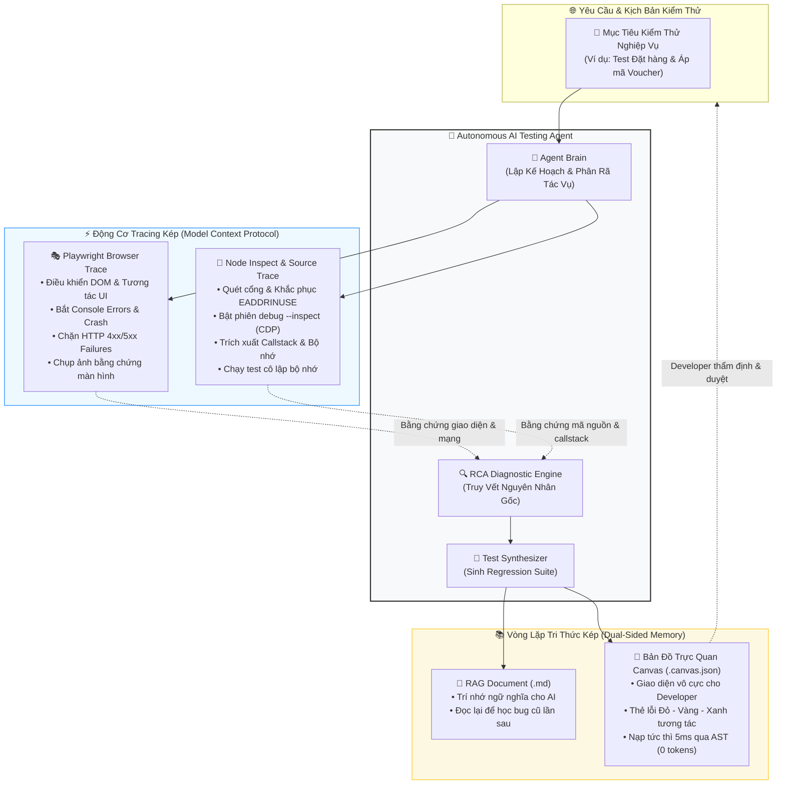
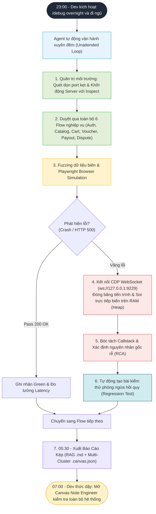
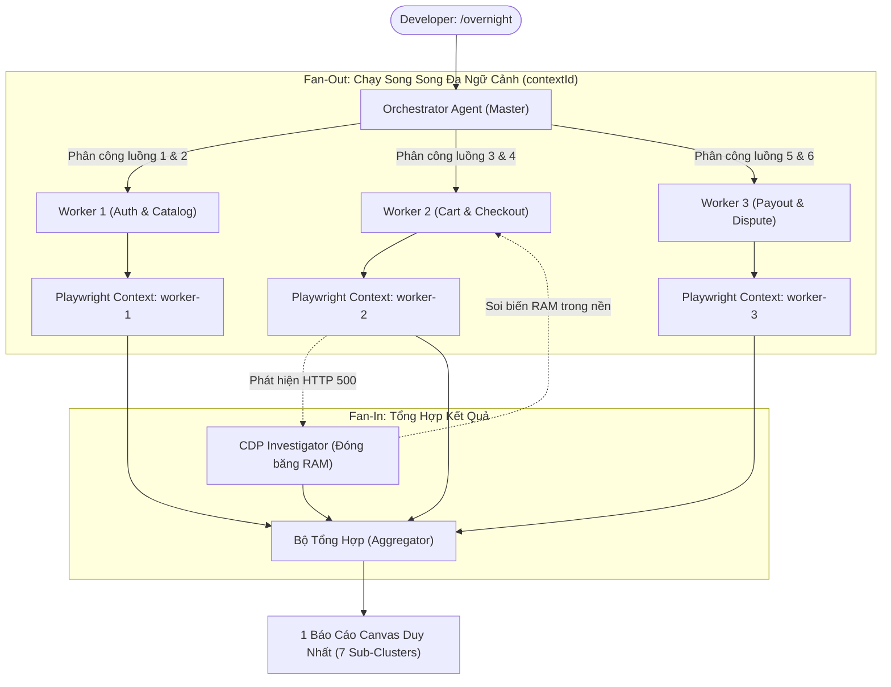
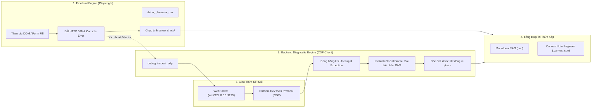
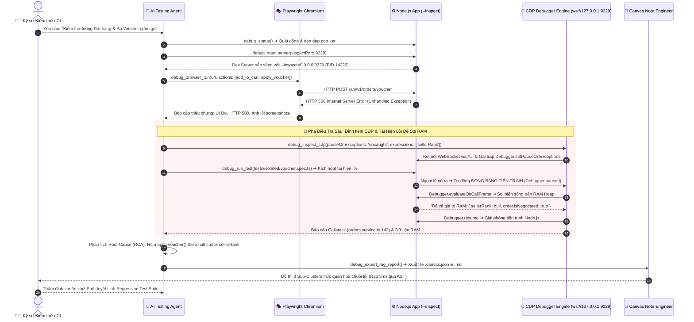
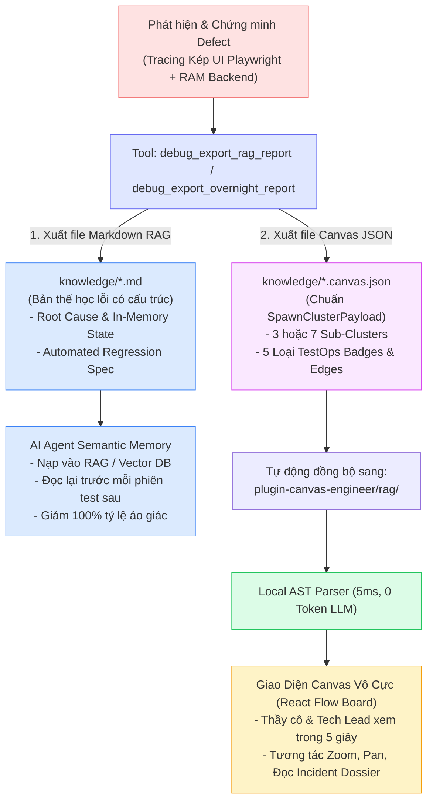
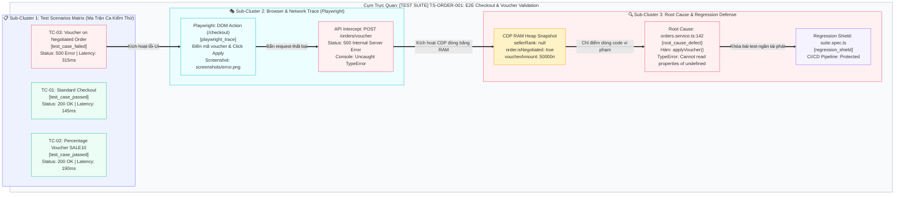
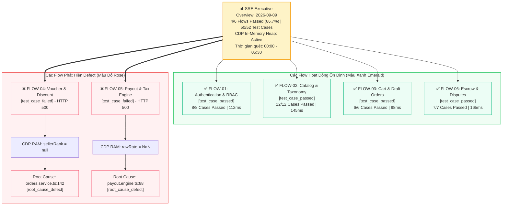
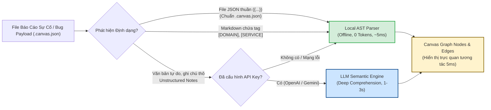

# Autonomous Web Testing & Diagnostic Agent
### Hệ Thống Tự Động Hóa Kiểm Thử Web Application Toàn Trình Kết Hợp Browser Trace, Source Code Trace & Vòng Lặp Tri Thức Kép (AI Memory + Canvas Visual Map)

[](https://choosealicense.com/licenses/mit/)
[](https://nodejs.org/)
[](https://playwright.dev/)
[](https://modelcontextprotocol.io/)
[](https://github.com/justpassingByte/canvas-note-engineer)
[](#-4-kiến-trúc-hệ-thống-6-tầng-toàn-trình)

> **Hồ sơ Đề tài Nghiên cứu / Đồ án Tốt nghiệp Kỹ sư CNTT**  
> *Đóng gói độc lập dạng Standalone Plugin (Self-contained) theo tiêu chuẩn Model Context Protocol (MCP).*  
> *100% Zero-Impact — Tích hợp ngay lập tức vào bất kỳ dự án Web/Backend nào mà không làm biến đổi hay phụ thuộc vào mã nguồn mục tiêu.*

---

## Mục Lục
1. [Giới Thiệu & Triết Lý Đề Tài](#1-giới-thiệu--triết-lý-cốt-lõi)
2. [Giá Trị Cốt Lõi & Bảng Đối Chiếu Công Cụ](#2-giá-trị-cốt-lõi--bảng-đối-chiếu-công-cụ)
3. [Sổ Tay Vận Hành: Kịch Bản Chính & Các Chế Độ Tương Tác](#3-sổ-tay-vận-hành-kịch-bản-chính--các-chế-độ-tương-tác)
  - [3.1. Kịch Bản Chính: Autonomous Overnight SRE Sweep](#31-kịch-bản-chính-autonomous-overnight-sre-sweep-quét-lỗi-xuyên-đêm-100-tự-động)
  - [3.2. Các Chế Độ Tương Tác Ban Ngày (Interactive Workflows)](#32-các-chế-độ-tương-tác-ban-ngày-interactive-workflows)
4. [Kiến Trúc Hệ Thống 6 Tầng Toàn Trình](#4-kiến-trúc-hệ-thống-6-tầng-toàn-trình)
  - [4.1. Cơ Chế Phối Hợp Giữa Frontend Playwright & Backend CDP Debugger](#41-cơ-chế-phối-hợp-giữa-frontend-playwright--backend-cdp-debugger)
5. [Quy Trình Phân Tích Sự Cố (Full-Stack RCA Loop)](#5-quy-trình-phân-tích-sự-cố-full-stack-rca-loop)
6. [Hệ Thống Tri Thức Kép (AI Memory + Canvas Note Engineer)](#6-hệ-thống-tri-thức-kép-ai-memory--canvas-note-engineer)
7. [Cấu Trúc Thư Mục Plugin Độc Lập](#7-cấu-trúc-thư-mục-plugin-độc-lập)
8. [Bộ 9 Công Cụ MCP Server (mcp/server.mjs)](#8-danh-mục-9-công-cụ-trong-mcp-server)
9. [Hướng Dẫn Cài Đặt & Chạy Thực Nghiệm](#9-hướng-dẫn-cài-đặt--thực-nghiệm-nhanh)
10. [Khung Đề Cương Nghiên Cứu & Báo Cáo Đồ Án (7 Chương)](#10-khung-đề-cương-thuyết-minh-đồ-án-tốt-nghiệp)

---

## 1. Giới Thiệu & Triết Lý Cốt Lõi

Hầu hết các giải pháp áp dụng Generative AI trong kiểm thử hiện nay chỉ dừng lại ở mức nông: *"Sinh test case từ user story"* hoặc *"Đọc log và phỏng đoán lỗi"*. Cách tiếp cận này thường xuyên gặp phải hiện tượng **AI Hallucination (ảo giác)** và **thiếu ngữ cảnh thực thi (Execution Context)**.

Đề tài này hiện thực hóa mô hình **Autonomous Testing & Site Reliability Engineer (SRE)**: AI Agent không chỉ là một mô hình ngôn ngữ đơn thuần, mà là một kỹ sư kiểm thử tự động sở hữu đầy đủ giác quan và công cụ để tương tác với thế giới phần mềm:

$$\text{Observe} \longrightarrow \text{Reason} \longrightarrow \text{Act} \longrightarrow \text{Investigate} \longrightarrow \text{Verify} \longrightarrow \text{Document} \longrightarrow \text{Remember}$$



---

## 2. Giá Trị Cốt Lõi & Bảng Đối Chiếu Công Cụ

Trong phát triển phần mềm hiện đại, kiểm thử ứng dụng web thường gặp phải 4 rào cản lớn:
1. **Chi phí viết test thủ công quá cao**: Kỹ sư phải code từng dòng script Playwright/Cypress cho hàng trăm giao diện.
2. **Đứt gãy giữa Giao diện và Mã nguồn**: Khi API trả về HTTP 500 hoặc giao diện bị đơ, công cụ E2E chỉ chụp được ảnh màn hình hoặc log console, không thể chỉ ra dòng code backend bị lỗi logic.
3. **Gián đoạn môi trường do kẹt cổng**: Việc khởi động và dừng server liên tục dẫn đến lỗi `listen EADDRINUSE`, ngắt quãng mạch làm việc của lập trình viên.
4. **Tri thức sự cố bị lãng quên**: Các lỗi sau khi sửa không được chuẩn hóa thành tài liệu tri thức (RAG) và không tự động chuyển hóa thành test phòng ngừa hồi quy (Regression Test).

Hệ thống **Agentic TestOps** giải quyết triệt để các rào cản này bằng cách kết hợp AI Agent với giao thức CDP và hệ thống bản đồ số Canvas:

### Bảng Đối Chiếu: Agentic Test Ops vs Công Cụ Truyền Thống

| Tiêu Chí So Sánh | Cypress / Playwright viết tay | Postman / Swagger UI | Agentic Test Ops (Plugin này) |
|---|---|---|---|
| **Người tạo kịch bản** | Lập trình viên phải code từng dòng | Lập trình viên tự gõ từng payload | **AI tự lập kế hoạch và tự thực thi** |
| **Khi kiểm thử thất bại** | Báo đỏ terminal, chụp 1 ảnh UI | Báo status 500 không rõ dòng code | **Lần ngược callstack vào tận file Backend vi phạm qua CDP** |
| **Xử lý đụng độ Port** | Bị crash `EADDRINUSE`, phải sửa tay | Không hỗ trợ | **Tự động quét cổng và diệt tiến trình zombie** |
| **Bảo lưu tri thức** | Báo cáo HTML trôi qua rồi mất | Lưu bộ sưu tập request | **Lưu tài liệu RAG và nạp đồ thị trực quan Canvas** |
| **Phòng ngừa tái phát** | Phải tự viết thêm test hồi quy | Không tự động | **Tự động sinh file Regression Test suite** |

---

## 3. Sổ Tay Vận Hành: Kịch Bản Chính & Các Chế Độ Tương Tác

Hệ thống được thiết kế theo mô hình **Agent-First**: Trọng tâm là **Kịch Bản Chính Quét Lỗi Qua Đêm (Autonomous Overnight SRE Sweep)** giúp giải phóng 100% thời gian cho lập trình viên, đi kèm các **Chế Độ Tương Tác Ban Ngày** phục vụ code tính năng và gỡ lỗi cục bộ.



---

### 3.1. Kịch Bản Chính: Autonomous Overnight SRE Sweep (Quét Lỗi Xuyên Đêm 100% Tự Động)

Đây là năng lực cốt lõi định hình nên giá trị của đề tài: **Bạn chỉ cần ra một lệnh duy nhất trước khi rời bàn làm việc hoặc trước khi đi ngủ, Agent sẽ tự động trinh sát xuyên đêm qua toàn bộ các luồng nghiệp vụ (Multi-Flow), tự gắn CDP bắt lỗi trên RAM, và sáng hôm sau nạp sẵn toàn bộ sơ đồ lỗi đa cụm lên Canvas.**

#### Kiến Trúc Phân Luồng Song Song (Parallel Fan-Out / Fan-In)

Để giải quyết triệt để vấn đề thời gian chạy lâu, hệ thống áp dụng mô hình **Bầy Subagents Song Song (Parallel Worker Swarm)**:



- **Tăng tốc 300% – 500%**: Thay vì chạy tuần tự tốn 45 phút, 3 Workers chạy song song trong các Browser Context độc lập (`worker-1`, `worker-2`, `worker-3`) giúp hoàn thành toàn bộ 6 flows chỉ trong **12 đến 15 phút**.
- **Không bao giờ bị nghẽn (Non-blocking Incident Triage)**: Khi Worker 2 gặp lỗi tại Checkout, `cdp-investigator` âm thầm kết nối CDP đóng băng RAM và phân tích lỗi trong nền, trong khi Worker 1 và Worker 3 vẫn tiếp tục chạy bình thường!

#### Cách kích hoạt kiểm thử qua đêm:
```bash
# Chạy quét qua đêm toàn bộ các flow nghiệp vụ trọng yếu
/debug overnight --flows "auth,products,cart,checkout,vouchers,payout,disputes"
```
Hoặc ra lệnh bằng ngôn ngữ tự nhiên trong cửa sổ Chat:
> *"Hãy chạy kiểm thử tự động toàn bộ các flow nghiệp vụ qua đêm. Tự động kết nối CDP để bắt biến trên RAM khi có lỗi và sáng mai xuất báo cáo tổng hợp tất cả các flow lên Canvas Note Engineer."*

#### Thành quả nhận được vào sáng hôm sau:
Khi bạn thức dậy vào 7:00 sáng, hệ thống đã tự động xuất sẵn cặp file tri thức:
1. **File Báo Cáo Tổng Hợp RAG (`knowledge/OVERNIGHT-SWEEP-<date>.md`)**:
   - **Bảng ma trận tổng hợp (Multi-Flow Health Matrix)**: Thống kê 6 flow nghiệp vụ, tỷ lệ Pass/Fail (ví dụ: `4/6 Flows Passed - 66.7%`), thời gian phản hồi trung bình (latency).
   - **Hồ sơ chi tiết từng luồng bị lỗi (Defect Dossier)**:
     - **Flow Đặt Hàng & Áp Mã (Voucher Flow)**: Lỗi 500 tại `orders.service.ts:142`, giá trị biến bắt từ RAM: `sellerRank = null`, `order.isNegotiated = true`.
     - **Flow Quyết Toán Doanh Thu (Payout Engine Flow)**: Lỗi 500 tại `payout.engine.ts:88`, giá trị biến bắt từ RAM: `rawRate = NaN`, vi phạm PPM BigInt.
     - Kèm giải pháp khắc phục và đường dẫn bộ test hồi quy tương ứng.
2. **Bản Đồ Canvas Đa Cụm (`knowledge/OVERNIGHT-SWEEP-<date>.canvas.json`)**:
   - Tự động đồng bộ sang `plugin-canvas-engineer/rag/`.
   - Khi mở Canvas Note Engineer, bạn sẽ thấy đồ thị vô cực phân chia thành các Sub-Cluster rõ ràng:
     - **Cụm Tổng Quan (SRE Executive Overview & KPIs)**: Tỷ lệ sống sót, tổng số ca kiểm thử (50/52 passed).
     - **Cụm Flow Đăng Nhập & Bảo Mật (Auth Flow)**: Badge Xanh Emerald (`test_case_passed`).
     - **Cụm Flow Danh Mục Sản Phẩm (Catalog Flow)**: Badge Xanh Emerald (`test_case_passed`).
     - **Cụm Flow Giỏ Hàng (Cart Flow)**: Badge Xanh Emerald (`test_case_passed`).
     - **Cụm Flow Áp Mã Voucher (Voucher Flow)**: Badge Đỏ Rose (`test_case_failed`), Badge Beetle Bug (`root_cause_defect`) nối thẳng vào `orders.service.ts:142`, Badge Cyan (`playwright_trace`) và Badge Tím (`regression_shield`).
     - **Cụm Flow Quyết Toán Phí (Payout Engine Flow)**: Badge Đỏ Rose (`test_case_failed`) nối vào lỗi tính toán BigInt tại `payout.engine.ts:88`.
     - **Cụm Flow Khiếu Nại & Ký Quỹ (Dispute Flow)**: Badge Xanh Emerald (`test_case_passed`).

---

### 3.2. Các Chế Độ Tương Tác Ban Ngày (Interactive Workflows)

Trong giờ làm việc ban ngày, lập trình viên sử dụng các chế độ tương tác phục vụ trực tiếp cho quá trình code tính năng và gỡ lỗi cục bộ:

#### Chế độ 1: Dọn dẹp cổng kẹt & Khởi động Server Debug
Khi mở máy, các tiến trình từ hôm trước có thể đang treo cổng `4201`, `9229`:
- **Bạn gõ vào Chat**:
  > *"Kiểm tra xem có cổng nào đang bị chiếm không, giải phóng các cổng inspect và bật api server ở chế độ debug."*
- **Agent tự động gọi**:
  1. `debug_status({ ports: [4200, 4201, 9229] })`
  2. `debug_kill_ports({ ports: [9229] })`
  3. `debug_start_server({ command: 'pnpm dev:api', inspectPort: 9229, app: 'api' })`
- **Kết quả**: Server sẵn sàng với `--inspect=0.0.0.0:9229`, sạch sẽ, triệt tiêu hoàn toàn lỗi `EADDRINUSE`.

#### Chế độ 2: Kiểm thử E2E tức thời khi vừa code xong tính năng
Bạn vừa hoàn thành chức năng *"Áp dụng voucher giảm giá ở giỏ hàng"*:
- **Bạn gõ vào Chat**:
  > *"/debug 'Mở trang http://localhost:4200/cart, click nút Áp dụng mã SALE100 và kiểm tra xem tổng tiền có cập nhật không'"*
- **Agent tự động**:
  1. Mở Playwright Chromium (có thể xem trực tiếp giao diện tự động thao tác).
  2. Tìm selector, điền mã `SALE100`, click nút Submit.
  3. Nếu thành công: Đo lường thời gian phản hồi, trạng thái DOM.
  4. Nếu thất bại: Tự động chụp ảnh màn hình lưu vào `screenshots/` và chuyển sang bước điều tra chuyên sâu.

#### Chế độ 3: Điều tra chuyên sâu & Soi biến RAM cho 1 Bug đơn lẻ
Khi phát hiện một lỗi cụ thể:
- **Bạn gõ vào Chat**:
  > *"Điều tra tại sao bấm áp mã lại bị lỗi 500 và chỉ cho tôi giá trị biến trên RAM."*
- **Agent tự động**:
  1. Đọc lại Network Error từ Playwright: `POST /api/v1/orders/voucher -> 500`.
  2. Kết nối trực tiếp vào WebSocket Debugger (`ws://127.0.0.1:9229`) qua công cụ `debug_inspect_cdp`.
  3. Đóng băng tiến trình Node khi văng Uncaught Exception và đọc biến trên RAM heap:
     ```json
     {
       "sellerRank": null,
       "order.isNegotiated": true,
       "voucherAmount": "50000n"
     }
     ```
  4. Định vị chính xác dòng code: `orders.service.ts:142` (Hàm `applyVoucher`) và đề xuất bản vá.

#### Chế độ 4: Lập trình viên tự tay Debug F5 trên VS Code (Human-in-the-Loop)
Nếu đó là một thuật toán đặc thù và bạn muốn tự tay nhảy qua từng dòng lệnh:
1. Bạn không cần khởi động lại server.
2. Mở file mã nguồn, đặt Breakpoint màu đỏ tại dòng mong muốn.
3. Nhấn **F5** trên bàn phím (Profile *"F5: Attach to Node (Inspect Port 9229)"* cấu hình sẵn trong `vscode/launch.json`).
4. VS Code lập tức gắn vào cổng `9229` đã được Agent mở sẵn để bạn tự tay thanh tra biến.

#### Chế độ 5: Xuất Báo Cáo RAG & Vẽ Canvas Cho 1 Luồng Đơn Lẻ
Sau khi điều tra xong 1 lỗi đơn lẻ:
- **Agent tự động gọi**: `debug_export_rag_report`
- **Hệ thống tạo ra cặp file tri thức**:
  1. `knowledge/TS-ORDER-001-e2e-checkout-voucher-validation.md`
  2. `knowledge/TS-ORDER-001-e2e-checkout-voucher-validation.canvas.json` (3 Sub-Clusters)
- Kéo vào **Canvas Note Engineer**: Đồ thị mở ra tức thì trong 5ms để bảo vệ đồ án hoặc báo cáo Tech Lead.

---

---

## 4. Kiến Trúc Hệ Thống 6 Tầng Toàn Trình

Hệ thống được tổ chức thành 6 tầng công nghệ tách biệt, đảm bảo khả năng mở rộng và tính độc lập tuyệt đối:

```
┌────────────────────────────────────────────────────────────────────────┐
│ Tầng 6: Tự Động Sinh Regression Test (Vitest / Playwright Suite)        │
├────────────────────────────────────────────────────────────────────────┤
│ Tầng 5: Canvas Visual Map (Tích hợp canvas-note-engineer cho Developer)│
├────────────────────────────────────────────────────────────────────────┤
│ Tầng 4: RAG Knowledge Memory (Bộ nhớ ngữ nghĩa cho AI học lại)         │
├────────────────────────────────────────────────────────────────────────┤
│ Tầng 3: Root Cause Analysis (RCA 4-Step Loop: Ngược dòng Callstack)    │
├────────────────────────────────────────────────────────────────────────┤
│ Tầng 2: Source Code Trace & Debug Session (Node Inspect --inspect)     │
├────────────────────────────────────────────────────────────────────────┤
│ Tầng 1: Browser Automation & Trace Engine (Playwright Headless/Headed) │
└────────────────────────────────────────────────────────────────────────┘
```

### Tầng 1: Browser Automation & Trace (Playwright Engine)
- Tự động điều khiển trình duyệt qua giao thức Playwright Chromium.
- Lắng nghe sự kiện tầng giao diện: `page.on('console')`, `page.on('pageerror')`.
- Giám sát luồng mạng tầng HTTP: bắt toàn bộ yêu cầu trả về mã lỗi `4xx` hoặc `5xx`.
- Tự động chụp ảnh màn hình lưu vào `screenshots/` làm bằng chứng nghiệm thu.

### Tầng 2: Source Code Trace & Debug Session (Node Inspect & CDP Engine)
- Khởi động tiến trình backend với tham số `NODE_OPTIONS=--inspect=0.0.0.0:<port>`.
- Giao tiếp trực tiếp với Node.js runtime thông qua **Chrome DevTools Protocol (CDP)**.
- Quét cổng, phát hiện tiến trình zombie và force-kill tức thời để dập tắt lỗi `EADDRINUSE`.
- Cho phép kỹ sư con người mở VS Code, nhấn **F5** để nhảy ngay vào breakpoint tại dòng code nghi vấn mà Agent đã khoanh vùng.

### Tầng 3: Root Cause Analysis (RCA Diagnostic Loop)
- Quy trình 4 bước chuẩn SRE (Site Reliability Engineering):
  1. **Triệu chứng (Symptom)**: Ghép đôi mã lỗi HTTP 500 với Uncaught TypeError trên Frontend.
  2. **Truy vết (Trace)**: Đọc ngược Callstack từ Controller ➔ Service ➔ Repository.
  3. **Chứng minh (Proof)**: Tạo kịch bản Replay/Mutation Test tối thiểu để kích hoạt lỗi có chủ đích.
  4. **Khắc phục tận gốc (Root Fix)**: Sửa tại đúng nguồn phát sinh dữ liệu, cấm vá ngọn (monkey-patch).

### Tầng 4: RAG Knowledge Memory (Bộ nhớ ngữ nghĩa cho AI)
- Lưu trữ mọi trường hợp lỗi đã được chứng minh vào thư mục `knowledge/` dưới dạng tài liệu Markdown chuẩn hóa.
- Định dạng tri thức bao gồm: `bugId`, `flow`, `symptoms`, `sourceLocation`, `rootCause`, `verified` và đường dẫn ảnh bằng chứng.
- Phục vụ cơ chế **Semantic Memory**: Trước khi test một module mới, Agent truy vấn RAG để học lại các lỗi từng xảy ra, từ đó chọn kịch bản biên (Edge Cases) sắc bén hơn.

### Tầng 5: Canvas Visual Map (Bản đồ số cho Lập trình viên)
- Trực quan hóa toàn bộ chuỗi mắt xích nguyên nhân - kết quả thành đồ thị tương tác kết nối với mã nguồn mở **[canvas-note-engineer](https://github.com/justpassingByte/canvas-note-engineer)**.
- Đóng vai trò cầu nối **Human-in-the-loop**: Kỹ sư con người nhìn đồ thị 5 giây là nắm trọn vẹn lỗi mà không phải đọc hàng ngàn dòng log thô.

### Tầng 6: Tự Động Sinh Regression Test (Phòng ngừa hồi quy)
- Agent tự động tổng hợp ca kiểm thử thành file test tự động độc lập (Vitest/Playwright).
- Cam kết nguyên tắc **Zero Empty Tests**: Mọi test case đều chứa các câu lệnh assertion thực chất, kiểm tra giá trị biên, sẵn sàng gắn vào CI/CD Pipeline.


---

### 4.1. Cơ Chế Phối Hợp Giữa Frontend Playwright & Backend CDP Debugger

Sự khác biệt cốt lõi giữa hệ thống này và các công cụ E2E truyền thống nằm ở **sự liên kết hai chiều giữa Giao diện người dùng (Black-box UI) và Bộ nhớ máy chủ (White-box Heap Memory)**:



#### Nguyên Lý Phối Hợp Kỹ Thuật Chi Tiết:

1. **Frontend Engine (Playwright Chromium - `mcp/server.mjs`)**:
   - Đóng vai trò mô phỏng người dùng: tự động mở URL, điền form, click nút và kích hoạt các kịch bản biên (Edge Cases).
   - Thiết lập 3 bộ lắng nghe sự kiện đồng thời:
     - `page.on('console')`: Bắt mọi lỗi và cảnh báo trên tab console trình duyệt.
     - `page.on('pageerror')`: Bắt ngoại lệ JavaScript làm treo giao diện (Uncaught UI Crash).
     - `page.on('response')`: Đón chặn mọi request mạng trả về mã lỗi HTTP >= 400.
   - Khi có sự cố (ví dụ `POST /api/v1/orders/voucher -> 500`), Playwright ghi nhận triệu chứng và tự động lưu ảnh chụp màn hình bằng chứng vào `screenshots/`.

   ```javascript
   // Trích từ mcp/server.mjs: Bộ giám sát đa kênh của Playwright
   page.on('response', (resp) => {
     if (resp.status() >= 400) {
       failedRequests.push({ url: resp.url(), status: resp.status() });
     }
   });
   page.on('pageerror', (err) => {
     pageErrors.push({ message: err.message, stack: err.stack });
   });
   ```

2. **Backend Diagnostic Engine (CDP WebSocket Client - `mcp/cdp-client.mjs`)**:
   - Khác với kiểm thử truyền thống chỉ dừng lại ở việc báo lỗi "API 500", Agent lập tức gọi công cụ `debug_inspect_cdp`.
   - Client CDP truy vấn endpoint `http://127.0.0.1:9229/json/list` để lấy `webSocketDebuggerUrl` của Node.js runtime.
   - Thiết lập kết nối native WebSocket và kích hoạt: `Debugger.setPauseOnExceptions({ state: 'uncaught' })`.
   - Khi mã nguồn backend văng ngoại lệ (Unhandled Exception), tiến trình Node.js **lập tức bị đóng băng trên bộ nhớ RAM (Heap)** tại đúng thời điểm sập.
   - Client CDP gửi lệnh `Debugger.evaluateOnCallFrame` để trích xuất trực tiếp giá trị của các biến trong callframe mà không cần chèn bất kỳ dòng `console.log` nào:

   ```javascript
   // Trích từ mcp/cdp-client.mjs: Soi biến trực tiếp trên RAM qua CDP
   ws.send(JSON.stringify({
     id: reqId++,
     method: 'Debugger.evaluateOnCallFrame',
     params: {
       callFrameId: topFrame.callFrameId,
       expression: 'sellerRank',
       returnByValue: true
     }
   }));
   // Giá trị trả về trực tiếp từ RAM: { type: 'object', value: null }
   ```

3. **Cơ Chế Bàn Giao Cho Kỹ Sư Con Người (Human-in-the-Loop qua VS Code - `vscode/launch.json`)**:
   - Nhờ backend được Agent khởi động với cờ `--inspect=0.0.0.0:9229`, phiên gỡ lỗi luôn sẵn sàng.
   - Khi kỹ sư muốn trực tiếp quan sát bằng mắt, chỉ cần đặt breakpoint trong mã nguồn và nhấn **F5** trên VS Code (`Attach to Node Inspect`).
   - VS Code sẽ gắn trực tiếp vào tiến trình đang chạy mà **không cần khởi động lại server**, giúp tiết kiệm tối đa thời gian phát triển.

---

## 5. Quy Trình Phân Tích Sự Cố (Full-Stack RCA Loop)

Biểu đồ tuần tự dưới đây thể hiện sự phối hợp nhịp nhàng giữa AI Agent, Trình duyệt E2E, Máy chủ Backend và Hệ thống Canvas:



---

## 6. Hệ Thống Tri Thức Kép (AI Memory + Canvas Note Engineer)

Một trong những đóng góp sáng tạo nhất của đề tài là giải quyết trọn vẹn bài toán: **Làm sao để vừa có tri thức máy cho AI Agent học ở các lần test sau, vừa có bản đồ trực quan dễ hiểu cho lập trình viên con người thẩm định?**



---

### Hình Ảnh & Video Thực Tế Trên Không Gian Vô Cực (Live Interactive Demo)

<p align="center">
  
</p>

<p align="center">
  <video src="https://raw.githubusercontent.com/justpassingByte/agentic-test-ops/main/public/canvas-demo.mp4" controls="controls" width="100%" preload="metadata" playsinline></video>
</p>

<p align="center">
  <em>Video thao tác trực tiếp: Zoom, Pan mượt mà, phân tách các Sub-Clusters và kích hoạt hạt xung lực lỗi Bug Vector Particle bò dọc dây nối DAG.</em><br>
  <a href="https://raw.githubusercontent.com/justpassingByte/agentic-test-ops/main/public/canvas-demo.mp4"><strong>[Bấm vào đây để mở / phát video MP4 trực tiếp]</strong></a>
</p>

---

### 6.1. Cấu Trúc Trực Quan Của Một Cụm Kiểm Thử Trên Canvas (Single-Flow Topology)

Khi bạn nạp file báo cáo kiểm thử đơn luồng (ví dụ: `TS-ORDER-001-e2e-checkout-voucher-validation.canvas.json`) vào **[justpassingByte/canvas-note-engineer](https://github.com/justpassingByte/canvas-note-engineer)**, giao diện vô cực không hiển thị những dòng JSON khô khan, mà tự động dựng thành **3 Phân Cụm (Sub-Clusters)** liên kết chặt chẽ theo chuỗi nhân quả:



#### Giải Thích Ý Nghĩa 3 Sub-Clusters Trên Bàn Làm Việc:
1. **Sub-Cluster 1: Ma Trận Ca Kiểm Thử (Test Scenarios Matrix)**:
   - Liệt kê toàn bộ các kịch bản kiểm thử đã thực thi (Happy Path, Edge Case).
   - Thẻ xanh biểu thị ca test vượt qua (`test_case_passed`), thẻ đỏ báo hiệu ca test gặp lỗi biên (`test_case_failed`).
2. **Sub-Cluster 2: Dấu Vết Trình Duyệt & Mạng (Browser & Network Trace)**:
   - Ghi lại chính xác hành động click chuột, điền form của Playwright kèm ảnh chụp màn hình lúc giao diện bị treo.
   - Bắt trọn vẹn request API `POST /orders/voucher` trả về mã lỗi 500.
3. **Sub-Cluster 3: Phân Tích Gốc Rễ & Phòng Thủ Hồi Quy (RCA & Defense)**:
   - **Thẻ CDP RAM Heap**: Đọc ra giá trị biến sống trên RAM (`sellerRank = null`) mà không cần `console.log`.
   - **Thẻ Root Cause Defect**: Con bọ đỏ trỏ thẳng vào `orders.service.ts:142` và hàm vi phạm `applyVoucher`.
   - **Thẻ Regression Shield**: Khiên tím đại diện cho file test hồi quy độc lập bảo vệ CI/CD.

---

### 6.2. Bản Đồ Tổng Thể Quét Xuyên Đêm (Overnight Multi-Flow Canvas Board)

Khi chạy qua đêm kịch bản `/overnight`, file `OVERNIGHT-SWEEP-<date>.canvas.json` tạo ra một **bản đồ toàn diện gồm 7 Phân Cụm** trên không gian vô cực:



- **Cụm trung tâm (SRE Executive KPI)**: Cung cấp góc nhìn toàn cảnh về tỷ lệ sống sót của hệ thống (4/6 flows, 50/52 tests).
- **Các cụm xanh (Green Sub-clusters)**: Đại diện cho các luồng đã an toàn, giúp kỹ sư yên tâm không cần rà soát lại.
- **Các cụm đỏ (Defect Sub-clusters)**: Nổi bật tức thì với con bọ bug và đường dẫn mũi tên nối thẳng vào file backend cùng biến RAM bị hỏng.

---

### 6.3. Bộ 5 Thẻ Pod Kiểm Thử Chuyên Biệt Trên Canvas Note Engineer

| Tên Badge Pod | Biểu Tượng SVG | Màu Sắc Chủ Đạo | Dữ Liệu Hiển Thị Bên Trong Thẻ |
|---|---|---|---|
| **`test_case_passed`** | CheckCircle2 | Xanh Emerald (`#10b981`) | Mã ca test, tên kịch bản, thời gian phản hồi (latency), kết quả PASS. |
| **`test_case_failed`** | AlertOctagon | Đỏ Rose (`#f43f5e`) | Mã ca test, mô tả ngoại lệ, mã HTTP 500, kết quả FAIL. |
| **`playwright_trace`** | AppWindow / Cursor | Xanh Cyan (`#06b6d4`) | Route URL (`/cart`), hành động DOM (click, fill), đường dẫn ảnh chụp màn hình. |
| **`root_cause_defect`** | Beetle Bug | Vàng Amber / Đỏ Rose | Tên file (`orders.service.ts`), số dòng lỗi (`142`), hàm (`applyVoucher`), và **giá trị biến RAM heap** (`sellerRank = null`). |
| **`regression_shield`** | ShieldCheck | Tím Violet (`#8b5cf6`) | Tên file test hồi quy tự động sinh, trạng thái bảo vệ CI/CD Gate. |

---

### 6.4. Cơ Chế Xử Lý Kép (Hybrid Ingestion: AST vs LLM)



### So Sánh Chi Tiết Hai Nhánh Xử Lý Trong Canvas Note Engineer

| Tiêu Chí So Sánh | Nhánh 1: Local AST Parser ("fast-path") | Nhánh 2: AI Semantic API |
|---|---|---|
| **Điều kiện kích hoạt** | • File `.canvas.json` do `debug_export_rag_report` hoặc `debug_export_overnight_report` xuất ra.<br>• Kéo thả trực tiếp file vào màn hình Canvas. | • Nhập văn bản tự do, ghi chú thô chưa có cấu trúc.<br>• Bấm nút trên Canvas UI: *AI Brainstorm, AI Expand Node*. |
| **Tiêu tốn Token** | **0 Tokens** *(Miễn phí 100%)* | Tốn Tokens gọi LLM (OpenAI/Gemini/Anthropic) |
| **Thời gian nạp** | **~5ms** *(Tức thì không độ trễ)* | 1.5s – 4.0s (Phụ thuộc độ trễ mạng & LLM) |
| **Tính nhất quán** | **100% Deterministic** (Không bao giờ bị ảo giác) | Phụ thuộc Temperature & Prompt |
| **Mục đích sử dụng** | **Hiển thị chính xác chuỗi lỗi RCA & Ma trận Test** do Agent điều tra được | **Mở rộng ý tưởng kiểm thử**, phân tích tài liệu thô |

---

## 7. Cấu Trúc Thư Mục Plugin Độc Lập

```text
debug-plugin/
├── .claude-plugin/
│   └── plugin.json                  # Manifest định danh plugin (hỗ trợ Claude Code & Antigravity)
├── mcp/
│   ├── server.mjs                   # Zero-dependency Node.js MCP Server (JSON-RPC 2.0 stdio, 9 tools)
│   ├── cdp-client.mjs               # Module client kết nối Chrome DevTools Protocol (CDP) WebSocket & soi RAM
│   ├── rag-exporter.mjs             # Module xuất Dual-Mode RAG Document & Canvas Graph (.canvas.json)
│   ├── package.json                 # Khai báo dependency Playwright Chromium
│   ├── setup-browser.ps1            # Script tự động cài đặt Chromium (Windows PowerShell)
│   └── setup-browser.sh             # Script tự động cài đặt Chromium (Linux / macOS)
├── knowledge/                       # Kho tri thức lỗi (RAG Docs & Canvas JSON cho canvas-note-engineer)
│   ├── BUG-2026-001-order-escrow-race.md & .canvas.json
│   ├── TS-ORDER-001-e2e-checkout-voucher-validation.md & .canvas.json
│   └── OVERNIGHT-SWEEP-2026-09-09.md & .canvas.json
├── screenshots/                     # Bằng chứng hình ảnh tự động chụp khi xảy ra lỗi
├── skills/
│   └── debug-rca/
│       ├── SKILL.md                 # Quy trình 4 bước Full-Stack RCA
│       ├── references/
│       │   ├── frontend-e2e-debugging.md   # Đối chiếu Network & UI Console
│       │   ├── systematic-debugging.md     # Phương pháp kiểm định giả thuyết khoa học
│       │   ├── root-cause-tracing.md       # Kỹ thuật lần ngược callstack
│       │   ├── log-and-ci-analysis.md      # Khai phá log máy chủ & CI
│       │   └── verification.md             # Tiêu chuẩn nghiệm thu chứng cứ
│       └── scripts/
│           ├── find-polluter.ps1    # Cô lập test case gây ô nhiễm môi trường (PowerShell)
│           └── find-polluter.sh     # Cô lập test case gây ô nhiễm môi trường (Bash)
├── agents/
│   ├── orchestrator.md              # Master subagent điều phối kiểm thử qua đêm (Parallel Fan-Out/Fan-In)
│   ├── flow-worker.md               # Subagent worker chạy song song theo từng browser contextId
│   ├── cdp-investigator.md          # Subagent chuyên trách đính kèm CDP WebSocket và soi RAM Heap
│   └── debugger.md                  # Subagent SRE điều tra sự cố toàn trình
├── commands/
│   ├── debug.md                     # Slash command /debug [nội dung vấn đề]
│   └── overnight.md                 # Slash command /overnight [quét lỗi qua đêm tự động]
├── vscode/
│   ├── launch.json                  # Cấu hình F5 Attach vào Node Inspect CDP (Port 9229, 9230)
│   └── tasks.json                   # Task tự động quét dọn port kẹt EADDRINUSE
└── README.md                        # Tài liệu hướng dẫn & thuyết minh đồ án chuẩn mực
```

---

## 8. Danh Mục 9 Công Cụ Trong MCP Server

Tất cả công cụ giao tiếp qua chuẩn **Model Context Protocol (JSON-RPC 2.0 stdio)**:

| Tên Tool | Tham số đầu vào | Chức năng kỹ thuật |
|---|---|---|
| **`debug_inspect_cdp`** | `inspectPort`, `pauseOnExceptions`, `expressions[]`, `timeoutMs` | **Client gỡ lỗi tự động qua CDP**: Kết nối trực tiếp vào `ws://127.0.0.1:9229`, tự động đóng băng tiến trình khi văng Uncaught Exception, trích xuất Callstack và **soi trực tiếp giá trị biến trên bộ nhớ RAM** mà không cần con người bấm F5! |
| **`debug_export_overnight_report`** | `sweepId`, `date`, `flows[]` | **Báo cáo kiểm thử quét qua đêm**: Tổng hợp kết quả kiểm thử của toàn bộ các flow nghiệp vụ, trích xuất lỗi RAM từ CDP, xuất cặp file `OVERNIGHT-SWEEP-<date>.md` và `OVERNIGHT-SWEEP-<date>.canvas.json` đa cụm. |
| **`debug_export_rag_report`** | `testId`, `title`, `route`, `symptoms`, `sourceLocation` | Tự động xuất cặp file tri thức TestOps đơn luồng: `.md` cho RAG và `.canvas.json` 3 Sub-Clusters nạp tức thì vào **canvas-note-engineer**. |
| **`debug_browser_run`** | `url`, `contextId`, `actions[]`, `headless`, `timeoutMs` | Khởi chạy Playwright Chromium, tự động hóa thao tác người dùng, lắng nghe lỗi Console, bắt HTTP 4xx/5xx và chụp ảnh màn hình lỗi. |
| **`debug_status`** | `ports[]` *(Mặc định quét 9 cổng)* | Quét trạng thái cổng ứng dụng (3000, 4200, 4201, 8080) và cổng inspect (9229, 9230...), trả về PID tiến trình đang giữ port. |
| **`debug_kill_ports`** | `ports[]` *(Mặc định `[9229, 9230, 9231]`)* | Force-kill các tiến trình đang chiếm dụng cổng, dập tắt dứt điểm lỗi `EADDRINUSE`. |
| **`debug_start_server`** | `command`, `inspectPort`, `app`, `cwd` | Khởi chạy dev server ở chế độ `--inspect=0.0.0.0:<port>` chạy ngầm, tự động dọn sạch port trước khi bật. |
| **`debug_stop_server`** | `app`, `pid` | Dừng tiến trình dev server một cách an toàn và giải phóng tài nguyên. |
| **`debug_run_test`** | `command`, `cwd`, `timeoutMs` | Chạy test đơn lẻ trong môi trường cô lập, bóc tách Callstack và mã thoát lỗi khi thất bại. |

## 9. Hướng Dẫn Cài Đặt & Thực Nghiệm Nhanh

### Bước 1: Thiết lập môi trường Playwright (Chỉ 1 lệnh)
Mở terminal tại thư mục `debug-plugin/mcp`:
- **Windows (PowerShell)**:
  ```powershell
  cd mcp
  .\setup-browser.ps1
  ```
- **Linux / macOS**:
  ```bash
  cd mcp
  chmod +x setup-browser.sh
  ./setup-browser.sh
  ```

### Bước 2: Kích hoạt Plugin trong AI Agent
- **Antigravity IDE / Gemini CLI**:
  - Sao chép thư mục `debug-plugin` vào `~/.gemini/config/plugins/debug-plugin/` (áp dụng toàn máy).
  - Hoặc đặt vào đồ án bất kỳ tại `.agents/plugins/debug-plugin/`.
- **Claude Code**:
  - Cài đặt plugin bằng lệnh:
    ```bash
    claude plugin install ./debug-plugin
    ```
  - Khởi động điều tra sự cố:
    ```bash
    /debug "Nút Checkout bị đơ và phản hồi HTTP 500 khi áp voucher"
    ```

### Bước 3: Trải nghiệm F5 Visual Debugging trong VS Code
1. Copy 2 file `vscode/launch.json` và `vscode/tasks.json` vào thư mục `.vscode/` của dự án mục tiêu.
2. Đặt breakpoint tại dòng code nghi vấn.
3. Nhấn **F5** (hoặc chọn profile *"F5: Attach to Node (Inspect Port 9229)"*) để debug từng bước trực quan.

### Bước 4: Mở bản đồ trực quan trên Canvas Note Engineer
1. Khởi động ứng dụng [justpassingByte/canvas-note-engineer](https://github.com/justpassingByte/canvas-note-engineer).
2. Kéo thả file `knowledge/BUG-2026-001-order-escrow-race.canvas.json` vào giao diện Canvas.
3. Bản đồ trực quan lập tức bung ra với đầy đủ màu sắc trạng thái (Đỏ = Lỗi, Vàng = Nguyên nhân gốc, Xanh = Đã khắc phục).

---

## 10. Khung Đề Cương Thuyết Minh Đồ Án Tốt Nghiệp

Dành cho sinh viên/nhóm nghiên cứu đưa vào nội dung Báo cáo Đồ án Tốt nghiệp Kỹ sư:

### 10.1. Câu hỏi nghiên cứu (Research Questions)
- **RQ1**: *AI Agent có thể tự động hóa quy trình kiểm thử Web Application ở mức độ toàn trình (End-to-End) hiệu quả hơn phương pháp viết script kiểm thử truyền thống ra sao?*
- **RQ2**: *Việc kết hợp đồng thời Browser Trace (tầng giao diện) và Source Code Trace qua Node Inspect (tầng mã nguồn) giúp rút ngắn bao nhiêu thời gian định vị nguyên nhân gốc (RCA)?*
- **RQ3**: *Cơ chế lưu trữ tri thức kiểm thử dưới dạng RAG Document có giúp AI Agent giảm tỷ lệ hallucination và lựa chọn kịch bản kiểm thử biên (edge cases) chính xác hơn qua từng phiên hay không?*
- **RQ4**: *Trực quan hoá chuỗi mắt xích lỗi bằng Canvas Knowledge Graph ([canvas-note-engineer](https://github.com/justpassingByte/canvas-note-engineer)) hỗ trợ lập trình viên thẩm định kết luận của AI nhanh hơn việc đọc raw log bao nhiêu phần trăm?*
- **RQ5**: *Bộ test hồi quy (Regression Test Suite) do AI tự động tổng hợp có đáp ứng được tính toàn vẹn và độ tin cậy để tích hợp vào CI/CD Pipeline thực tế hay không?*

### 10.2. Giả thuyết nghiên cứu (Scientific Hypotheses)
- **H1**: AI Agent tự động hóa giúp cắt giảm **40% – 60%** thời gian thiết kế và thực thi kịch bản kiểm thử lặp lại.
- **H2**: Động cơ trinh sát kép (Browser Trace + Source Trace) giúp tăng độ chính xác định vị dòng code lỗi lên trên **85%**.
- **H3**: Cơ sở tri thức RAG giúp tăng tỷ lệ phát hiện lỗi logic tiềm ẩn (business edge cases) thêm **35%** sau 5 chu kỳ kiểm thử.
- **H4**: Bản đồ số trực quan Canvas giúp giảm **70%** thời gian đọc hiểu và xác thực lỗi của kỹ sư con người (Human-in-the-loop).

### 10.3. Đề cương 7 chương báo cáo chuẩn học thuật
1. **Chương 1 — Tổng quan đề tài**: Bối cảnh chuyển đổi AI trong Software Testing, Problem Statement, Mục tiêu, Phạm vi và Đóng góp kỹ thuật của đề tài.
2. **Chương 2 — Cơ sở lý thuyết & Công nghệ nền tảng**: Software Testing Lifecycle, E2E Testing với Playwright, Chrome DevTools Protocol & Node Inspect, Kiến trúc AI Agent & Function Calling, Giao thức Model Context Protocol (MCP), Retrieval-Augmented Generation (RAG).
3. **Chương 3 — Phân tích & Thiết kế Kiến trúc Hệ thống**: Kiến trúc 6 tầng kỹ thuật, Chuẩn giao tiếp JSON-RPC 2.0 stdio, Đặc tả Data Schema của RAG Document & Canvas Graph (`SpawnClusterPayload`), Thiết kế thuật toán RCA Loop 4 bước.
4. **Chương 4 — Xây dựng & Hiện thực hóa Hệ thống**: Cài đặt MCP Server, Xây dựng module Playwright Runner, Module kết nối CDP Source Trace, Tích hợp cơ chế Hybrid Ingestion (AST vs AI API) với Canvas Note Engineer.
5. **Chương 5 — Thực nghiệm & Đánh giá**: Xây dựng môi trường thử nghiệm Web App thực tế (Trustbase E-Commerce Platform), Kỹ thuật tiêm lỗi chủ động (Mutation Testing / Injected Faults), Đo đạc thời gian phát hiện và định vị lỗi.
6. **Chương 6 — Bàn luận & Phân tích Kết quả**: So sánh hiệu năng đối chứng, Đánh giá tỷ lệ False Positives / False Negatives, Phân tích tính ổn định của bài test hồi quy.
7. **Chương 7 — Kết luận & Hướng phát triển**: Tổng kết kết quả đạt được, Giới hạn hiện tại và Định hướng phát triển tính năng Tự phục hồi mã nguồn (Self-Healing Code).

---

## Giấy Phép & Bản Quyền
Dự án được phát hành theo giấy phép **MIT License**. Tự do sử dụng, sửa đổi và tích hợp vào các công trình nghiên cứu khoa học, đồ án tốt nghiệp hoặc dự án công nghiệp.
