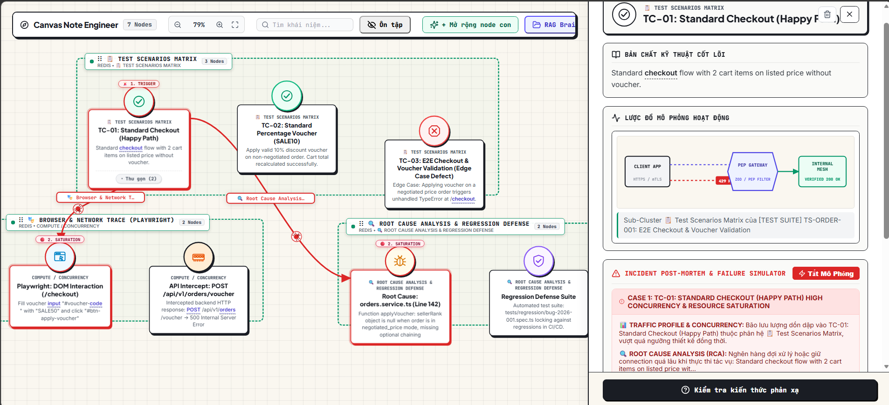
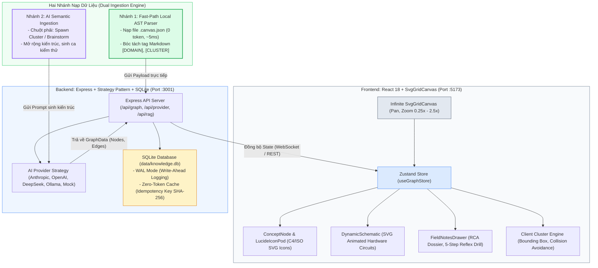
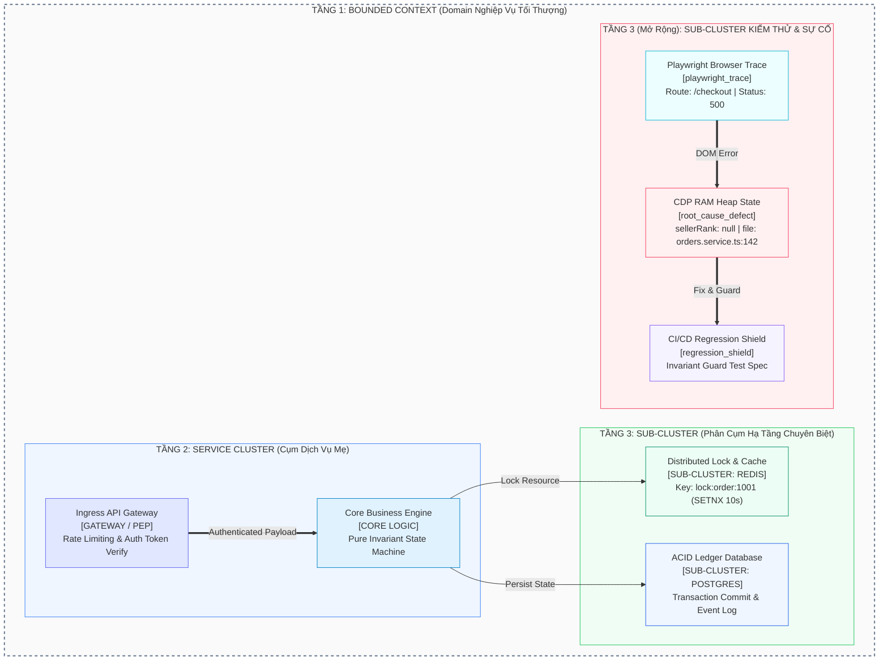
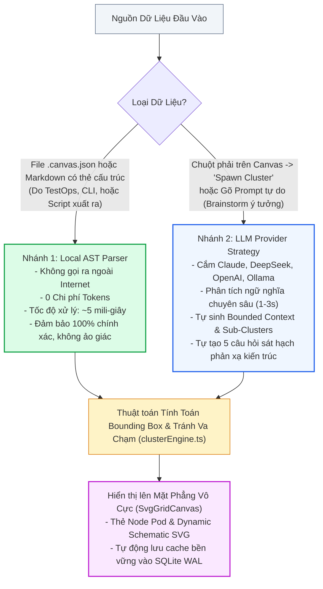
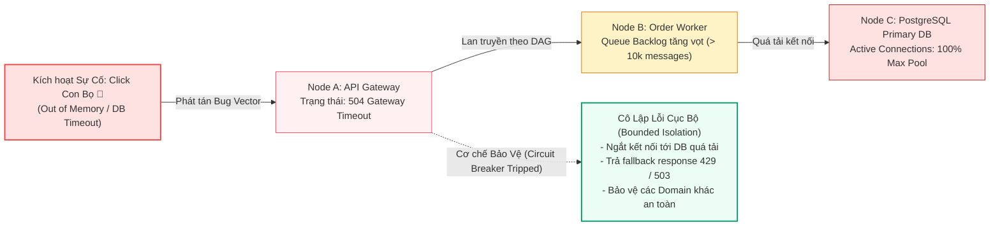
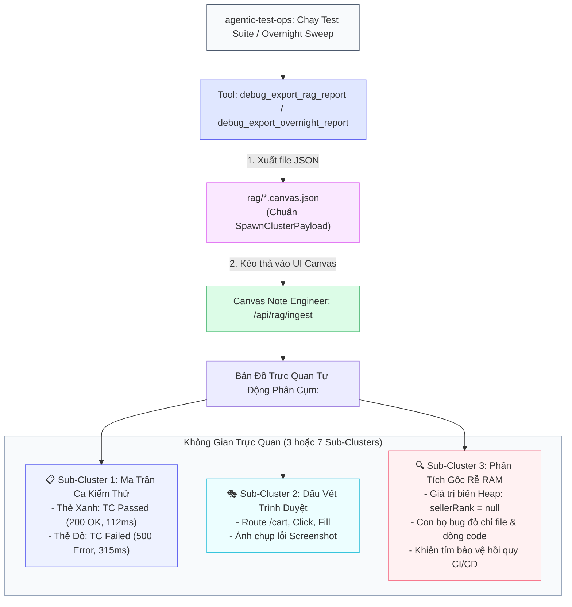

# Canvas Note Engineer

> **Interactive Engineering Knowledge Graph, SRE Incident Simulator & Architecture Field Notebook**  
> Thiết kế chuyên dụng cho **Kỹ sư Phần mềm (Software Engineers)**, **Kiến trúc sư Hệ thống (System Architects)** và **Nhà phát triển tích hợp Agentic AI (Antigravity, Claude Code, Cursor, DeepSeek)**.

[](#-cong-nghe-su-dung)
[-brightgreen)](#-kiem-thu-tu-dong-toan-dien)
[-orange)](#-luu-tru-va-du-lieu)
[](#-kien-truc-phan-cap-4-tang-bounded-context)

<p align="center">
  
</p>

> **Video Trực Quan Hóa Thực Tế (Screen Recording MP4)**: [Xem Video Thao Tác Canvas & Lan Truyền Sự Cố SRE](public/canvas-demo.mp4) *(Thao tác Zoom, Pan mượt mà, phân tách các Sub-Clusters và kích hoạt hạt xung lực lỗi Bug Vector Particle bò dọc dây nối DAG).*

---

## 1. Khái Niệm Cốt Lõi: Canvas Note Engineer Là Gì?

Khác với các ứng dụng vẽ sơ đồ phẳng (Miro, Excalidraw) hoặc ghi chú văn bản thuần túy (Obsidian, Notion), **Canvas Note Engineer** là một **Mặt Phẳng Không Gian Vô Cực Tương Tác (Interactive Spatial Canvas)** được lập trình dựa trên các nguyên lý chuẩn mực của **Domain-Driven Design (DDD)** và **Kỹ nghệ Độ tin cậy Hệ thống (SRE)**.

### Ba Giá Trị Khác Biệt Cốt Lõi:
1. **Phân Cấp Không Gian 4 Tầng (4-Tier Spatial Hierarchy)**: Không xếp chồng các khối hình phẳng hỗn loạn. Hệ thống tự động phân tách theo: `Domain (Bounded Context)` $\to$ `Service Cluster (Cụm Dịch Vụ Mẹ)` $\to$ `Sub-Cluster (Phân Cụm Hạ Tầng & Kiểm Thử)` $\to$ `Node Pods & Causal Edges`.
2. **Sơ Đồ Mạch Động (Dynamic Hardware/Protocol Schematics)**: Không dùng ảnh tĩnh. Mỗi node kỹ thuật sở hữu sơ đồ SVG hoạt họa mô phỏng trực tiếp nguyên lý phần cứng và giao thức (băng chuyền Kafka, ổ khóa Redis SETNX, piston ACID commit, bộ đếm Token Bucket).
3. **Mô Phỏng Sự Cố SRE & Cầu Nối TestOps**: Kích hoạt con bọ đỏ (Bug Vector Particle) bò dọc theo chuỗi DAG để thấy hiệu ứng domino khi dịch vụ sụp đổ, đồng thời tiếp nhận trực tiếp file kết quả từ **agentic-test-ops** để biến bug vô hình trên RAM thành bản đồ trực quan dễ hiểu.

---

## 2. Kiến Trúc Kỹ Thuật Toàn Cảnh (End-to-End Architecture)



---

## 3. Kiến Trúc Phân Cấp 4 Tầng (Bounded Context Topology)

Hệ thống không sử dụng mô hình phẳng mà tổ chức không gian theo 4 cấp bậc rõ rệt:



### Ý Nghĩa Của Từng Tầng:
- **Tầng 1 - Bounded Context (Domain Boundary)**: Ranh giới nghiệp vụ độc lập (ví dụ: `Identity Platform`, `Payment Engine`, `TestOps E2E Suite`). Ngăn chặn rò rỉ trạng thái nội bộ sang các hệ thống khác.
- **Tầng 2 - Service Cluster (Cụm Dịch Vụ Mẹ)**: Bao bọc logic chính bao gồm các Gateway, Dispatcher, Business Logic Engine.
- **Tầng 3 - Sub-Clusters (Phân Cụm Hạ Tầng / Kiểm Thử)**: Các nhóm tài nguyên chuyên biệt nằm độc lập:
  - *Hạ tầng hệ thống*: `REDIS CACHE SUBSYSTEM`, `KAFKA MESSAGE STREAM`, `POSTGRES ACID LEDGER`.
  - *Kiểm thử TestOps*: `Ma Trận Kịch Bản (Test Scenarios)`, `Dấu Vết Trình Duyệt (Browser Trace)`, `Gốc Rễ RAM & Khiên Hồi Quy (RCA & Regression Shield)`.
- **Tầng 4 - Node Pods & Causal Edges**:
  - Từng thẻ bài đại diện cho một thành phần cụ thể với icon SVG chuẩn C4/ISO.
  - Các dây nối (Cubic Bezier Edges) thể hiện hướng luồng dữ liệu hoặc quan hệ nhân quả lỗi, có xung nhịp phát sáng chuyển động.

---

## 4. Cơ Chế Xử Lý Kép (Dual Ingestion Pipeline)

Hệ thống cung cấp hai cơ chế nạp tri thức độc lập, đáp ứng cả nhu cầu nạp nhanh tự động và sáng tạo bằng AI:



### Bảng So Sánh Hai Nhánh Xử Lý:

| Đặc Tính | Nhánh 1: Local AST Parser ("Fast-Path") | Nhánh 2: AI Semantic Ingestion |
|---|---|---|
| **Điều kiện kích hoạt** | Kéo thả file `.canvas.json` từ `agentic-test-ops` hoặc file Markdown chứa tag `[DOMAIN]`, `[CLUSTER]`. | Bấm chuột phải chọn `Spawn Cluster (Agent)` hoặc `Spawn Concept`. |
| **Tiêu tốn Token** | **0 Tokens** *(Hoàn toàn miễn phí)* | Tốn tokens gọi API LLM (OpenAI / Claude / DeepSeek). |
| **Thời gian nạp** | **~5 mili-giây** *(Tức thì, không độ trễ)* | 1.5s – 3.5s (Phụ thuộc mạng & LLM). |
| **Độ tin cậy** | **100% Deterministic** (Chính xác tuyệt đối theo schema). | Phụ thuộc độ hiểu ngữ cảnh của mô hình. |
| **Ứng dụng chính** | Hiển thị báo cáo kiểm thử TestOps, kiểm toán sự cố SRE. | Thiết kế kiến trúc mới, mở rộng ý tưởng hệ thống. |

---

## 5. Mô Phỏng Sự Cố SRE & Cầu Nối TestOps

### 5.1. Chuỗi Lan Truyền Sự Cố SRE (Cascading Failure Simulator)



- Khi click vào nút **🐛** trên bất kỳ thẻ sự cố nào, hệ thống kích hoạt **Bug Vector Particle**: một hạt sáng đỏ chuyển động dọc theo các dây nối DAG sang các node hạ nguồn.
- Giúp trực quan hóa ngay lập tức: *Nếu Redis chết, dịch vụ nào sẽ sập tiếp theo? Liệu Circuit Breaker có kịp ngắt để cứu database hay không?*

---

### 5.2. Đồng Bộ Báo Cáo Kiểm Thử Với `agentic-test-ops`

Khi plugin kiểm thử **[justpassingByte/agentic-test-ops](https://github.com/justpassingByte/agentic-test-ops)** chạy xong kịch bản đơn luồng hoặc quét xuyên đêm (`/overnight`), file `.canvas.json` xuất ra sẽ được Canvas Note Engineer dựng thành các phân cụm trực quan:



### Bảng 5 Thẻ Pod Kiểm Thử Chuyên Biệt:

| Tên Badge Pod | Biểu Tượng SVG | Màu Sắc | Dữ Liệu Hiển Thị Bên Trong Thẻ |
|---|---|---|---|
| **`test_case_passed`** | CheckCircle2 | Xanh Emerald (`#10b981`) | Mã ca test, tên kịch bản, thời gian phản hồi (latency), kết quả PASS. |
| **`test_case_failed`** | AlertOctagon | Đỏ Rose (`#f43f5e`) | Mã ca test, mô tả ngoại lệ, mã HTTP 500, kết quả FAIL. |
| **`playwright_trace`** | AppWindow | Xanh Cyan (`#06b6d4`) | Route URL (`/cart`), hành động DOM (click, fill), đường dẫn ảnh chụp màn hình. |
| **`root_cause_defect`** | Beetle Bug | Đỏ Rose (`#ef4444`) | Tên file (`orders.service.ts`), dòng lỗi (`142`), hàm (`applyVoucher`), và **giá trị biến RAM heap** (`sellerRank = null`). |
| **`regression_shield`** | ShieldCheck | Tím Violet (`#8b5cf6`) | Tên file test hồi quy tự động sinh, trạng thái bảo vệ CI/CD Gate. |

---

## 6. Quick Start Trong 60 Giây (Zero-Bullshit Setup)

```bash
# 1. Clone repository
git clone https://github.com/justpassingByte/canvas-note-engineer.git
cd canvas-note-engineer

# 2. Cài đặt toàn bộ dependencies (Root + Frontend + Backend)
npm install
npm run --prefix frontend install
npm run --prefix backend install

# 3. Tạo file .env từ template (tùy chọn cắm key AI, mặc định có Mock Provider chạy offline 0đ)
cp .env.example .env

# 4. Khởi chạy song song cả Frontend (Vite) và Backend (Express)
npm run dev
```

- 🌐 **Frontend Dev UI**: [`http://localhost:5173`](http://localhost:5173)
- 🚀 **Backend REST API**: [`http://localhost:3001`](http://localhost:3001)
- 🗄️ **Database SQLite WAL**: Tự động tạo tại `data/knowledge.db` (mở xem trực tiếp bằng DBeaver hoặc SQLite Viewer).

---

## 7. Thao Tác Chuột & Phím Tắt Nhanh (Canvas Cheat Sheet)

| Thao tác | Hành vi trên Canvas |
|---|---|
| **Chuột phải (Vùng trống)** | Mở Context Menu: Chọn `Spawn Cluster (Agent)` hoặc `Spawn Concept (Agent)` $\to$ Hiện popup nhập prompt $\to$ **Enter** để sinh cụm kiến trúc. |
| **Chuột phải (Lên Node)** | Mở Context Menu theo Node: Spawn cụm mới nối từ node này, mở Field Notes, thu gọn nhánh con, hoặc xóa node. |
| **Kéo rê chuột trái (Pan)** | Di chuyển góc nhìn camera trên mặt giấy vô hạn. |
| **Cuộn chuột (Zoom)** | Phóng to / Thu nhỏ mượt mà theo tâm con trỏ chuột (0.25x - 2.5x). |
| **Kéo thả Node** | Nhấn giữ chuột trái vào thẻ Node để dời vị trí $\to$ Tự động lưu tọa độ vào SQLite khi buông chuột. |
| **Kéo thả Cụm** | Nhấn giữ vào thẻ tiêu đề Cụm (`⋮⋮ TÊN CỤM`) để dời đồng loạt toàn bộ các node bên trong cụm. |
| **Click vào Node** | Mở **Field Notes Drawer**: Khám phá bản chất, sơ đồ động, hồ sơ sự cố (Incident Dossier) và chuỗi 5 câu hỏi sát hạch phản xạ kiến trúc sư. |
| **Click nút 🐛 trên Thẻ Sự cố** | Kích hoạt mô phỏng sóng lan truyền sự cố: Hạt xung lực đỏ (Bug Vector Particle) bò dọc theo dây nối DAG. |

---

## 8. Bản Đồ Codebase Dành Cho Hacker & Kỹ Sư (Hacker's Code Map)

Nếu bạn muốn nhảy vào sửa code, thêm tính năng, hay cắm mô hình AI của riêng bạn, đây là các file trọng yếu:

```text
canvas-note-engineer/
├── frontend/src/
│   ├── components/Canvas/
│   │   └── SvgGridCanvas.tsx         # Trái tim Canvas: Pan, Zoom, Cubic Bezier, Chuột phải & Prompt Popup
│   ├── components/NodePod/
│   │   ├── ConceptNode.tsx           # Thẻ Node: Badges, tiêu đề, tóm tắt, collapse pill, hover effect
│   │   └── LucideIconPod.tsx         # Vẽ Icon SVG kỹ thuật chuẩn ISO/C4 (Database, CPU, RAM, Gateway...)
│   ├── components/Animation/
│   │   └── DynamicSchematic.tsx      # Sơ đồ mạch động SVG (Kafka conveyor, Redis lock, ACID cylinder...)
│   ├── components/Drawer/
│   │   └── FieldNotesDrawer.tsx      # Sổ tay kỹ thuật: Phân tích chuyên sâu, 5 câu hỏi sát hạch, Incident dossier
│   ├── utils/
│   │   ├── clusterEngine.ts          # Thuật toán tính Cụm Mẹ / Cụm Con theo Bounded Context & auto Bounding Box
│   │   └── geometry.ts               # Thuật toán tính toán đường cong dây nối Cubic Bezier mượt mà
│   └── store/
│       └── useGraphStore.ts          # Zustand Store quản lý toàn bộ State: Zoom, Pan, Nodes, Edges, AI actions
│
├── backend/src/
│   ├── providers/                    # Chiến lược cắm rút AI đa nhà cung cấp (Strategy Pattern)
│   │   ├── providerStrategy.ts       # Interface AIProviderStrategy chuẩn mực
│   │   ├── openaiCompatibleProvider.ts # Tương thích OpenAI, DeepSeek, Minimax, Ollama localhost
│   │   ├── anthropicProvider.ts      # Hỗ trợ Claude 3.5 Sonnet / Claude 3 Opus
│   │   └── mockProvider.ts           # Chạy offline 100% không tốn token, dùng cho unit test & vọc UI
│   ├── tools/
│   │   └── toolHandlers.ts           # Core Engine xử lý đồ thị: spawn cluster, bóc tách layer, reflex drill
│   ├── services/
│   │   └── aiGraphService.ts         # Service kết nối LLM Provider sinh đồ thị & mở rộng kiến trúc
│   ├── db/
│   │   └── sqliteClient.ts           # SQLite3 WAL Mode: Khóa Idempotency, lưu trữ đồ thị 0-token, provider config
│   └── index.ts                      # Express API Server phục vụ REST endpoint & Static build
│
├── data/
│   └── knowledge.db                  # Database SQLite file thực tế (WAL mode)
└── rag/                              # Thư mục nạp tài liệu RFC, Markdown, Mermaid cho tính năng RAG Brainstorm
```

---

## 9. Cắm AI / LLM Provider Của Riêng Bạn (Bring Your Own Model)

Hệ thống thiết kế theo kiến trúc **Strategy Pattern** độc lập, cho phép bạn cắm bất kỳ nhà cung cấp AI nào (OpenAI, Anthropic Claude, DeepSeek, Minimax, hoặc Ollama chạy Local).

### Cách 1: Cấu hình qua file `.env`
Mở file `.env` ở thư mục gốc:

```env
# Chọn Provider mặc định: 'anthropic' | 'openai' | 'deepseek' | 'custom' | 'mock'
DEFAULT_AI_PROVIDER=anthropic

# Cấu hình Anthropic Claude (hoặc proxy Minimax / OpenAI-compatible)
ANTHROPIC_API_KEY=sk-ant-api03-...
ANTHROPIC_MODEL=claude-3-5-sonnet-20241022

# Cấu hình DeepSeek hoặc OpenAI
DEEPSEEK_API_KEY=sk-...
OPENAI_API_KEY=sk-...

# Chạy mô hình Local với Ollama (0 chi phí)
CUSTOM_BASE_URL=http://localhost:11434/v1
CUSTOM_API_KEY=ollama
CUSTOM_MODEL=llama3.2
```

### Cách 2: Cấu hình động ngay trên giao diện Web UI (Không cần restart server)
1. Bấm vào icon **Bánh răng (⚙️)** trên thanh công cụ nổi (Floating Toolbar).
2. Chọn Preset có sẵn (Claude, OpenAI, DeepSeek, Ollama, Minimax) hoặc chọn **Custom Endpoint**.
3. Điền `Base URL`, `API Key`, `Model Name` $\to$ Bấm **"Lưu & Kích hoạt"**. Cấu hình sẽ tự động lưu bền vững vào bảng `provider_configs` trong SQLite.

---

## 10. Hướng Dẫn Thêm Tính Năng Tự Vọc (Hacker's Extension Recipes)

### 1. Thêm một Biểu tượng Kỹ thuật SVG mới (Custom Icon)
- Mở `frontend/src/components/NodePod/LucideIconPod.tsx`.
- Thêm một `case` mới vào hàm `LucideIconPod` và vẽ SVG theo sở thích:
```tsx
case 'my_custom_service':
  return (
    <svg viewBox="0 0 32 32" className={className} fill="none" stroke="currentColor" strokeWidth="2.2">
      <rect x="4" y="4" width="24" height="24" rx="4" />
      {/* Thêm các đường vector của bạn */}
    </svg>
  );
```

### 2. Thêm một Sơ đồ Mạch Động Mới (Custom Schematic Animation)
- Mở `frontend/src/components/Animation/DynamicSchematic.tsx`.
- Thêm một case mới tương ứng với mã hiệu trong thuộc tính hoạt họa:
```tsx
case 'my_stream_pipeline': {
  return (
    <svg width="100%" height="100%" viewBox="0 0 450 125">
      {/* Tạo các phần tử SVG kèm <animate> cho hiệu ứng chuyển động */}
      <circle cx="50" cy="62" r="8" fill="#3B82F6">
        <animate attributeName="cx" values="50;400;50" dur="3s" repeatCount="indefinite" />
      </circle>
    </svg>
  );
}
```

### 3. Tùy biến Quy tắc Phân tầng Kiến trúc (Layer Sanitizer)
- Mở `backend/src/tools/toolHandlers.ts`.
- Hàm `sanitizeNodeLayerLabel` quyết định nhãn badge màu sắc (`GATEWAY / INGRESS`, `EVENT STREAM / TOPIC`, `STORAGE / ACID DB`). Bạn có thể thêm từ khóa nhận diện mới chỉ với 2 dòng:
```ts
if (textToCheck.includes('my-custom-keyword')) {
  return 'CUSTOM / LAYER';
}
```

---

## 11. Bộ Lệnh Hữu Ích (Developer Cheatsheet)

```bash
# Chạy toàn bộ kiểm thử tích hợp (10 test suites, 42 tests)
npm run test:integration

# Chạy kiểm thử đơn vị frontend
npm run test:unit

# Build bundle frontend (Vite SingleFile)
npm run build:frontend

# Build toàn bộ dự án
npm run build

# Dọn sạch Database về trạng thái Canvas tinh khôi (chạy bằng Node trực tiếp)
node -e "const db=require('better-sqlite3')('data/knowledge.db'); db.exec('DELETE FROM knowledge_graphs; DELETE FROM idempotency_keys; VACUUM;'); console.log('DB Cleaned!');"
```

---

## 12. Bản Quyền & Đóng Góp
Dự án được xây dựng dưới triết lý mã nguồn mở dành cho cộng đồng Kỹ sư Phần mềm yêu thích kiến trúc hệ thống, distributed systems và agentic workflows. Mọi đóng góp (PR, Issue, Ideas) đều được nhiệt liệt hoan nghênh!
