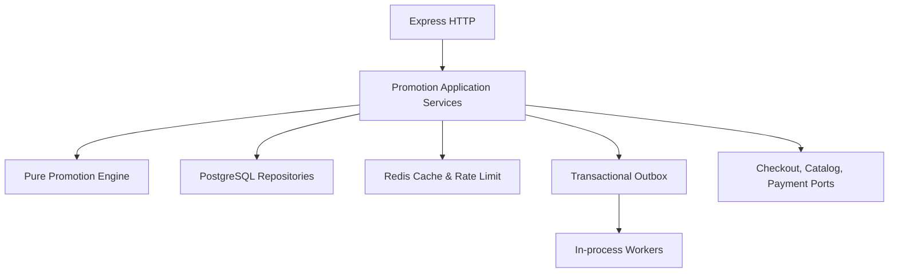
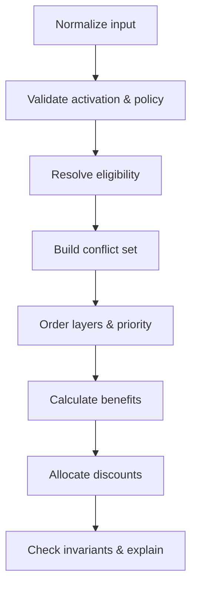
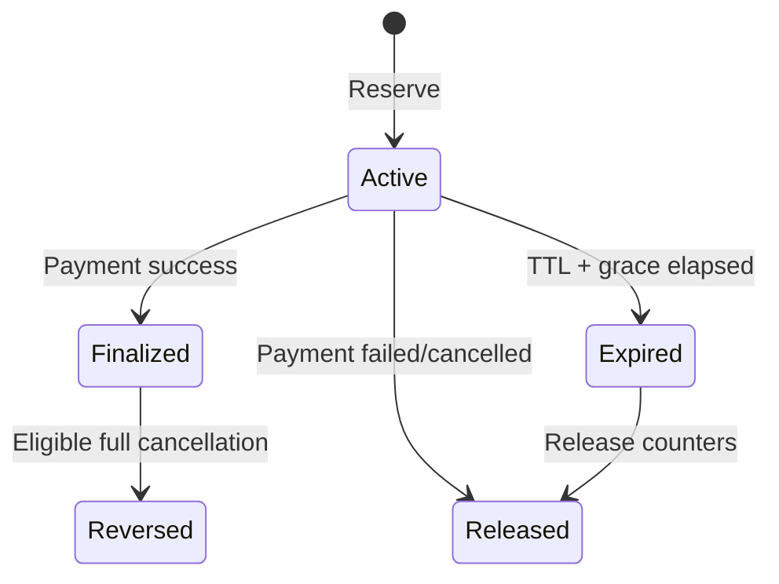

# Technical Design Specification — Promo Code & Voucher Marketplace

**Phiên bản:** 1.0 Draft  
**Ngày:** 2026-09-01  
**Stack:** Node.js, TypeScript, Express, PostgreSQL, Redis  
**Kiến trúc:** Modular monolith  
**Tài liệu nghiệp vụ:** [PROMO_CODE_MARKETPLACE_SRS.md](PROMO_CODE_MARKETPLACE_SRS.md)

---

## 1. Mục đích

Tài liệu này chuyển các yêu cầu trong SRS thành thiết kế kỹ thuật có thể triển khai. Nội dung tập trung vào:

- Ranh giới module và dependency direction.
- Domain model và TypeScript contracts.
- PostgreSQL schema, indexes và transaction boundaries.
- Redis cache/rate-limit strategy.
- Promotion Engine, stacking và allocation algorithms.
- Multi-seller checkout, payment reservation và redemption ledger.
- Concurrency, idempotency, failure recovery và reconciliation.
- Express API, error model, authorization và validation.
- Testing, observability, migration và rollout.

Tài liệu không thay thế SRS. Mọi thay đổi nghiệp vụ phải cập nhật SRS/Decision Log trước, sau đó mới cập nhật technical design.

---

## 2. Technical decisions

| ID | Quyết định kỹ thuật | Lý do |
|---|---|---|
| TDEC-001 | Promotion là một module độc lập trong modular monolith. | Giữ transaction nội bộ đơn giản nhưng không để logic rải trong Checkout/Order. |
| TDEC-002 | PostgreSQL là source of truth cho definition, quota, budget, reservation, redemption và ledger. | Cần ACID và row-level locking cho dữ liệu tài chính. |
| TDEC-003 | Redis chỉ dùng cache, rate limit và dữ liệu có thể tái tạo. | Redis outage không được làm sai quota/budget. |
| TDEC-004 | Promotion Engine là pure domain service, không gọi DB/Redis/network. | Deterministic, test nhanh, dễ replay và audit. |
| TDEC-005 | Mọi amount dùng minor-unit `bigint`; percentage dùng basis points. | Tránh floating-point và sai số tiền. |
| TDEC-006 | API serialize money amount thành chuỗi số nguyên. | JSON không hỗ trợ JavaScript `bigint` an toàn. |
| TDEC-007 | Financial write dùng PostgreSQL transaction và lock theo thứ tự cố định. | Tránh overspend và giảm deadlock. |
| TDEC-008 | Dùng transactional outbox cho integration events. | Không cần distributed transaction với worker/payment integration. |
| TDEC-009 | Refund dùng order snapshot/allocation; không chạy lại engine. | Bảo toàn lịch sử giá và settlement. |
| TDEC-010 | Rule config dùng typed JSONB có `schemaVersion`, kết hợp các cột/index chuẩn hóa. | Đủ linh hoạt cho benefit đa dạng nhưng vẫn migrate/validate được. |
| TDEC-011 | Không dùng Redis distributed lock để đảm bảo quota. | Lock có thể hết hạn/split-brain; PostgreSQL đã là authority. |
| TDEC-012 | Không xây combinatorial “best discount optimizer” trong v1. | SRS yêu cầu customer tự chọn khi conflict. |

### 2.1 Source-of-truth hierarchy

1. SRS và Decision Log: nghiệp vụ.
2. PostgreSQL order/promotion snapshots: giao dịch đã phát sinh.
3. PostgreSQL current promotion definitions: rule hiện hành.
4. Redis: bản sao tăng tốc, có thể xóa và dựng lại.
5. Client state: chỉ phục vụ UX, không quyết định giá.

---

## 3. Kiến trúc tổng thể



### 3.1 Module boundaries

| Module | Trách nhiệm | Promotion được phép dùng |
|---|---|---|
| `promotions` | Definition, code, wallet, evaluation, reservation, redemption, ledger | Ports/interfaces của các module khác |
| `checkout` | Cart snapshot, shipping/fee quote, price version, apply/remove UX state | Promotion application service |
| `orders` | Order Group, Seller Orders, immutable financial snapshot, refund | Promotion snapshot/allocation API |
| `payments` | Payment attempt, provider callbacks, payment status | Reservation/finalization application service |
| `catalog` | Product/SKU/category/seller ownership | Read port/batch resolver |
| `inventory` | Gift stock availability/reservation | Gift availability port |
| `customers` | Account, segment, order history | Eligibility context port |
| `identity` | Guest verified email/phone, OTP state | Identity context port |
| `sellers` | Seller ownership/status/permissions | Authorization port |
| `shipping` | Shipment quote, seller responsibility | Checkout snapshot |
| `fees` | Platform/service fees | Checkout snapshot |

### 3.2 Dependency rules

- `promotions/domain` không import Express, PostgreSQL client, Redis client hoặc module implementation khác.
- `promotions/application` chỉ phụ thuộc domain và ports.
- `promotions/infrastructure` implement repositories/ports.
- `promotions/http` map HTTP DTO sang commands/queries.
- Module khác không query trực tiếp bảng promotion.
- Không để Checkout tự tính phần trăm/fixed discount.
- Không để Payment tự sửa counters; Payment gọi Promotion application service hoặc phát event nội bộ.

---

## 4. Cấu trúc thư mục đề xuất

```text
src/
  modules/
    promotions/
      domain/
        entities/
        value-objects/
        rules/
        benefits/
        engine/
        allocation/
        errors/
      application/
        commands/
        queries/
        services/
        ports/
        dto/
      infrastructure/
        postgres/
          repositories/
          mappers/
          migrations/
        redis/
        outbox/
      http/
        routes/
        controllers/
        middleware/
        schemas/
        presenters/
      workers/
        reservation-expiry.worker.ts
        outbox-publisher.worker.ts
        reconciliation.worker.ts
      index.ts
  shared/
    db/
    redis/
    idempotency/
    observability/
    money/
```

### 4.1 Public module facade

Chỉ export facade/ports cần cho module khác:

```ts
export interface PromotionsFacade {
  preview(command: PreviewPromotionsCommand): Promise<PromotionPreview>;
  reserve(command: ReservePromotionsCommand): Promise<ReservationResult>;
  finalize(command: FinalizeRedemptionCommand): Promise<void>;
  release(command: ReleaseReservationCommand): Promise<void>;
  restore(command: RestoreRedemptionCommand): Promise<void>;
  getOrderPromotionSnapshot(orderGroupId: string): Promise<OrderPromotionSnapshot>;
}
```

Không export repositories hoặc internal database models.

---

## 5. Domain model TypeScript

### 5.1 Money và percentage

```ts
export type CurrencyCode = string;

export interface Money {
  readonly amount: bigint;
  readonly currency: CurrencyCode;
}

export type BasisPoints = number & { readonly __brand: 'BasisPoints' };

export function assertBasisPoints(value: number): BasisPoints {
  if (!Number.isInteger(value) || value < 0 || value > 10_000) {
    throw new DomainError('INVALID_BASIS_POINTS');
  }
  return value as BasisPoints;
}
```

Quy ước:

- `10_000` basis points = 100%.
- Không dùng `number` cho money amount trong domain.
- Không trộn hai Money khác currency.
- HTTP DTO dùng string: `{ "amount": "100000", "currency": "VND" }`.
- PostgreSQL `bigint` thường được Node PostgreSQL driver trả về dạng string; repository mapper phải parse rõ sang `bigint`, không ép qua `Number`.

### 5.2 Promotion definition

```ts
export type PromotionStatus =
  | 'DRAFT'
  | 'SCHEDULED'
  | 'ACTIVE'
  | 'PAUSED'
  | 'EXHAUSTED'
  | 'EXPIRED'
  | 'ENDED'
  | 'CANCELLED'
  | 'ARCHIVED';

export type PromotionLayer =
  | 'ITEM_AND_GIFT'
  | 'SELLER_ORDER'
  | 'MARKETPLACE_ORDER'
  | 'SHIPPING'
  | 'SERVICE_FEE';

export interface PromotionDefinition {
  readonly id: string;
  readonly campaignId: string;
  readonly revision: number;
  readonly owner: PromotionOwner;
  readonly status: PromotionStatus;
  readonly layer: PromotionLayer;
  readonly priority: number;
  readonly currency: CurrencyCode;
  readonly schedule: PromotionSchedule;
  readonly benefit: PromotionBenefit;
  readonly scopes: readonly PromotionScope[];
  readonly conditions: readonly PromotionCondition[];
  readonly stacking: StackingPolicy;
  readonly guestPolicy: GuestPolicy;
  readonly funding: FundingPolicy;
  readonly limits: PromotionLimits;
  readonly firstRedeemedAt: Date | null;
}
```

### 5.3 Discriminated benefit union

```ts
export type PromotionBenefit =
  | { type: 'PERCENT_OFF'; basisPoints: BasisPoints; maxDiscount?: Money }
  | { type: 'FIXED_AMOUNT_OFF'; amount: Money }
  | { type: 'FIXED_PRICE'; targetPrice: Money; maxUnits?: number }
  | { type: 'BUY_X_GET_Y_PERCENT'; buyQty: number; getQty: number; basisPoints: BasisPoints; selection: ItemSelection }
  | { type: 'BUY_X_GET_Y_FREE'; buyQty: number; giftSkuId: string; giftQty: number }
  | { type: 'TIERED_DISCOUNT'; tiers: readonly DiscountTier[] }
  | { type: 'BUNDLE_DISCOUNT'; bundle: BundleRequirement; discount: BundleDiscount }
  | { type: 'NTH_ITEM_DISCOUNT'; nth: number; discount: UnitDiscount; selection: ItemSelection }
  | { type: 'FREE_SHIPPING'; maxDiscount?: Money }
  | { type: 'SHIPPING_DISCOUNT'; discount: UnitDiscount; maxDiscount?: Money }
  | { type: 'SERVICE_FEE_DISCOUNT'; discount: UnitDiscount; maxDiscount?: Money }
  | { type: 'ORDER_DISCOUNT'; discount: UnitDiscount; maxDiscount?: Money }
  | { type: 'FREE_GIFT'; giftSkuId: string; giftQty: number; outOfStockPolicy: GiftStockPolicy };
```

Mỗi union variant phải có schema validation riêng và `schemaVersion` khi persist JSONB.

### 5.4 Checkout snapshot

```ts
export interface PriceableCheckoutSnapshot {
  readonly checkoutId: string;
  readonly priceVersion: string;
  readonly currency: CurrencyCode;
  readonly customer: CustomerPromotionContext;
  readonly lines: readonly PriceableLine[];
  readonly sellerGroups: readonly SellerGroup[];
  readonly shipments: readonly PriceableShipment[];
  readonly fees: readonly PriceableFee[];
  readonly appliedActivations: readonly PromotionActivation[];
  readonly evaluatedAt: Date;
}

export interface PriceableLine {
  readonly id: string;
  readonly sellerId: string;
  readonly productId: string;
  readonly skuId: string;
  readonly categoryPathIds: readonly string[];
  readonly brandId?: string;
  readonly quantity: number;
  readonly unitPrice: Money;
  readonly subtotal: Money;
  readonly tags: readonly string[];
}
```

Snapshot phải chứa đủ dữ liệu để engine không gọi Catalog/Customer trong lúc tính.

### 5.5 Engine output

```ts
export interface PromotionPreview {
  readonly priceVersion: string;
  readonly promotionRevisionSetHash: string;
  readonly applications: readonly PromotionApplicationResult[];
  readonly conflicts: readonly PromotionConflict[];
  readonly rejected: readonly PromotionRejection[];
  readonly totals: CheckoutTotals;
  readonly invariants: readonly InvariantResult[];
}

export interface PromotionApplicationResult {
  readonly promotionId: string;
  readonly revision: number;
  readonly activation: PromotionActivation;
  readonly sequence: number;
  readonly eligibleAmount: Money;
  readonly discount: Money;
  readonly allocations: readonly PromotionAllocationResult[];
  readonly funding: FundingPolicy;
  readonly explanation: PromotionExplanation;
}
```

---

## 6. PostgreSQL data model

### 6.1 Quy ước chung

- Primary key: UUID/ULID theo convention hiện tại; ví dụ dưới dùng `uuid`.
- Timestamp: `timestamptz`, lưu UTC.
- Money: `bigint` minor units + `currency_code varchar(3)`.
- Percentage: `integer` basis points.
- Mutable records có `version integer` để optimistic concurrency.
- Trạng thái dùng `varchar` + CHECK hoặc lookup table; tránh PostgreSQL enum nếu đội muốn migration linh hoạt.
- JSONB luôn có `schemaVersion` và validate ở application layer.

### 6.2 Definition tables

```sql
create table promotion_campaigns (
  id uuid primary key,
  owner_type varchar(20) not null check (owner_type in ('MARKETPLACE', 'SELLER')),
  owner_id uuid,
  name varchar(200) not null,
  status varchar(20) not null,
  currency_code varchar(3) not null,
  budget_amount bigint,
  created_by uuid not null,
  created_at timestamptz not null default now(),
  updated_at timestamptz not null default now(),
  version integer not null default 1,
  check (budget_amount is null or budget_amount >= 0),
  check ((owner_type = 'SELLER' and owner_id is not null) or owner_type = 'MARKETPLACE')
);

create table promotions (
  id uuid primary key,
  campaign_id uuid not null references promotion_campaigns(id),
  revision integer not null default 1,
  owner_type varchar(20) not null check (owner_type in ('MARKETPLACE', 'SELLER')),
  owner_id uuid,
  status varchar(20) not null,
  name varchar(200) not null,
  description text,
  layer smallint not null,
  priority integer not null default 100,
  stacking_mode varchar(20) not null,
  exclusive_group varchar(100),
  compatible_groups jsonb not null default '[]'::jsonb,
  calculation_base varchar(40) not null,
  currency_code varchar(3) not null,
  start_at timestamptz not null,
  end_at timestamptz,
  timezone varchar(100) not null,
  allow_guest boolean not null default false,
  guest_verification varchar(30) not null,
  identity_limit_scope varchar(40) not null,
  first_redeemed_at timestamptz,
  published_at timestamptz,
  rule_schema_version integer not null,
  created_by uuid not null,
  created_at timestamptz not null default now(),
  updated_at timestamptz not null default now(),
  version integer not null default 1,
  unique (id, revision),
  check (end_at is null or end_at > start_at)
);

create table promotion_benefits (
  promotion_id uuid primary key references promotions(id) on delete cascade,
  benefit_type varchar(50) not null,
  target_type varchar(30) not null,
  config jsonb not null,
  schema_version integer not null,
  check (jsonb_typeof(config) = 'object')
);

create table promotion_scopes (
  id uuid primary key,
  promotion_id uuid not null references promotions(id) on delete cascade,
  mode varchar(10) not null check (mode in ('INCLUDE', 'EXCLUDE')),
  scope_type varchar(30) not null,
  scope_id uuid,
  scope_value varchar(200),
  created_at timestamptz not null default now()
);

create index idx_promotion_scopes_lookup
  on promotion_scopes (promotion_id, mode, scope_type, scope_id);

create table promotion_conditions (
  id uuid primary key,
  promotion_id uuid not null references promotions(id) on delete cascade,
  condition_type varchar(50) not null,
  operator varchar(20) not null,
  config jsonb not null,
  schema_version integer not null
);

create table promotion_funding (
  promotion_id uuid primary key references promotions(id) on delete cascade,
  funding_source varchar(20) not null check (funding_source in ('MARKETPLACE', 'SELLER')),
  funder_id uuid,
  config jsonb not null default '{}'::jsonb
);

create table promotion_limits (
  promotion_id uuid primary key references promotions(id) on delete cascade,
  global_redemption_limit bigint,
  per_identity_limit integer,
  budget_amount bigint,
  daily_redemption_limit bigint,
  daily_budget_amount bigint,
  claim_issuance_limit bigint,
  check (global_redemption_limit is null or global_redemption_limit >= 0),
  check (per_identity_limit is null or per_identity_limit >= 0),
  check (budget_amount is null or budget_amount >= 0)
);
```

### 6.3 Code và wallet

```sql
create table promotion_codes (
  id uuid primary key,
  promotion_id uuid not null references promotions(id),
  code_type varchar(20) not null check (code_type in ('PUBLIC', 'PERSONAL')),
  lookup_hash bytea not null,
  public_normalized_code varchar(100),
  code_preview varchar(20) not null,
  assigned_customer_id uuid,
  status varchar(20) not null,
  valid_from timestamptz,
  valid_to timestamptz,
  created_at timestamptz not null default now(),
  unique (lookup_hash),
  check (
    (code_type = 'PUBLIC' and public_normalized_code is not null)
    or (code_type = 'PERSONAL' and assigned_customer_id is not null)
  )
);

create unique index uq_public_promotion_code
  on promotion_codes (upper(public_normalized_code))
  where public_normalized_code is not null;

create table wallet_entitlements (
  id uuid primary key,
  promotion_id uuid not null references promotions(id),
  customer_id uuid not null,
  status varchar(20) not null,
  source varchar(30) not null,
  claimed_at timestamptz not null default now(),
  expires_at timestamptz,
  used_redemption_id uuid,
  version integer not null default 1,
  unique (promotion_id, customer_id)
);
```

Personal code lookup:

```text
lookup_hash = HMAC-SHA256(server_secret, normalize(code))
```

- Không log raw personal code.
- `code_preview` chỉ chứa phần mask đủ cho support, ví dụ `ABCD…9X2K`.
- Public code không được xem là secret; có thể lưu normalized text để hiển thị.

### 6.4 Counters, reservation và ledger

```sql
create table promotion_campaign_counters (
  campaign_id uuid primary key references promotion_campaigns(id),
  redeemed_budget bigint not null default 0,
  reserved_budget bigint not null default 0,
  version bigint not null default 0,
  updated_at timestamptz not null default now(),
  check (redeemed_budget >= 0 and reserved_budget >= 0)
);

create table promotion_counters (
  promotion_id uuid primary key references promotions(id),
  redeemed_count bigint not null default 0,
  reserved_count bigint not null default 0,
  redeemed_budget bigint not null default 0,
  reserved_budget bigint not null default 0,
  version bigint not null default 0,
  updated_at timestamptz not null default now(),
  check (redeemed_count >= 0 and reserved_count >= 0),
  check (redeemed_budget >= 0 and reserved_budget >= 0)
);

create table promotion_identity_counters (
  promotion_id uuid not null references promotions(id),
  identity_key bytea not null,
  redeemed_count integer not null default 0,
  reserved_count integer not null default 0,
  updated_at timestamptz not null default now(),
  primary key (promotion_id, identity_key),
  check (redeemed_count >= 0 and reserved_count >= 0)
);

create table promotion_daily_counters (
  promotion_id uuid not null references promotions(id),
  bucket_date date not null,
  timezone varchar(100) not null,
  redeemed_count bigint not null default 0,
  reserved_count bigint not null default 0,
  redeemed_budget bigint not null default 0,
  reserved_budget bigint not null default 0,
  primary key (promotion_id, bucket_date),
  check (redeemed_count >= 0 and reserved_count >= 0),
  check (redeemed_budget >= 0 and reserved_budget >= 0)
);

create table promotion_claim_counters (
  promotion_id uuid primary key references promotions(id),
  claimed_count bigint not null default 0,
  updated_at timestamptz not null default now(),
  check (claimed_count >= 0)
);

create table promotion_reservations (
  id uuid primary key,
  checkout_id uuid not null,
  payment_attempt_id uuid not null,
  order_group_id uuid,
  status varchar(20) not null check (status in ('ACTIVE', 'FINALIZED', 'RELEASED', 'EXPIRED')),
  currency_code varchar(3) not null,
  total_reserved_budget bigint not null,
  expires_at timestamptz not null,
  release_after timestamptz not null,
  idempotency_key varchar(200) not null,
  created_at timestamptz not null default now(),
  finalized_at timestamptz,
  released_at timestamptz,
  unique (idempotency_key),
  unique (payment_attempt_id)
);

create index idx_promotion_reservation_expiry
  on promotion_reservations (release_after, id)
  where status = 'ACTIVE';

create table promotion_reservation_items (
  reservation_id uuid not null references promotion_reservations(id),
  application_key uuid not null,
  promotion_id uuid not null references promotions(id),
  promotion_revision integer not null,
  identity_key bytea not null,
  reserved_usage integer not null,
  reserved_budget bigint not null,
  application_snapshot jsonb not null,
  primary key (reservation_id, application_key),
  check (reserved_usage > 0 and reserved_budget >= 0)
);

create table promotion_redemptions (
  id uuid primary key,
  promotion_id uuid not null references promotions(id),
  promotion_revision integer not null,
  reservation_id uuid not null references promotion_reservations(id),
  application_key uuid not null,
  code_id uuid references promotion_codes(id),
  entitlement_id uuid references wallet_entitlements(id),
  order_group_id uuid not null,
  customer_id uuid,
  guest_identity_key bytea,
  discount_amount bigint not null,
  currency_code varchar(3) not null,
  status varchar(20) not null check (status in ('FINALIZED', 'REVERSED')),
  finalized_at timestamptz not null,
  reversed_at timestamptz,
  reversal_reason varchar(100),
  unique (order_group_id, application_key),
  unique (reservation_id, application_key),
  check (discount_amount >= 0)
);

create table promotion_ledger (
  id uuid primary key,
  promotion_id uuid not null references promotions(id),
  reservation_id uuid,
  redemption_id uuid,
  entry_type varchar(30) not null,
  usage_delta integer not null,
  budget_delta bigint not null,
  identity_key bytea,
  idempotency_key varchar(200) not null unique,
  metadata jsonb not null default '{}'::jsonb,
  created_at timestamptz not null default now()
);
```

Ledger là append-only. Không xóa hoặc update entry tài chính; reversal tạo compensating entry.

### 6.5 Application và allocation snapshot

```sql
create table order_promotion_applications (
  id uuid primary key,
  order_group_id uuid not null,
  application_key uuid not null,
  promotion_id uuid not null,
  promotion_revision integer not null,
  code_id uuid,
  entitlement_id uuid,
  sequence integer not null,
  eligible_amount bigint not null,
  discount_amount bigint not null,
  currency_code varchar(3) not null,
  rule_snapshot jsonb not null,
  explanation_snapshot jsonb not null,
  created_at timestamptz not null default now(),
  unique (order_group_id, application_key),
  check (eligible_amount >= 0 and discount_amount >= 0)
);

create table order_promotion_allocations (
  id uuid primary key,
  application_id uuid not null references order_promotion_applications(id),
  target_type varchar(30) not null,
  target_id uuid not null,
  seller_order_id uuid,
  amount bigint not null,
  currency_code varchar(3) not null,
  funding_source varchar(20) not null,
  funder_id uuid,
  created_at timestamptz not null default now(),
  check (amount >= 0)
);

create index idx_promotion_allocations_refund
  on order_promotion_allocations (seller_order_id, target_type, target_id);
```

### 6.6 Audit và outbox

```sql
create table promotion_audit_logs (
  id uuid primary key,
  actor_type varchar(30) not null,
  actor_id uuid,
  entity_type varchar(30) not null,
  entity_id uuid not null,
  action varchar(50) not null,
  before_state jsonb,
  after_state jsonb,
  reason text,
  correlation_id varchar(100),
  created_at timestamptz not null default now()
);

create table outbox_events (
  id uuid primary key,
  aggregate_type varchar(50) not null,
  aggregate_id uuid not null,
  event_type varchar(100) not null,
  payload jsonb not null,
  occurred_at timestamptz not null,
  published_at timestamptz,
  attempts integer not null default 0,
  next_attempt_at timestamptz not null default now(),
  last_error text
);

create index idx_outbox_unpublished
  on outbox_events (next_attempt_at, id)
  where published_at is null;
```

---

## 7. Promotion Engine

### 7.1 Contract

```ts
export interface PromotionEngine {
  evaluate(input: PromotionEvaluationInput): PromotionPreview;
}

export interface PromotionEvaluationInput {
  checkout: PriceableCheckoutSnapshot;
  candidates: readonly PromotionDefinition[];
  requestedActivations: readonly PromotionActivation[];
  systemPolicy: PromotionSystemPolicy;
  now: Date;
}
```

Engine không được:

- Gọi repository.
- Đọc clock trực tiếp; `now` được truyền vào.
- Sinh random ID.
- Đọc environment variables.
- Mutate input.
- Dựa vào thứ tự query DB không xác định.

### 7.2 Evaluation pipeline



Chi tiết:

1. Kiểm tra currency và checkout arithmetic.
2. Validate promotion status/schedule/revision.
3. Validate code/entitlement/customer binding ở application layer; engine nhận activation đã resolve.
4. Resolve item/shipment/fee scope.
5. Evaluate customer/guest/minimum conditions.
6. Tạo conflict graph theo stacking group.
7. Nếu có conflict chưa được customer resolve, không tự chọn.
8. Sort promotion theo layer, priority và deterministic tie-break.
9. Tính benefit trên original/remaining base.
10. Clamp target amounts.
11. Allocate order-level/seller-level discount.
12. Kiểm tra invariants.
13. Trả explanation codes và values.

### 7.3 Benefit strategy

```ts
export interface BenefitCalculator<T extends PromotionBenefit = PromotionBenefit> {
  supports(benefit: PromotionBenefit): benefit is T;
  calculate(context: BenefitContext, benefit: T): BenefitResult;
}
```

Mỗi benefit có một calculator riêng. Không tạo một function lớn chứa toàn bộ `switch` và side effects.

### 7.4 Scope matcher

Quy tắc:

- Tính include set.
- Nếu không có include cụ thể, dùng owner/system default scope.
- Trừ toàn bộ exclude set.
- Seller promotion luôn intersect với `sellerId = ownerId`.
- Category path đã hydrate sẵn để match descendant không query DB.

### 7.5 Stacking conflict

```ts
export interface PromotionConflict {
  readonly conflictId: string;
  readonly incomingPromotionId: string;
  readonly conflictingApplicationIds: readonly string[];
  readonly keepCurrentPreview: ConflictPriceOption;
  readonly useIncomingPreview: ConflictPriceOption;
}
```

`conflictId` là hash của checkout price version + incoming promotion revision + current application IDs. Nếu cart thay đổi, conflict cũ không còn hợp lệ.

### 7.6 Percent calculation

```text
discount = floor(base_amount × basis_points / 10_000)
discount = min(discount, configured_cap, remaining_target_amount)
```

Không dùng decimal float.

### 7.7 Largest-remainder allocation

```ts
type AllocationWeight = { targetId: string; weight: bigint };

export function allocateProRata(
  totalDiscount: bigint,
  weights: readonly AllocationWeight[],
): Map<string, bigint> {
  const totalWeight = weights.reduce((sum, x) => sum + x.weight, 0n);
  if (totalDiscount < 0n || totalWeight <= 0n) throw new DomainError('INVALID_ALLOCATION');

  const rows = weights.map((x) => {
    const numerator = totalDiscount * x.weight;
    return {
      targetId: x.targetId,
      amount: numerator / totalWeight,
      remainder: numerator % totalWeight,
    };
  });

  let remaining = totalDiscount - rows.reduce((sum, x) => sum + x.amount, 0n);
  rows.sort((a, b) => {
    if (a.remainder === b.remainder) {
      if (a.targetId === b.targetId) return 0;
      return a.targetId < b.targetId ? -1 : 1;
    }
    return a.remainder > b.remainder ? -1 : 1;
  });

  for (let i = 0; remaining > 0n; i += 1, remaining -= 1n) rows[i].amount += 1n;
  return new Map(rows.map((x) => [x.targetId, x.amount]));
}
```

Production code phải thêm clamp/capacity redistribution nếu target có remaining amount nhỏ hơn allocation thô.

### 7.8 Engine invariants

Mọi preview phải assert:

```text
line subtotal = unit price × quantity
sum(application allocations) = application discount
sum(application discounts) = checkout discount
target allocations <= target original amount
seller-funded allocations only target owner seller assets
marketplace fee discount funding source = marketplace
payable >= 0
all monetary currencies equal checkout currency
application order deterministic
```

Invariant fail là server error/alert, không trả preview “best effort”.

---

## 8. Candidate resolution và cache

### 8.1 Candidate query

Không load toàn bộ active promotions. Candidate resolver sử dụng:

- Explicit public/personal codes khách nhập.
- Wallet entitlement IDs khách chọn.
- Seller IDs có trong checkout.
- Product/SKU/category IDs có trong checkout.
- Promotion state/time window.

Auto-apply không thuộc v1 nên candidate set chủ yếu đến từ activation explicit.

### 8.2 Redis keys

```text
promo:def:{promotionId}:{revision}          -> serialized hydrated definition
promo:code:{lookupHash}                    -> promotionCodeId/promotionId
promo:wallet:{customerId}:version           -> wallet cache version
promo:ratelimit:apply:{ip}:{window}         -> counter
promo:ratelimit:session:{checkoutId}        -> counter
promo:ratelimit:identity:{identityHash}      -> counter
```

### 8.3 Cache rules

- Cache-aside, TTL ngắn-vừa tùy definition volatility.
- Cache value chứa revision/schema version.
- Definition mutation ghi outbox event `PromotionDefinitionChanged` trong cùng DB transaction.
- Consumer xóa keys liên quan; stale entry vẫn bị phát hiện qua revision khi cần.
- Cache miss fallback PostgreSQL.
- Redis unavailable: bỏ cache, dùng DB; rate-limit có degraded policy được cấu hình.
- Không cache counters để quyết định reserve.

---

## 9. Code và wallet flows

### 9.1 Code normalization

```ts
export function normalizePromoCode(raw: string): string {
  return raw
    .normalize('NFKC')
    .trim()
    .toUpperCase();
}
```

Sau normalize:

- Validate length.
- Validate allow-list characters.
- Compute HMAC lookup hash.
- Rate limit trước/đồng thời với lookup.
- Không cho client biết personal code thuộc customer nào.

### 9.2 Wallet claim transaction

```text
BEGIN
  SELECT promotion and claim policy
  validate claim window/customer
  INSERT wallet_entitlement ... ON CONFLICT -> return existing
  optionally increment claim issuance counter
  INSERT audit/outbox
COMMIT
```

Không update `promotion_counters.reserved_*` hoặc `redeemed_*` khi claim.

### 9.3 Personal code

- Application layer resolve code bằng lookup hash.
- So sánh assigned customer với authenticated customer.
- Guest chỉ dùng nếu identity đã verify và code được gán theo cơ chế đó; mặc định yêu cầu login.
- Code dùng một lần vẫn được kiểm soát bằng redemption/per-identity limit, không chỉ đổi status trước payment.

---

## 10. Preview/apply flow

### 10.1 Read path

1. HTTP middleware xác thực customer hoặc guest checkout ownership.
2. Validate request DTO.
3. Rate limit apply attempts.
4. Load Checkout snapshot và `priceVersion`.
5. Resolve code/entitlement thành activation.
6. Batch load hydrated Promotion definitions.
7. Load customer usage summary cần cho eligibility; đây là advisory ở preview.
8. Chạy pure engine.
9. Store applied activation references trên Checkout Session bằng optimistic version.
10. Trả preview mới.

Preview không giữ quota và không đảm bảo voucher còn lượt khi payment bắt đầu.

### 10.2 Optimistic checkout version

- Client gửi `priceVersion` hiện tại.
- Checkout mutation tạo version mới.
- Nếu version mismatch, server trả `PROMO_PRICE_CHANGED` với preview mới.
- Conflict resolution chỉ hợp lệ với đúng price version/conflict hash.

### 10.3 Không persist preview như financial truth

Checkout có thể cache preview để UX nhanh, nhưng Place Order phải hydrate/re-evaluate và reserve lại. Order snapshot chỉ được tạo từ kết quả trong transaction/place-order workflow.

---

## 11. Reservation transaction

### 11.1 Lock ordering

Mọi code path reserve/finalize/release/restore phải lock theo cùng thứ tự:

1. Campaign counter nếu dùng shared campaign budget, sort campaign ID.
2. Promotion counter, sort promotion ID.
3. Daily counter bucket, sort `(promotion ID, bucket date)`.
4. Identity counter, sort `(promotion ID, identity key)`.
5. Reservation row.
6. Wallet entitlement row nếu có.

Không thay đổi thứ tự giữa các code path.

### 11.2 Isolation

Mặc định có thể dùng `READ COMMITTED` với explicit `SELECT ... FOR UPDATE`. Không nâng toàn hệ thống lên SERIALIZABLE nếu chưa benchmark. Với transaction đặc biệt phức tạp có thể dùng SERIALIZABLE + retry có giới hạn.

### 11.3 Reserve algorithm

```text
BEGIN
  verify idempotency key; return existing if present
  load latest checkout snapshot
  evaluate promotions using current revisions
  insert missing daily/identity counter rows ON CONFLICT DO NOTHING
  lock campaign/promotion/daily/identity counter rows in deterministic order
  re-check global limit, budget, daily bucket, per-identity limit
  insert reservation + reservation items
  increment reserved_count/reserved_budget counters
  mark wallet entitlement RESERVED logically if policy needs exclusivity
  create payment attempt linkage and outbox event
COMMIT
```

Counter check:

```text
available_usage = global_limit - redeemed_count - reserved_count
available_budget = budget_amount - redeemed_budget - reserved_budget
```

Nếu limit là null thì coi là unlimited.

### 11.4 Multi-promotion atomicity

Vì checkout có thể dùng nhiều promotion, reserve tất cả trong một transaction. Nếu bất kỳ promotion nào fail, rollback toàn bộ reservation set và trả preview mới. Không để checkout ở trạng thái chỉ reserve một phần tổ hợp.

### 11.5 Deadlock handling

- Lock ordering là biện pháp chính.
- PostgreSQL vẫn có thể báo deadlock; retry toàn transaction tối đa 2–3 lần với jitter.
- Idempotency key giữ nguyên khi retry.
- Sau giới hạn retry, trả lỗi tạm thời có correlation ID.

---

## 12. Payment và redemption

### 12.1 State relation



### 12.2 Payment attempt timing

- PSP payment expiry phải nhỏ hơn hoặc bằng reservation expiry.
- Reservation có `release_after = expires_at + webhook_grace_period`.
- Worker không release ngay tại `expires_at`; dùng grace để nhận webhook trễ.
- Payment module persist provider status/timestamp trước khi gọi finalize.
- Vì modular monolith dùng cùng PostgreSQL, payment status update, order creation, promotion finalization và outbox có thể nằm trong một coordinated transaction nếu ranh giới hiện tại cho phép.

### 12.3 Finalize algorithm

```text
BEGIN
  deduplicate payment-success event
  lock reservation
  if FINALIZED -> return success
  verify payment attempt, amount, currency and order group
  lock counters in deterministic order
  decrement reserved counters
  increment redeemed counters
  insert redemption rows and FINALIZE ledger entries
  persist order applications/allocations/rule snapshots
  mark wallet entitlement USED
  set promotion.first_redeemed_at if null
  mark reservation FINALIZED
  insert outbox events
COMMIT
```

### 12.4 Payment failure/release

```text
BEGIN
  lock reservation
  if RELEASED/FINALIZED -> idempotent outcome
  confirm payment is non-success or expiry policy allows release
  lock counters
  decrement reserved counters
  append RELEASE ledger entries
  unlock entitlement if needed
  mark reservation RELEASED
COMMIT
```

### 12.5 Late payment anomaly

Nếu PSP báo payment success sau khi reservation đã release:

1. Không tự hủy hoặc giảm quyền lợi của paid order.
2. Thử finalize bằng transaction compensating path.
3. Nếu quota/budget đã được người khác dùng, ghi `LATE_PAYMENT_OVERAGE` ledger/metric.
4. Marketplace phải honor giá đã charge hoặc đưa vào manual reconciliation; không charge bổ sung tự động.
5. Alert Operations và kiểm tra PSP expiry/webhook latency.

Giảm khả năng xảy ra bằng PSP expiry, webhook grace và reconciliation.

---

## 13. Reservation expiry worker

Worker chạy theo batch:

```sql
select id
from promotion_reservations
where status = 'ACTIVE'
  and release_after <= now()
order by release_after, id
for update skip locked
limit 100;
```

Với mỗi batch:

- Kiểm tra payment state trong cùng DB.
- Nếu payment success: enqueue/finalize, không release.
- Nếu pending nhưng PSP chưa hết hạn bất thường: defer ngắn có giới hạn.
- Nếu failed/expired: release idempotently.
- Ghi metrics lag, batch size, released count và failures.

Nhiều worker instance có thể chạy nhờ `SKIP LOCKED`.

---

## 14. Order snapshot, cancellation và refund

### 14.1 Persist order snapshot

Trong transaction tạo order/finalize, persist:

- Order Group totals.
- Seller Order totals.
- Item/shipment/fee gross và net.
- Promotion Application revisions.
- Allocation theo target và funder.
- Customer activation reference.
- Rule/explanation snapshot.

### 14.2 Refund query

Refund service lấy allocation theo target:

```text
refundable_paid_amount(target)
  = target_gross
  - sum(discount_allocations_for_target)
  - prior_refunds_for_target
```

Không query current Promotion definition để tính refund.

### 14.3 Partial Seller Order cancellation

- Refund đúng net amount/allocation của Seller Order.
- Không reverse redemption.
- Không thay đổi wallet entitlement USED.
- Giữ funding history cho settlement/reconciliation.

### 14.4 Full eligible cancellation

Restore transaction:

```text
BEGIN
  deduplicate cancellation event
  verify every Seller Order in Order Group cancelled for eligible reason
  lock redemption and counters
  if already REVERSED -> return success
  decrement redeemed counters/budget
  append REVERSE ledger entries
  set redemptions REVERSED
  restore wallet entitlement if policy/time permits
  insert outbox/audit
COMMIT
```

Nếu promotion hết hạn và grace policy chưa chốt, chuyển record sang `RESTORATION_REVIEW_REQUIRED`; không tự sáng tạo expiry mới.

---

## 15. Seller authorization và policy enforcement

### 15.1 Server-side scope injection

Khi Seller tạo/sửa promotion:

```ts
const enforcedOwnerScope: PromotionScope = {
  mode: 'INCLUDE',
  type: 'SELLER',
  id: authenticatedSellerId,
};
```

- Bỏ qua/reject owner ID từ request nếu khác authenticated seller.
- Batch verify mọi product/SKU/gift SKU thuộc Seller.
- Seller không tạo SERVICE_FEE layer.
- Seller shipping discount chỉ target shipment có seller-funded responsibility.
- Funding bị ép `SELLER` và `funderId = authenticatedSellerId` cho Seller promotion.

### 15.2 Discount ceiling

Engine clamp seller-funded discount theo eligible seller remaining amount. Publish validation cũng từ chối cấu hình hiển nhiên vượt policy, nhưng runtime clamp vẫn bắt buộc vì cart thay đổi.

### 15.3 Rule lock

Update transaction:

1. Lock promotion row.
2. Kiểm tra `first_redeemed_at`.
3. Kiểm tra active reservations nếu sửa financial rule.
4. So sánh field-level diff với allow-list mutable fields.
5. Increment revision/version theo loại thay đổi.
6. Ghi audit và invalidation outbox.

Sau first redemption, financial diff trả `PROMO_RULE_LOCKED`; clone là command riêng.

---

## 16. Guest identity và abuse controls

### 16.1 Identity key

```text
identity_key = HMAC-SHA256(identity_secret, type + ':' + normalized_verified_value)
```

- Ưu tiên customer ID cho logged-in customer.
- Guest dùng verified phone/email khi policy yêu cầu.
- Không dùng raw email/phone trong promotion counter/ledger.
- Secret rotation cần version prefix hoặc dual-read migration.

### 16.2 Risk policy interface

```ts
export interface PromotionRiskPolicy {
  requiredVerification(input: {
    promotion: PromotionDefinition;
    customer: CustomerPromotionContext;
  }): GuestVerificationLevel;
}
```

Rule-based, synchronous, versioned config; không ML.

### 16.3 Rate limiting

Redis rate limit theo:

- IP + rolling/fixed window.
- Checkout session.
- Identity key nếu có.
- Số lần code invalid liên tiếp.

Failure policy:

- Redis timeout ngắn.
- Có thể fail-open cho low-risk public validation với local process limit.
- Fail-closed hoặc yêu cầu verification với high-risk personal/high-value promotions.
- Rate limit chỉ giảm abuse; không thay quota transaction.

---

## 17. Express HTTP layer

### 17.1 Middleware order

```text
request-id
-> structured logging context
-> authentication/guest checkout ownership
-> body size/content type
-> schema validation
-> rate limit where applicable
-> authorization
-> controller
-> domain/application error mapper
```

### 17.2 Controller rule

Controller chỉ:

- Parse DTO đã validate.
- Tạo command/query.
- Gọi application service.
- Map presenter/HTTP status.

Không đặt promotion calculation hoặc SQL trong controller.

### 17.3 Endpoint summary

| Method | Path | Application service |
|---|---|---|
| POST | `/v1/checkout-sessions/:id/promotions/validate` | `ValidatePromotionActivation` |
| POST | `/v1/checkout-sessions/:id/promotions` | `ApplyPromotionActivation` |
| DELETE | `/v1/checkout-sessions/:id/promotions/:applicationId` | `RemovePromotionActivation` |
| POST | `/v1/checkout-sessions/:id/promotion-conflicts/:conflictId/resolve` | `ResolvePromotionConflict` |
| GET | `/v1/customers/me/vouchers` | `ListWalletEntitlements` |
| POST | `/v1/promotions/:id/claim` | `ClaimWalletEntitlement` |
| POST | `/v1/promotions` | `CreatePromotionDraft` |
| PATCH | `/v1/promotions/:id` | `UpdatePromotion` |
| POST | `/v1/promotions/:id/publish` | `PublishPromotion` |
| POST | `/v1/promotions/:id/pause` | `PausePromotion` |
| POST | `/v1/promotions/:id/resume` | `ResumePromotion` |
| POST | `/v1/promotions/:id/end` | `EndPromotion` |
| POST | `/v1/promotions/:id/clone` | `ClonePromotion` |

### 17.4 Money DTO

```ts
export interface MoneyDto {
  amount: string;   // integer minor units, e.g. "100000"
  currency: string; // e.g. "VND"
}
```

Reject:

- Decimal strings.
- Exponential notation.
- Negative amounts nơi không cho phép.
- Currency mismatch.

### 17.5 Error envelope

```json
{
  "error": {
    "code": "PROMO_MIN_SPEND_NOT_MET",
    "messageKey": "promotion.minimum_spend_not_met",
    "details": {
      "requiredAmount": { "amount": "500000", "currency": "VND" },
      "missingAmount": { "amount": "120000", "currency": "VND" }
    },
    "correlationId": "req_..."
  }
}
```

Không gửi stack trace, SQL error hoặc internal personal-code data.

### 17.6 HTTP status mapping

| Nhóm | Status |
|---|---:|
| Invalid DTO/code format | 400 |
| Login/verification required | 401/403 theo auth convention |
| Permission/owner scope | 403 |
| Promotion/code không tồn tại hoặc không usable | 404 hoặc 422 theo anti-enumeration policy |
| Business eligibility/conflict | 409/422 |
| Price version conflict | 409 |
| Rate limited | 429 |
| Temporary reservation/deadlock exhausted | 503 |
| Invariant/internal error | 500 |

Chọn convention nhất quán toàn API; machine error code quan trọng hơn việc tranh luận 409 hay 422.

---

## 18. Idempotency

### 18.1 Operations bắt buộc

- Wallet claim.
- Apply mutation nếu client retry.
- Place order/reserve.
- Payment success/failure callback.
- Finalize/release.
- Refund/restoration.
- Admin manual adjustment.

### 18.2 Key scope

Idempotency uniqueness phải bao gồm operation/actor scope, ví dụ:

```text
place-order:{checkoutId}:{clientKey}
payment-success:{provider}:{providerEventId}
restore:{orderGroupId}:{cancellationEventId}
claim:{customerId}:{promotionId}:{clientKey}
```

Không chỉ tin key tùy ý của client trên global namespace.

### 18.3 Response replay

Với HTTP mutation, có thể dùng shared `idempotency_records` lưu:

- Scope/key.
- Request hash.
- Status PROCESSING/COMPLETED/FAILED_RETRYABLE.
- Response status/body.
- Expiry.

Cùng key nhưng request hash khác phải trả conflict.

---

## 19. Transactional outbox và workers

### 19.1 Publisher query

```sql
select id, event_type, payload
from outbox_events
where published_at is null
  and next_attempt_at <= now()
order by occurred_at, id
for update skip locked
limit 100;
```

### 19.2 Delivery semantics

- At-least-once delivery.
- Consumer idempotent theo event ID.
- Không yêu cầu exactly-once message broker.
- Khi chưa có external queue, worker trong cùng Node service có thể poll PostgreSQL.
- Sau này có event bus vẫn giữ outbox contract.

### 19.3 Worker lifecycle

- Graceful shutdown ngừng nhận batch mới.
- Có lease/transaction ngắn; không giữ DB transaction khi gọi network.
- Exponential backoff + jitter.
- Sau ngưỡng retry, đánh dấu/alert nhưng không xóa event.
- Metrics: backlog, oldest age, attempts, success/failure.

---

## 20. Redis availability và consistency

### 20.1 Được lưu trong Redis

- Hydrated promotion definitions theo revision.
- Code lookup cache.
- Wallet listing cache/version.
- Rate-limit counters.
- Short-lived negative cache cho invalid public codes, tránh cache lỗi auth-specific.

### 20.2 Không được lưu duy nhất trong Redis

- Redemption quota.
- Monetary budget.
- Per-customer usage truth.
- Active financial reservation.
- Redemption ledger.
- Order allocation snapshot.
- Idempotency cho payment/finalization.

### 20.3 Cache stampede

- TTL jitter.
- Single-flight trong process cho hot keys nếu cần.
- Không dùng long distributed lock.
- DB query vẫn phải có index và chịu được cache cold start.

---

## 21. Observability

### 21.1 Structured log fields

```text
request_id
correlation_id
checkout_id
price_version
order_group_id
seller_order_id
payment_attempt_id
promotion_id
promotion_revision
reservation_id
redemption_id
actor_type
actor_id (khi được phép)
operation
result_code
duration_ms
```

Không log raw personal code, raw OTP, email/phone hoặc payment credentials.

### 21.2 Metrics

- `promotion_preview_duration_ms` histogram.
- `promotion_preview_total{result_code}`.
- `promotion_conflict_total`.
- `promotion_reservation_total{status}`.
- `promotion_reservation_active` gauge.
- `promotion_reservation_expiry_lag_seconds`.
- `promotion_redemption_total{status}`.
- `promotion_budget_minor_units{funder_type}`.
- `promotion_late_payment_overage_total`.
- `promotion_reconciliation_mismatch_total{type}`.
- `promotion_cache_hit_total{cache}`.
- `promotion_rate_limited_total{dimension}`.

Không dùng promotion ID làm metric label nếu cardinality quá lớn; để trong logs/traces.

### 21.3 Tracing

Trace span đề xuất:

- `promotion.resolve_activation`
- `promotion.load_definitions`
- `promotion.evaluate`
- `promotion.allocate`
- `promotion.reserve.transaction`
- `promotion.finalize.transaction`
- `promotion.restore.transaction`

---

## 22. Reconciliation

### 22.1 Online invariants

Assert trong write transaction:

- Counters không âm.
- Reserved + redeemed không vượt configured limit.
- Reserved + redeemed budget không vượt configured budget, trừ explicit late-payment anomaly path.
- Sum allocations bằng discount.
- Payment/order currency khớp.
- Funding target hợp lệ.

### 22.2 Scheduled reconciliation

Job chạy định kỳ:

1. Tìm active reservation quá `release_after`.
2. So payment status và reservation status.
3. So finalized redemption với paid Order Group.
4. So application/allocation totals với Order totals.
5. Tái tính counters từ ledger theo batch/time window.
6. So wallet entitlement USED với redemption.
7. Tạo mismatch record và alert.

Không tự sửa financial mismatch trong job đầu tiên. Cung cấp repair command riêng có dry-run, permission và audit.

---

## 23. Security checklist

- Seller owner ID lấy từ auth context, không từ request body.
- Admin/Seller permissions kiểm tra ở application layer.
- Code input length/charset validation trước HMAC/lookup.
- Rate limit validation endpoints.
- Personal code HMAC lookup và masked logs.
- Guest identity lưu hash trong promotion subsystem.
- Parameterized SQL/ORM bindings.
- JSONB schema validation và size limits.
- Audit các financial rule mutation và manual reversal.
- Secrets trong secret manager/environment injection, không commit.
- Redis keys không chứa raw email/phone/code.
- API response chống customer/code enumeration.
- Content Security/CORS/CSRF theo auth architecture hiện tại.

---

## 24. Testing strategy

### 24.1 Unit tests

- Mỗi BenefitCalculator.
- Scope include/exclude.
- Guest/system risk override.
- Stacking compatibility và tie-break.
- Money clamp và currency guards.
- Largest-remainder allocation.
- Error explanation mapping.

### 24.2 Golden fixtures

Lưu checkout snapshots + promotion definitions + expected output dạng JSON. Mỗi bug pricing tạo một regression fixture. Golden result gồm:

- Application order.
- Eligible targets.
- Discount totals.
- Allocations.
- Rejections/conflicts.
- Explanation codes.

### 24.3 Property-based tests

Dùng `fast-check` hoặc equivalent:

- Payable không âm.
- Allocation sum luôn đúng.
- Allocation không vượt target capacity.
- Cùng input cho cùng output.
- Thêm excluded item không làm tăng eligible amount.
- Percent 0–100% không tạo discount âm/vượt base.
- Pro-rata luôn phân đủ minor units.

### 24.4 PostgreSQL integration tests

Chạy với PostgreSQL thật/Testcontainers:

- Hai transaction tranh redemption cuối.
- Multi-promotion lock order.
- Duplicate idempotency key.
- Deadlock retry.
- Reservation expiry/finalize race.
- Duplicate payment webhook.
- Full restoration retry.
- Ledger/counter reconciliation.

SQLite/in-memory DB không thay thế các test này vì semantics lock khác PostgreSQL.

### 24.5 Redis tests

- Cache hit/miss/invalidation.
- Redis unavailable fallback.
- Rate limit windows.
- Không thay đổi financial result khi xóa toàn bộ cache.

### 24.6 API contract tests

- DTO validation.
- Auth/owner scoping.
- Stable error codes.
- Money string serialization.
- Price version conflict.
- Conflict resolution token invalidation.

### 24.7 Load tests

- Hot public code trên nhiều checkout.
- Last-quota contention.
- 1–5 promotions mỗi checkout.
- Cart 100+ lines, nhiều sellers/categories.
- Outbox/reservation expiry backlog recovery.

---

## 25. Performance design

- Batch load scope entities và usage counters.
- Không query DB trong vòng lặp từng cart line.
- Compile/hydrate Promotion definitions trước khi đưa vào engine.
- Cache definition theo immutable revision.
- Index code hash, active status/time, reservations expiry, redemption identity/order.
- Giữ transaction reserve/finalize ngắn; không gọi PSP/Redis trong DB transaction.
- Sort lock targets trước transaction hoặc ngay khi có đủ IDs.
- Benchmark engine độc lập với DB.

Target ban đầu từ SRS: P95 validate/reprice ≤ 300 ms ở tải bình thường. Cần đo lại theo cart size và số promotion thực tế.

---

## 26. Migration và rollout

### 26.1 Database migration

Áp dụng expand-migrate-contract:

1. Tạo tables/indexes mới.
2. Deploy code dual-compatible nếu tích hợp hệ thống voucher cũ.
3. Backfill definitions/history cần giữ.
4. Shadow evaluate và so kết quả.
5. Bật read path theo feature flag.
6. Bật write/reservation cho internal Admin campaigns.
7. Mở Seller self-service theo cohort.
8. Xóa đường cũ chỉ sau reconciliation ổn định.

Index lớn tạo `CONCURRENTLY` ngoài transaction migration khi cần.

### 26.2 Feature flags

- `promotion_engine_v2_preview`
- `promotion_reservation_enabled`
- `seller_promotion_self_service`
- `advanced_benefits_enabled`
- `guest_promotion_enabled`
- `promotion_restore_enabled`

Không dùng feature flag để thay đổi nghĩa của order snapshot đã tạo.

### 26.3 Kill switches

- Pause Promotion cụ thể.
- Pause toàn Seller-created promotions.
- Disable guest voucher application.
- Disable new reservations trong khi vẫn finalize payment success hiện có.
- Disable advanced benefit type nếu calculator lỗi.

Kill switch không được làm mất finalize/release/reconciliation workers.

---

## 27. Implementation phases

### Phase T1 — Foundation

- Module skeleton và public facade.
- Money/value objects.
- Definition/code/wallet schema.
- Percent/fixed benefits.
- Pure engine + golden/property tests.
- Admin/Seller draft/publish/lock/audit.

### Phase T2 — Checkout và financial integrity

- Checkout snapshot integration.
- Stacking/conflict/allocation.
- Counters, reservation, ledger.
- Payment finalize/release.
- Order snapshot.
- Concurrency/idempotency integration tests.

### Phase T3 — Refund và operations

- Partial refund allocation.
- Full eligible restoration.
- Outbox workers.
- Reconciliation và support lookup.
- Metrics/alerts.

### Phase T4 — Advanced benefit catalog

- Shipping/service fee.
- Gift/BOGO/bundle/tier/nth-item.
- Gift inventory integration.
- Personal code batch.
- Guest risk overrides.

---

## 28. Requirement traceability

| SRS requirement | Technical sections |
|---|---|
| DEC-010, FR-ORD-001..003 | 3, 5.4, 6.5, 14 |
| DEC-007, FR-CODE-004 | 6.3, 9.2 |
| DEC-008..009, FR-PRICE-003..005 | 7.2, 7.5, 10 |
| DEC-013..015, FR-ORD-004..006 | 14 |
| DEC-016, FR-ORD-007..008 | 6.5, 7.8, 14 |
| DEC-017, FR-GUEST-* | 16 |
| DEC-018, FR-CAM-006 | 15.3 |
| FR-LIMIT-* | 6.4, 11, 12, 13 |
| FR-UI-* | 10, 17 |
| FR-OPS-* | 6.6, 19, 21, 22 |
| AC-004..006 | 11, 12, 24.4 |
| AC-008..009 | 14, 24.4 |
| AC-014 | 7.7, 24.2..3 |

---

## 29. Technical open questions

1. PostgreSQL client/ORM hiện dùng: `pg`, Knex, Prisma, Drizzle, TypeORM hay khác.
2. Cách quản lý transaction context giữa modules trong modular monolith.
3. Payment module và PSP có hỗ trợ payment expiry/authorization-capture hay không.
4. Queue hiện chưa có: dùng PostgreSQL outbox poller dài hạn hay sẽ thêm broker sau.
5. Currency thực tế và minor digits; ví dụ VND thường không dùng phần thập phân trong UX.
6. Tax/commission base từ SRS Open Questions.
7. Customer/guest identity verification hiện nằm ở module nào.
8. Catalog category tree được hydrate/batch resolve ra sao.
9. Gift inventory có reservation API và idempotency hay chưa.
10. Volume dự kiến: active promotions, checkout RPS, cart size và hot-code contention.
11. Chính sách late payment đã được Payment/Finance chấp thuận hay cần fail-safe khác.
12. Có hệ thống voucher cũ cần migrate/dual-run hay đây là greenfield.

Các mục này ảnh hưởng implementation detail nhưng không ngăn việc xây domain engine và schema nền tảng.

---

## 30. Technical Definition of Done

- TypeScript strict mode; không dùng `any` trong domain/application contracts.
- Promotion Engine pure và deterministic.
- Golden tests bao phủ toàn bộ benefit/stacking được release.
- Property tests xác minh monetary invariants.
- PostgreSQL concurrency tests chứng minh không overspend quota/budget.
- Redis outage test không làm sai financial truth.
- Apply/place-order/payment/refund/restoration idempotent.
- Seller authorization được test ở backend.
- Order snapshot/allocation immutable và refund không re-run engine.
- Outbox/reservation/reconciliation workers có metrics và graceful shutdown.
- Migration có rollback/kill-switch plan.
- SRS traceability được cập nhật khi requirement thay đổi.
- Finance xác nhận settlement/tax examples trước production.
