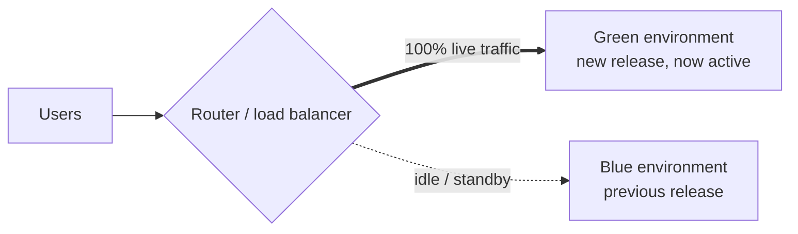
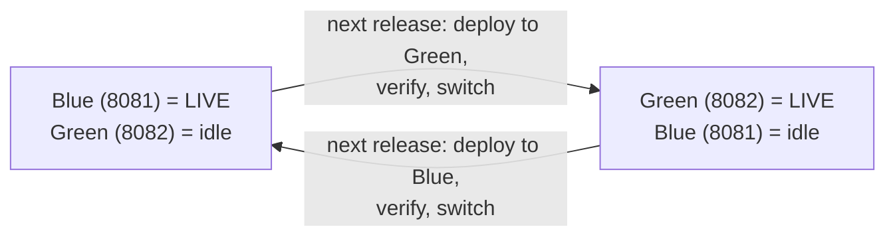
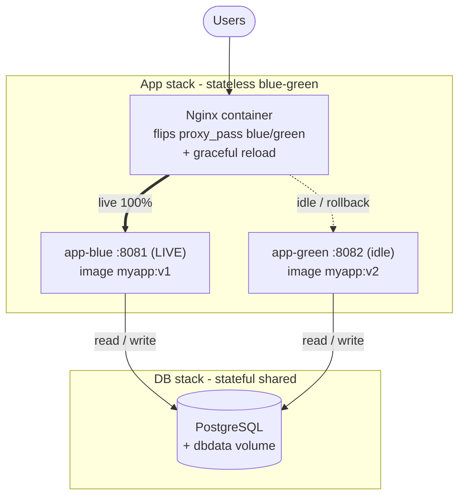

# Blue-Green Deployment

> Generic implementation reference for zero-downtime releases. Run two identical environments and switch traffic between them.

## Overview

Blue-green deployment keeps **two identical environments** — call them **Blue** and **Green**. At any moment, **one is live** (serves all user traffic) and **the other is idle**. To release a new version, you deploy it to the idle environment, verify it there, then **flip the router** so the idle environment becomes live and the previously live one becomes idle standby.

The release is a **traffic switch**, not a redeploy. Because nothing is overwritten in place, rollback is the same operation in reverse — point the router back at the previous environment.



Before the switch, Blue was live and Green was idle staging the new release. After the switch (shown above), Green is live and Blue is the standby you can flip back to.

## The switch

1. Deploy the new release to the **idle** environment (the one receiving no traffic).
2. Verify it in place — health checks, smoke tests, integration tests — without exposing it to users.
3. Repoint the router (load balancer, reverse proxy, or DNS) from the live environment to the newly deployed one.
4. The new environment is now live; the previous one becomes idle standby — your **instant rollback target**.
5. Keep the old environment warm for a rollback window, then decommission once the release is confirmed stable.

## The toggle

The slots are fixed — Blue is always one environment, Green the other. Only **live vs idle swaps**. Each new release goes into whichever slot is currently idle, then traffic flips to it. The colors never get renamed; `proxy_pass` just toggles `blue` → `green` → `blue` → …



So after Green is live and stable, the next release deploys into **Blue** and traffic flips back to Blue — no relabeling needed. Each box is a steady state; the arrows are one full release cycle.

**With real release versions** — the idle slot alternates each deploy; only live/idle swaps:

| Deploy | Deploy into (idle slot) | New release | Currently live | Live after switch |
|--------|-------------------------|-------------|----------------|-------------------|
| 1st | Green (8082) | v2 | Blue (8081) = v1 | Green (8082) = v2 |
| 2nd | Blue (8081) | v3 | Green (8082) = v2 | Blue (8081) = v3 |
| 3rd | Green (8082) | v4 | Blue (8081) = v3 | Green (8082) = v4 |

Read row 2: the **new release (v3) goes into Blue (8081)**, while **Green (8082) still serves the current release (v2)** until the switch — exactly the "blue becomes the new release, green is the current release" case.

## Nginx example

The "router" in the diagram above is Nginx here. Define one `upstream` per environment and proxy to the one that is live. Switching = repoint `proxy_pass` + reload.

```nginx
# /etc/nginx/conf.d/app.conf

upstream blue {
    server 127.0.0.1:8081;   # Blue environment (current release)
}

upstream green {
    server 127.0.0.1:8082;   # Green environment (new release)
}

server {
    listen 80;
    server_name app.example.com;

    location / {
        proxy_pass http://blue;   # live traffic -> Blue; change to http://green to switch

        proxy_set_header Host              $host;
        proxy_set_header X-Real-IP         $remote_addr;
        proxy_set_header X-Forwarded-For   $proxy_add_x_forwarded_for;
        proxy_set_header X-Forwarded-Proto $scheme;
    }
}
```

Deploy the new release to Green, verify it directly, then flip the router and reload:

```bash
# 1. Verify Green serves the new release before exposing it:
curl http://127.0.0.1:8082/health

# 2. Flip live traffic from Blue -> Green:
sudo sed -i 's|proxy_pass http://blue;|proxy_pass http://green;|' /etc/nginx/conf.d/app.conf

# 3. Validate config, then gracefully reload:
nginx -t && nginx -s reload
```

Rollback is the mirror — flip back to Blue and reload:

```bash
sudo sed -i 's|proxy_pass http://green;|proxy_pass http://blue;|' /etc/nginx/conf.d/app.conf
nginx -t && nginx -s reload
```

- `nginx -s reload` is **graceful**: the master starts new workers on the new config while old workers finish in-flight requests, then exit — that is the zero-downtime switch.
- Each `upstream` is one environment; in production these are separate hosts, or a pool of instances per environment, not two ports on one box.
- For hands-off switching, drive the active `proxy_pass` target from an include file or templating so the flip is CI-driven rather than a manual `sed`.

## Docker Compose example

The same pattern lands naturally in Docker Compose: run **both slots as services on one network**, put an Nginx container in front, and switch by repointing `proxy_pass` and reloading — now *inside* the Nginx container. Compose resolves each app by its **service name**, so the upstreams are `app-blue` / `app-green`, not IP addresses.



Snapshot of a release in flight: **green runs the new image `v2`** (idle), **blue still serves `v1`** (live). After green verifies, the flip makes `v2` live and `v1` the rollback target. The **app stack** is the only thing that toggles; the **database is stateful and shared**, so it lives in a *separate* stack on the same network and a deploy never recreates it. This makes the *Decouple database changes from code deploys* rule concrete (see *Gotchas* below): blue and green both read/write **one** database.

```yaml
# docker-compose.yml  — app stack (stateless, blue-green)
services:
  app-blue:
    image: myapp:v1            # current LIVE release (pin explicit tags, not :latest)
    ports: ["8081:8080"]       # host port for direct verification
    environment:
      - DATABASE_URL=postgres://app:${DB_PASSWORD}@db:5432/app
    restart: unless-stopped
    networks: [appnet]

  app-green:
    image: myapp:v1            # idle mirror; bumped to v2/v3/... via an override file (step 2)
    ports: ["8082:8080"]
    environment:
      - DATABASE_URL=postgres://app:${DB_PASSWORD}@db:5432/app
    restart: unless-stopped
    networks: [appnet]

  nginx:
    image: nginx:stable
    ports: ["80:80"]
    volumes:
      - ./nginx/app.conf:/etc/nginx/conf.d/app.conf:ro
    depends_on: [app-blue, app-green]
    restart: unless-stopped
    networks: [appnet]

networks:
  appnet:
    external: true             # created once, shared with the db stack below
```

```yaml
# docker-compose.db.yml — DB stack (stateful, NOT part of the toggle)
services:
  db:
    image: postgres:16
    environment:
      - POSTGRES_USER=app
      - POSTGRES_PASSWORD=${DB_PASSWORD}
    volumes:
      - dbdata:/var/lib/postgresql/data
    restart: unless-stopped
    networks: [appnet]

volumes:
  dbdata:

networks:
  appnet:
    external: true
```

```nginx
# nginx/app.conf — upstreams use compose service names
upstream blue  { server app-blue:8080; }
upstream green { server app-green:8080; }

server {
    listen 80;
    server_name app.example.com;

    location / {
        proxy_pass http://blue;   # live -> blue; flip to http://green to switch

        proxy_set_header Host              $host;
        proxy_set_header X-Real-IP         $remote_addr;
        proxy_set_header X-Forwarded-For   $proxy_add_x_forwarded_for;
        proxy_set_header X-Forwarded-Proto $scheme;
    }
}
```

One release cycle, step by step:

```bash
# 0. One-time prerequisites: the shared network + the DB stack (runs indefinitely)
docker network create appnet
docker compose -p db -f docker-compose.db.yml up -d

# 1. Start the app stack: both slots run the same release, nginx routes to blue
docker compose up -d

# 2. Deploy the NEW release (v2) to the idle slot (green) — leave live (blue) untouched
#    Bump only green's image with a small override file (base compose stays stable):
#      docker-compose.green-v2.yml ->  services: { app-green: { image: myapp:v2 } }
docker compose -f docker-compose.yml -f docker-compose.green-v2.yml pull app-green
docker compose -f docker-compose.yml -f docker-compose.green-v2.yml up -d --no-deps app-green   # --no-deps keeps nginx/blue/db up

# 3. Verify green serves the new release BEFORE exposing users
curl http://127.0.0.1:8082/health                       # via green's host port
docker compose exec nginx curl -s app-green:8080/health # or from inside the network

# 4. Flip live traffic blue -> green (edit the mounted conf, then reload inside the container)
sed -i 's|proxy_pass http://blue;|proxy_pass http://green;|' nginx/app.conf
docker compose exec nginx nginx -t && docker compose exec nginx nginx -s reload

# 5. green is now LIVE; blue is idle standby = instant rollback target
```

Rollback is the mirror — flip back to blue and reload:

```bash
sed -i 's|proxy_pass http://green;|proxy_pass http://blue;|' nginx/app.conf
docker compose exec nginx nginx -t && docker compose exec nginx nginx -s reload
```

- `--no-deps` matters: recreating `app-green` must not bounce Nginx or `app-blue`, or you lose the zero-downtime property mid-deploy.
- The bind mount makes the host-side `sed` instantly visible inside the container — no rebuild, no restart, just `nginx -s reload`.
- **DB stays out of the toggle**: run migrations once against the shared DB *before* the switch (a one-shot migrate step), and keep them expand/contract so the new code tolerates the current schema during the flip.
- The toggle still alternates: once green is live and stable, the **next** release deploys into `app-blue` and traffic flips back (see the version table above).
- **Traefik alternative**: to avoid manual reloads entirely, run Traefik as the proxy and route by container label — bringing the new slot up with the live label *is* the switch, discovered automatically with no `sed` or reload step.

## Pros and cons

| Pros | Cons |
|---|---|
| Near-zero-downtime switch — only traffic moves | Requires roughly **twice** the infrastructure |
| Instant rollback — flip the router back | Breaking DB migrations break both environments |
| New release verified on production-equivalent hardware first | Long-lived sessions / WebSockets can drop on switch |
| Clean separation of live vs staging-in-place | The switch mechanism itself (DNS, router) is a failure point |

## When to use

- Use when you want **near-zero downtime** and **instant rollback** and can afford two parallel environments.
- Best for **stateless** services; treat databases and sessions with care.
- Avoid when duplicating infrastructure or large datasets is impractical, or cost outweighs the benefit.
- When you need **gradual** risk reduction, prefer canary or rolling deployments — blue-green is all-or-nothing at the switch.

## Gotchas

- **Database migrations**: the new release must run against the *current* schema during the switch window. Use expand–contract migrations; a breaking migration affects both environments.
- **Sessions / stateful connections**: in-memory state is lost when traffic flips. Use shared session storage or drain connections gracefully.
- **Background jobs / queues**: ensure in-flight work drains or is idempotent across the switch.
- **DNS-based switches**: respect TTLs — clients may cache the old endpoint. Prefer a load balancer or reverse proxy switch for immediacy.
- **Cost**: two full environments run concurrently; scale the idle one down where possible.

## Implementation notes

- Keep the two environments as identical as possible — same config, infrastructure, and secrets.
- Automate both the switch and the rollback; rollback is the mirror of the switch.
- Move traffic at the router or load balancer, never by redeploying into the live environment.
- Decouple database changes from code deploys — schema migrations are the hardest part to reverse.
- Gate the switch on health checks and monitoring on the new environment, both before and after the flip.
