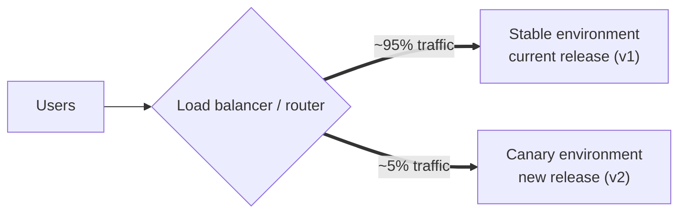
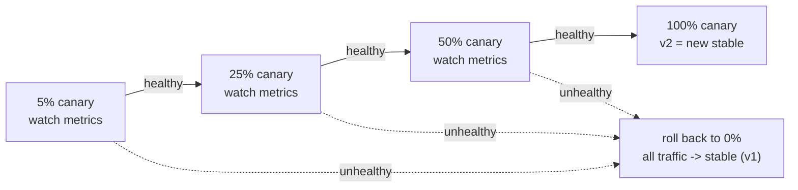
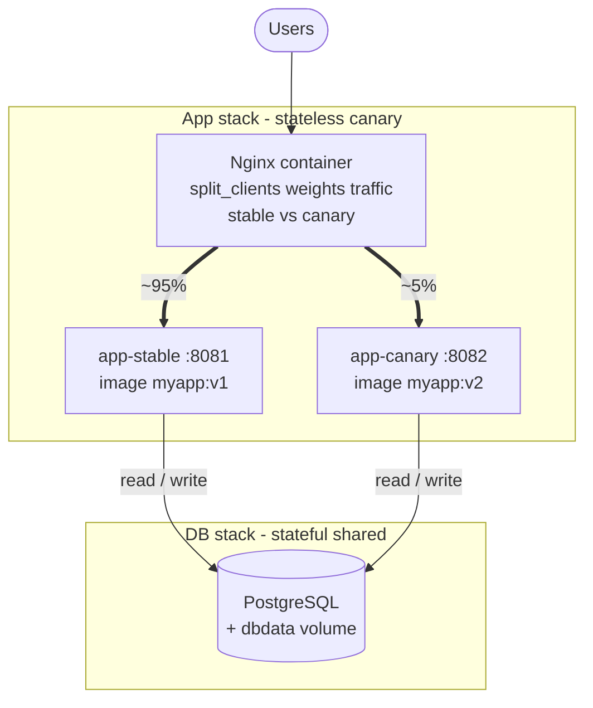

# Canary Deployment

> Generic implementation reference for gradual, risk-controlled releases. Roll a new version out to a small slice of traffic first, watch it, then widen.

## Overview

Canary deployment releases a new version to **a small percentage of users first** — the "canary" — while the **stable version keeps serving everyone else**. You watch the canary slice for errors, latency, or bad business metrics. If it is healthy, you **increase its traffic share in stages** until it serves 100% and becomes the new stable. If it misbehaves, you route that slice back to stable — a partial, fast rollback that never exposed most users to the fault.

The release is a **gradual traffic shift**, not a swap. Unlike blue-green (all-or-nothing at the switch), the two versions run **concurrently** and traffic is **split by weight**, not flipped. Risk is discovered at 5% instead of 100%.



The split is weighted, not binary: the canary gets a measured slice while stable absorbs the rest. Raising the canary's weight widens exposure; dropping it to zero is the rollback.

## The rollout

1. Deploy the new release to the **canary** environment alongside the live **stable** one — stable keeps serving 100%.
2. Route a **small slice** of traffic (e.g. 5%) to canary; stable takes the remaining ~95%.
3. **Watch** the canary slice against the stable baseline — error rate, latency, logs, business metrics — for a fixed observation window.
4. **Advance**: if healthy, raise the canary share to the next stage (25% → 50% → 100%), watching at each step.
5. **Roll back**: if unhealthy at any stage, drop the canary share to 0% — all traffic returns to stable, which never stopped running.
6. At 100%, canary is the new stable; retire the previous version once the release is confirmed good.

## The progression

The weights step up; only the **percentage** changes, both versions stay up throughout. A bad signal at any stage collapses back to 0% — the instant rollback path.



So a problem surfacing at 25% rolls the whole release back to stable — most users never left v1. Each stage is a decision gate, not just a number.

**With real release versions** — the canary weight climbs stage by stage; stable holds the line until canary reaches 100%:

| Stage | Canary traffic | Stable pool | Canary pool | On healthy | On unhealthy |
|-------|----------------|-------------|-------------|------------|--------------|
| 1 | 5% | v1 (8081) | v2 (8082) | advance to 25% | halt, roll back to 0% |
| 2 | 25% | v1 | v2 | advance to 50% | halt, roll back to 0% |
| 3 | 50% | v1 | v2 | advance to 100% | halt, roll back to 0% |
| 4 | 100% | drain / retire | v2 = new stable | release complete | roll back to previous stable |

Read stage 2: **canary serves v2 to a quarter of traffic** while **stable still serves v1 to the other three quarters** — both versions are live at once, which is exactly what blue-green avoids by flipping 100% in one move.

## Nginx example

The "router" in the diagram above is Nginx here. Use `split_clients` to hash a stable identifier into weighted buckets — one bucket name per pool — and proxy to the resolved name. Widening the release = raise the canary percentage and reload.

```nginx
# /etc/nginx/conf.d/app.conf

# split_clients hashes the first arg into buckets; ~5% fall into the canary bucket.
# Hash a STABLE identifier so a given user always lands in the same version.
split_clients "${remote_addr}${http_x_request_id}" $app_pool {
    5%  canary;     # 5% of traffic -> new release (v2)
    *   stable;     # the rest -> current release (v1)
}

upstream stable {
    server 127.0.0.1:8081;   # current release (v1)
}

upstream canary {
    server 127.0.0.1:8082;   # new release (v2)
}

server {
    listen 80;
    server_name app.example.com;

    location / {
        proxy_pass http://$app_pool;   # resolves to the upstream named by the bucket

        proxy_set_header Host              $host;
        proxy_set_header X-Real-IP         $remote_addr;
        proxy_set_header X-Forwarded-For   $proxy_add_x_forwarded_for;
        proxy_set_header X-Forwarded-Proto $scheme;
    }
}
```

Advance the canary share (and reload), watching metrics between each bump:

```bash
# 1. Verify canary serves the new release before sending it any traffic:
curl http://127.0.0.1:8082/health

# 2. Raise the canary share 5% -> 25%:
sudo sed -i 's/5%  canary;/25% canary;/' /etc/nginx/conf.d/app.conf

# 3. Validate config, then gracefully reload:
nginx -t && nginx -s reload
```

Rollback is dropping the weight to zero — all traffic returns to stable:

```bash
sudo sed -i 's/[0-9]\+%  canary;/0%  canary;/' /etc/nginx/conf.d/app.conf
nginx -t && nginx -s reload
```

- `nginx -s reload` is **graceful**: the new split takes effect for new requests while in-flight ones finish — the shift is zero-downtime.
- Because `proxy_pass http://$app_pool;` uses a **variable**, Nginx resolves the pool **per request** by searching the defined `upstream` groups (`stable`, `canary`) — that is the weighted-split mechanism. A `resolver` is only needed if the resolved name is not a defined upstream.
- `split_clients` buckets are **approximate** (hash distribution, not exact counts) and the percentages are configured, not measured — verify actual traffic share in your metrics, not just in the config.
- For **hands-off progression**, drive the active percentage from an include file or templating so each bump is CI-driven and metric-gated rather than a manual `sed`.

## Docker Compose example

The same pattern lands in Docker Compose: run **both versions as services on one network**, put an Nginx container in front using `split_clients`, and widen the canary by editing the mounted config and reloading — now *inside* the container. Compose resolves each app by its **service name**, so the upstreams are `app-stable` / `app-canary`.



Snapshot of a release in flight: **canary runs the new image `v2`** on a small slice, **stable still serves `v1`** to most users. After canary verifies at each stage, widening the weight makes `v2` serve more until it is 100% and `v1` is retired. The **app stack** is the only thing that shifts weight; the **database is stateful and shared**, so it lives in a *separate* stack on the same network and a deploy never recreates it. This makes the *Decouple database changes from code deploys* rule concrete (see *Gotchas* below): stable and canary both read/write **one** database.

```yaml
# docker-compose.yml  — app stack (stateless, canary)
services:
  app-stable:
    image: myapp:v1            # current release (pin explicit tags, not :latest)
    ports: ["8081:8080"]       # host port for direct verification
    environment:
      - DATABASE_URL=postgres://app:${DB_PASSWORD}@db:5432/app
    restart: unless-stopped
    networks: [appnet]

  app-canary:
    image: myapp:v1            # starts as a mirror; bumped to v2 via an override file (step 2)
    ports: ["8082:8080"]
    environment:
      - DATABASE_URL=postgres://app:${DB_PASSWORD}@db:5432/app
    restart: unless-stopped
    networks: [appnet]

  nginx:
    image: nginx:stable
    ports: ["80:80"]
    volumes:
      - ./nginx/app.conf:/etc/nginx/conf.d/app.conf:ro
    depends_on: [app-stable, app-canary]
    restart: unless-stopped
    networks: [appnet]

networks:
  appnet:
    external: true             # created once, shared with the db stack below
```

```yaml
# docker-compose.db.yml — DB stack (stateful, NOT part of the split)
services:
  db:
    image: postgres:16
    environment:
      - POSTGRES_USER=app
      - POSTGRES_PASSWORD=${DB_PASSWORD}
    volumes:
      - dbdata:/var/lib/postgresql/data
    restart: unless-stopped
    networks: [appnet]

volumes:
  dbdata:

networks:
  appnet:
    external: true
```

```nginx
# nginx/app.conf — split_clients over compose service names
split_clients "${remote_addr}${http_x_request_id}" $app_pool {
    5%  canary;
    *   stable;
}

upstream stable { server app-stable:8080; }
upstream canary { server app-canary:8080; }

server {
    listen 80;
    server_name app.example.com;

    location / {
        proxy_pass http://$app_pool;   # weighted split; raise the % to widen

        proxy_set_header Host              $host;
        proxy_set_header X-Real-IP         $remote_addr;
        proxy_set_header X-Forwarded-For   $proxy_add_x_forwarded_for;
        proxy_set_header X-Forwarded-Proto $scheme;
    }
}
```

One release cycle, step by step:

```bash
# 0. One-time prerequisites: the shared network + the DB stack (runs indefinitely)
docker network create appnet
docker compose -p db -f docker-compose.db.yml up -d

# 1. Start the app stack: both slots run the same release, nginx sends 5% to canary
docker compose up -d

# 2. Deploy the NEW release (v2) to the canary slot — leave stable untouched
#    Bump only canary's image with a small override file (base compose stays stable):
#      docker-compose.canary-v2.yml ->  services: { app-canary: { image: myapp:v2 } }
docker compose -f docker-compose.yml -f docker-compose.canary-v2.yml pull app-canary
docker compose -f docker-compose.yml -f docker-compose.canary-v2.yml up -d --no-deps app-canary   # --no-deps keeps nginx/stable/db up

# 3. Verify canary serves the new release BEFORE widening
curl http://127.0.0.1:8082/health                        # via canary's host port
docker compose exec nginx curl -s app-canary:8080/health # or from inside the network

# 4. Widen the canary share 5% -> 25% (edit the mounted conf, then reload inside the container)
sed -i 's/5%  canary;/25% canary;/' nginx/app.conf
docker compose exec nginx nginx -t && docker compose exec nginx nginx -s reload

# 5. Repeat the bump + watch loop (50% -> 100%). At 100% canary IS the new stable.
```

Rollback at any stage is dropping the weight to zero — all traffic returns to stable:

```bash
sed -i 's/[0-9]\+%  canary;/0%  canary;/' nginx/app.conf
docker compose exec nginx nginx -t && docker compose exec nginx nginx -s reload
```

- `--no-deps` matters: recreating `app-canary` must not bounce Nginx or `app-stable`, or you lose the zero-downtime property mid-deploy.
- The bind mount makes the host-side `sed` instantly visible inside the container — no rebuild, no restart, just `nginx -s reload`.
- **DB stays out of the split**: run migrations once against the shared DB *before* the first canary user hits it, and keep them expand/contract so stable and canary both tolerate the current schema during the whole progression.
- Once canary reaches 100% and is confirmed stable, it becomes the new baseline; the **next** release deploys a fresh canary alongside it and the cycle repeats.
- **Traefik alternative**: to avoid manual reloads, run Traefik and weight traffic by service label — adjusting the canary service's weight *is* the shift, discovered automatically with no `sed` or reload step.

## Pros and cons

| Pros | Cons |
|---|---|
| Risk discovered at 5%, not 100% — most users never see a bad release | Slower than a flip — each stage needs an observation window |
| Fast, partial rollback — drop the weight to zero | Two versions run concurrently; both must coexist |
| Real production signal (real users, real load) before full commit | Requires **weighted routing** + solid monitoring to be meaningful |
| Tunable blast radius per release | Shared state (DB, sessions, queues) must tolerate both versions at once |

## When to use

- Use when you want **gradual risk reduction** and **real production validation** before a full commit, and can run two versions concurrently.
- Best for **stateless** services where weighted traffic is easy; pair with strong monitoring (error rate, latency, business metrics) so each stage has a signal.
- Avoid when the two versions cannot coexist on the same data, or when you need an **instant all-or-nothing rollback** — there, prefer blue-green deployment.
- Canary trades blue-green's instant switch for **measured exposure**; it is the gradual counterpart to blue-green's binary flip.

## Gotchas

- **Database migrations**: stable and canary run against the *same* schema **at the same time**. Use expand–contract migrations; the new code must tolerate the old schema, and the old code must tolerate the new, throughout the whole progression.
- **Sessions / stateful connections**: a user routed to canary may later be routed to stable (or vice-versa) if the split is not sticky. Hash a stable identifier (cookie, request id) so a user stays on one version; use shared session storage.
- **Consistency across versions**: mixed traffic means mixed client/API versions simultaneously. Keep API changes backward-compatible for the duration of the rollout.
- **Background jobs / queues**: both versions may produce or consume work at once — ensure jobs are idempotent and version-tolerant.
- **Metric baselines**: the canary is only meaningful compared against a baseline. Compare canary metrics to stable's, and scale thresholds to the slice size (a 5% slice is noisier than a 50% slice).
- **Traffic split accuracy**: `split_clients` percentages are configured, not measured, and hash-distribution is approximate. Verify the *actual* share in your metrics, especially at small slices.
- **Cost**: two full versions run concurrently; scale stable down only after canary reaches 100%.

## Implementation notes

- Keep stable and canary as identical as possible — same config, infrastructure, and secrets; only the version differs.
- Automate both the widen step and the rollback; rollback is dropping the weight to zero, and should be a single fast action.
- Move traffic at a weighted router or load balancer, never by redeploying into the live environment.
- Decouple database changes from code deploys — concurrent-version schema compatibility is the hardest part to reverse.
- Gate each stage on health checks and monitoring on the canary slice, both before widening and after; define the advance/halt/rollback criteria up front.
