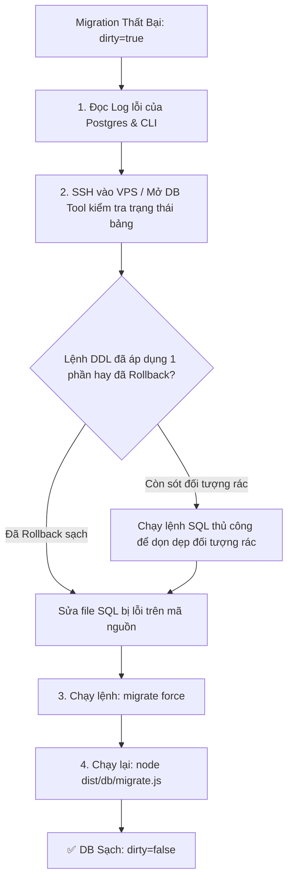

# Database Migration & Backup Architecture Guide

> **Mục đích tài liệu:** Hướng dẫn chuyên sâu về kiến trúc quản lý cơ sở dữ liệu của Trustbase: cơ chế chuyển dịch từ Drizzle-kit sang **golang-migrate**, quản trị trạng thái **Dirty**, cơ chế **Legacy Adoption**, chiến lược phòng chống mất dữ liệu khi test, và quy trình Rollback.

---

## 1. Bối cảnh: Tại sao chuyển từ Drizzle-Kit sang golang-migrate?

Trong giai đoạn đầu, dự án sử dụng `drizzle-kit` để quản lý schema (`db:push` và `drizzle-kit generate`). Tuy nhiên, khi đưa vào môi trường Production và Staging thực tế, một số điểm nghẽn nghiêm trọng xuất hiện:

| Vấn đề của Drizzle-kit / ORM-generated Migrations | Giải pháp của golang-migrate |
|---|---|
| **Không có cơ chế Rollback (`down`) tự động:** Drizzle chỉ sinh file migration một chiều (forward-only). Nếu deploy lỗi trên Production, không có cách tự động hoàn tác schema. | **Bắt buộc cặp file kép (`.up.sql` và `.down.sql`):** Mọi thay đổi schema đều phải có kịch bản hoàn tác chính xác. |
| **Phụ thuộc vào TypeScript/Node runtime nặng nề:** Việc chạy Drizzle migrator đòi hỏi load toàn bộ ORM schema và TypeScript compiler, tốn RAM và dễ xung đột package. | **File nhị phân thuần C/Go (Binary):** Cực nhẹ, chạy độc lập không cần Node.js, tốc độ thực thi tính bằng mili-giây. |
| **Thiếu Advisory Lock cấp cơ sở dữ liệu:** Khi có nhiều instance deploy đồng thời, Drizzle dễ bị race condition tạo trùng bảng hoặc duplicate index. | **Tích hợp `pg_advisory_lock`:** Đảm bảo chỉ có duy nhất 1 tiến trình được phép chạy migration tại một thời điểm, các tiến trình sau sẽ fail-fast. |
| **Xử lý lỗi mơ hồ:** Khi migration gặp lỗi giữa chừng, bảng migrations của Drizzle có thể ghi nhận sai trạng thái hoặc để lại schema nửa vời. | **Trạng thái `dirty` tường minh:** Đánh dấu ngay lập tức nếu câu lệnh DDL thất bại, chặn đứng mọi đợt deploy tiếp theo cho đến khi con người can thiệp. |

> [!NOTE]
> **Vai trò của Drizzle-ORM hiện tại:** `drizzle-orm` vẫn là Query Builder chính trong runtime code của API (`api/src/db/schema.ts`). Nhưng `drizzle-kit` bị **ĐÓNG BĂNG (FROZEN)** và quyền kiểm soát schema DB thuộc về `golang-migrate`.

---

## 2. Bản chất hoạt động của golang-migrate

### 2.1 Cấu trúc file chuẩn
Trong thư mục `api/migrations/`:
```
api/migrations/
├── 000048_add_dispute_evidence_hash.up.sql
├── 000048_add_dispute_evidence_hash.down.sql
├── 000049_platform_vouchers.up.sql
└── 000049_platform_vouchers.down.sql
```
- Tên file bắt đầu bằng số thứ tự tuần tự gồm 6 chữ số zero-padded (`NNNNNN`).
- `.up.sql`: Chứa các lệnh DDL/DML để nâng cấp schema.
- `.down.sql`: Chứa các lệnh hoàn tác chính xác những gì `.up.sql` đã tạo ra.

### 2.2 Bảng ghi nhận trạng thái (`schema_migrations`)
Toàn bộ lịch sử migration trong PostgreSQL chỉ được theo dõi qua một bảng duy nhất:
```sql
CREATE TABLE IF NOT EXISTS "schema_migrations" (
  "version" bigint NOT NULL PRIMARY KEY,
  "dirty" boolean NOT NULL
);
```
Bảng này luôn chỉ chứa **đúng 1 dòng dữ liệu**:
- `version`: Phiên bản migration hiện tại (ví dụ: `49`).
- `dirty`: Cờ báo lỗi (`false`: sạch sẽ / thành công; `true`: có lỗi xảy ra).

### 2.3 Transaction & Advisory Lock
1. **Implicit Transaction:** PostgreSQL hỗ trợ Transactional DDL (hầu hết các lệnh `CREATE TABLE`, `ALTER TABLE`, `ADD COLUMN` đều nằm được trong transaction). `golang-migrate` gửi toàn bộ nội dung file `.sql` trong 1 query duy nhất được bọc bởi `BEGIN ... COMMIT`. Nếu một câu lệnh thất bại, DB tự động `ROLLBACK` về trạng thái trước đó.
2. **Postgres Advisory Lock:** Trước khi thực thi, công cụ gọi `pg_advisory_lock(crc32('golang-migrate'))`. Bất kỳ tiến trình nào khác cố chạy song song sẽ bị chặn ngay lập tức, ngăn ngừa đụng độ.

---

## 3. Quản trị trạng thái "Dirty" (Fail-Closed Mechanics)

### 3.1 Trạng thái "Dirty" là gì?
Khi bạn chạy `pnpm db:migrate` hoặc server deploy chạy `node dist/db/migrate.js`, nếu có bất kỳ lỗi SQL nào xảy ra (ví dụ: syntax error, vi phạm `CHECK` constraint, trùng tên cột), `golang-migrate` sẽ:
1. Ghi nhận `dirty = true` vào bảng `schema_migrations`.
2. Dừng quá trình di trú ngay lập tức (Fail-Closed).
3. Khóa toàn bộ các lần deploy tiếp theo: nếu ai cố chạy migration tiếp, CLI sẽ từ chối thẳng thừng với thông báo:
   ```
   Dirty database version 49. Fix and force version.
   ```

### 3.2 Tại sao Dirty lại là cơ chế bảo vệ cực kỳ an toàn?
Trong các hệ thống tài chính/thanh toán (như Trustbase), việc "cố chạy tiếp khi đã có lỗi" (fail-open) là thảm họa vì sẽ tạo ra dữ liệu bất đồng nhất (Inconsistent State). Việc khóa DB bằng cờ `dirty` ép buộc kỹ sư phải:
- Xem xét nguyên nhân gốc rễ.
- Khắc phục dữ liệu bị lỗi trực tiếp trong DB.
- Ra quyết định rõ ràng bằng lệnh `force`.

### 3.3 Quy trình gỡ lỗi Dirty State từng bước (Step-by-Step Recovery)



**Ví dụ lệnh thực tế:**
Giả sử migration `49` bị lỗi và làm bẩn database:
```bash
# Bước 1: Khắc phục lỗi schema/dữ liệu bằng psql
psql $DATABASE_URL -c "DROP TABLE IF EXISTS platform_vouchers CASCADE;"

# Bước 2: Set trạng thái DB về phiên bản 48 an toàn (xoá cờ dirty)
# Chạy binary golang-migrate:
api/bin/migrate -path migrations -database "$DATABASE_URL" force 48

# Bước 3: Sau khi sửa code/SQL, chạy lại bình thường:
node dist/db/migrate.js
```

---

## 4. Case Study Thực Tế: Bài học `CHECK ... NOT VALID` (Migration 000041)

### Vấn đề:
Trong migration `000041_normalize_legacy_fee_tax_percent.up.sql`, hệ thống cần bổ sung ràng buộc kiểm tra định dạng dữ liệu cho bảng cài đặt hệ thống (`system_settings`):
```sql
-- CÂU LỆNH GÂY LỖI KHI DEPLOY:
ALTER TABLE system_settings ADD CONSTRAINT system_settings_value_shape
  CHECK (jsonb_typeof(value) IN ('object', 'array', 'string', 'number', 'boolean'));
```
**Hậu quả:** Khi áp dụng lên DB Staging đã có sẵn dữ liệu cũ (chứa một số record legacy có giá trị null hoặc không hợp lệ), Postgres lập tức quét toàn bộ bảng và phát hiện vi phạm -> Ném lỗi -> DB rơi vào trạng thái `dirty=true`!

### Giải pháp kỹ thuật chuẩn Production:
Sử dụng mệnh đề **`NOT VALID`**:
```sql
-- CÂU LỆNH CHUẨN PRODUCTION:
ALTER TABLE system_settings ADD CONSTRAINT system_settings_value_shape
  CHECK (jsonb_typeof(value) IN ('object', 'array', 'string', 'number', 'boolean')) NOT VALID;
```
- **Ý nghĩa:** Postgres sẽ chỉ kiểm tra constraint này đối với các bản ghi **mới được INSERT hoặc UPDATE sau này**. Nó bỏ qua việc quét toàn bộ dữ liệu lịch sử, không khóa bảng (Zero Table Lock) và không làm fail migration của DB hiện hữu.
- Sau khi migrate xong và làm sạch dữ liệu cũ bằng background worker, kỹ sư có thể chạy `ALTER TABLE ... VALIDATE CONSTRAINT;` một cách êm ái.

---

## 5. Cơ chế kế thừa không gián đoạn (Zero-Downtime Legacy Adoption)

### Thách thức:
Trước khi chuyển sang `golang-migrate`, database Production đã chạy 34 migrations thông qua Drizzle-kit và đang ghi nhận trong bảng `drizzle.__drizzle_migrations`.
Nếu chuyển thẳng sang `golang-migrate`, công cụ sẽ thấy bảng `schema_migrations` rỗng và cố gắng chạy lại từ migration `000001` -> Gây lỗi trùng bảng `relation "users" already exists` và làm sập hệ thống.

### Giải pháp: Hàm `adoptLegacyMigrations()` trong [`migrate-run.ts`](file:///c:/Users/MSI/Desktop/Trustbase/trustbase-project/api/src/db/migrate-run.ts)
```typescript
export async function adoptLegacyMigrations(databaseUrl: string): Promise<boolean> {
  const client = new pg.Client({ connectionString: ensureSslmode(databaseUrl) });
  try {
    await client.connect();
    // 1. Kiểm tra xem có bảng lịch sử của Drizzle không
    const legacy = await client.query<{ present: boolean }>(
      'SELECT to_regclass($1) IS NOT NULL AS present',
      ['drizzle.__drizzle_migrations'],
    );
    if (legacy.rows[0]?.present !== true) return false;

    // 2. Tạo bảng schema_migrations của golang-migrate
    await client.query(
      'CREATE TABLE IF NOT EXISTS "schema_migrations" ("version" bigint NOT NULL PRIMARY KEY, "dirty" boolean NOT NULL)',
    );
    const existing = await client.query<{ count: string }>(
      'SELECT count(*)::text AS count FROM "schema_migrations"',
    );
    if (existing.rows[0]?.count !== '0') return false;

    // 3. Đánh dấu đã áp dụng thành công 34 migrations đầu tiên (Baseline)
    await client.query('INSERT INTO "schema_migrations" ("version", "dirty") VALUES ($1, false)', [
      LEGACY_ADOPTION_VERSION, // 34
    ]);
    await client.query('DROP TABLE IF EXISTS "pgmigrations"');
    return true;
  } finally {
    await client.end();
  }
}
```
**Kết quả:**
- Trên DB cũ: Tự động ghi nhận `version = 34, dirty = false` mà không chạy lại SQL cũ. Đợt deploy tiếp theo chỉ chạy từ migration `000035` trở đi.
- Trên DB mới tạo (Local/CI): Không có bảng Drizzle -> Chạy mượt mà từ file `000001` đến hết.

---

## 6. Chiến lược Backup & Hoàn tác (Rollback & Disaster Recovery)

### 6.1 Hoàn tác Schema (Rollback via Down Migration)
Khi một tính năng mới gây lỗi nghiêm trọng sau khi deploy, kỹ sư có thể hoàn tác ngay lập tức trên VPS:
```bash
cd /home/trustbase-project/api
# 1. Dừng API để chặn request ghi mới
pm2 stop api

# 2. Hoàn tác 1 migration gần nhất
node dist/db/migrate.js down 1

# 3. Hoàn tác code về commit an toàn trước đó
git checkout <previous-commit-hash>
pnpm build

# 4. Khởi động lại API
pm2 start api
```

### 6.2 Drizzle-Kit Frozen Backup Policy
Thư mục `api/drizzle/` và file `src/db/migrate-legacy.ts` được giữ lại dưới dạng **FROZEN BACKUP**:
- Dùng để dựng lại môi trường kiểm thử chính xác với trạng thái trước ngày cutover.
- Làm cứu cánh khẩn cấp nếu golang-migrate gặp sự cố không thể khắc phục.
- **Điều kiện xoá bỏ:** Sau khi Production đã chạy ổn định với `golang-migrate` qua nhiều sprint, toàn bộ thư mục legacy này sẽ được dọn dẹp sạch sẽ.

---

## 7. Các bẫy kỹ thuật môi trường (Environment Gotchas)

### 7.1 Lỗi `dotenv { override: true }` xoá sạch dữ liệu Dev/Prod khi chạy Test
- **Nguyên nhân từng xảy ra:** Trong `api/src/config/env.ts`, `dotenv.config({ path: envFile, override: true })` bị gọi đè lên môi trường. Khi kỹ sư chạy integration test, test helper load file `.env.test` nhưng vì `override: true` nên các biến môi trường của môi trường dev/local bị trỏ lung tung, dẫn đến việc hàm dọn dẹp test `TRUNCATE` nhầm vào database chính!
- **Giải pháp triệt để:**
  1. Chỉ cho phép `override: true` khi `NODE_ENV !== 'test'`.
  2. Bổ sung hàm phòng vệ nghiêm ngặt [`assertTestDb()`](file:///c:/Users/MSI/Desktop/Trustbase/trustbase-project/api/test/integration/helpers/db.ts):
     ```typescript
     export function assertTestDb(databaseUrl: string): void {
       const url = new URL(databaseUrl);
       const dbName = url.pathname.replace(/^\//, '');
       if (!dbName.endsWith('_test') && !dbName.includes('test')) {
         throw new Error(`CRITICAL: Database "${dbName}" is NOT a test database! Aborting to prevent data loss.`);
       }
     }
     ```

### 7.2 Lỗi đường dẫn Windows khi chạy golang-migrate
- **Hiện tượng:** Trên Windows, nếu truyền đường dẫn tuyệt đối `-path C:\Users\...`, golang-migrate sẽ hiểu nhầm ký tự hai chấm (`C:`) là scheme của URL (`file://`) và ném lỗi `bad URL schema`.
- **Giải pháp trong [`migrate-run.ts`](file:///c:/Users/MSI/Desktop/Trustbase/trustbase-project/api/src/db/migrate-run.ts):**
  Luôn truyền đường dẫn tương đối kết hợp đặt `cwd` tường minh:
  ```typescript
  spawnSync(MIGRATE_BINARY, ['-path', 'migrations', ...args], { cwd: API_ROOT });
  ```
