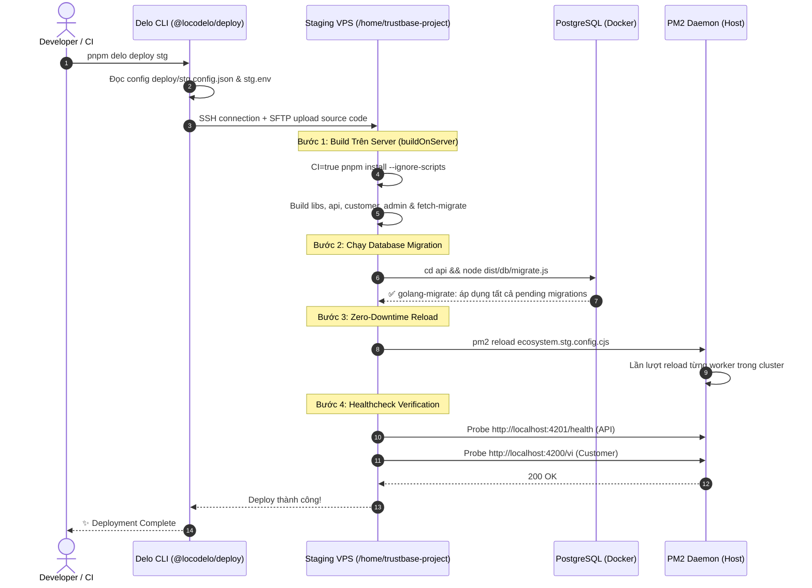

# Delo Deployment Architecture & Operations Guide

> **Mục đích tài liệu:** Hướng dẫn toàn diện về kiến trúc triển khai thực tế (Production/Staging) của dự án Trustbase sử dụng công cụ **Delo**, mô hình tiến trình **PM2 Cluster**, và kiến trúc hạ tầng lai (Hybrid: Host Services + Dockerized Databases).

---

## 1. Triết lý thiết kế (Architecture Philosophy)

### Tại sao không dùng Kubernetes hay Docker-in-Docker toàn phần?
Ở giai đoạn hiện tại (Single VPS / Small Cluster), việc đóng gói toàn bộ Frontend Next.js SSR và Backend Node.js vào Docker containers rồi chạy Docker-in-Docker hoặc K8s mang lại nhiều chi phí phát sinh:
1. **Tiêu tốn RAM & CPU:** Next.js và Node.js chạy trong container thường ngốn thêm overhead ảo hoá mạng, filesystem layers và bộ đệm bộ nhớ của Docker daemon.
2. **Build Time & Layer Transfer:** Mỗi lần deploy phải đóng image hàng GB, push lên Container Registry (GHCR/DockerHub) rồi VPS pull về -> tốn băng thông và thời gian deploy (5–15 phút).
3. **Độ trễ khi gỡ lỗi (Debugging):** Khi process gặp sự cố (OOM, unhandled rejection), truy cập trực tiếp file log hoặc dump heap trên host qua PM2 nhanh và trực quan hơn nhiều so với việc nhảy vào container.

### Mô hình kiến trúc Lai (Hybrid Topology)
Trustbase lựa chọn mô hình **Hybrid Architecture**:
- **Stateful Services (PostgreSQL 18 + Redis 7):** Chạy trong Docker container để cô lập volume, dữ liệu lưu bền vững tại host qua volume bind-mounts, dễ dàng backup/restore và cập nhật phiên bản DB mà không ảnh hưởng OS host.
- **Stateless Applications (API + Customer):** Chạy trực tiếp trên Host qua **PM2 Cluster Mode** để tận dụng tối đa số nhân CPU, khởi động tức thì, chia sẻ cache socket và reload zero-downtime.
- **Static Frontend (Admin Dashboard):** Build ra static assets (`admin/dist`) và được **Nginx** phục vụ trực tiếp với zero Node.js process runtime.
- **Reverse Proxy & SSL:** **Nginx** trên host làm gateway duy nhất (ports 80/443), quản lý SSL tự động qua Certbot/Let's Encrypt và proxy ngược vào các port nội bộ.

---

## 2. Bản đồ hạ tầng VPS (Topology Map)

```
                       ┌─────────────────────────────────────────┐
                       │           INTERNET / USERS              │
                       └────────────────────┬────────────────────┘
                                            │ HTTPS (:443) / HTTP (:80)
                                            ▼
                       ┌─────────────────────────────────────────┐
                       │          NGINX REVERSE PROXY            │
                       │           (SSL Termination)             │
                       └────┬───────────────┼───────────────┬────┘
                            │               │               │
        proxy_pass :4201    │   proxy_pass  │    root       │ static files
                            │      :4200    │  admin/dist/  │
                            ▼               ▼               ▼
┌───────────────────────────────┐ ┌──────────────────┐ ┌──────────────────┐
│        API (Node.js)          │ │ Customer (Next)  │ │ Admin Dashboard  │
│      PM2 Cluster Mode         │ │ PM2 Cluster Mode │ │  (Pure Static)   │
│   Port: 127.0.0.1:4201        │ │ Port: :4200      │ │  Port: :4203     │
└───────────────┬───────────────┘ └──────────────────┘ └──────────────────┘
                │
                │ (Internal Network / Docker Port Bindings)
                ├──────────────────────────────────────┐
                ▼                                      ▼
┌───────────────────────────────┐      ┌───────────────────────────────┐
│     PostgreSQL 18 (Docker)    │      │        Redis 7 (Docker)       │
│ Container: trustbase-postgres │      │ Container: trustbase-redis    │
│ Host Port: 127.0.0.1:5432     │      │ Host Port: 127.0.0.1:6379     │
│ Volume: .data/postgres        │      │ Volume: trustbase-redis-data  │
└───────────────────────────────┘      └───────────────────────────────┘
```

---

## 3. Delo Deployment Pipeline hoạt động như thế nào?

Công cụ triển khai được định nghĩa trong `deploy/stg.config.json` và được thực thi bằng lệnh:
```bash
pnpm delo deploy stg
```

### Vòng đời từng bước của một đợt Deploy (Step-by-Step Lifecycle)



### Chi tiết các giai đoạn cốt lõi:

#### Bước 1: Cài đặt phụ thuộc an toàn
Lệnh thực thi trên VPS:
```bash
CI=true pnpm install --ignore-scripts --no-frozen-lockfile
```
- `--ignore-scripts`: Ngăn chặn việc chạy các script lifecycle tự động (`postinstall`, `preinstall`) từ các package bên thứ ba nhằm tránh rủi ro bảo mật (supply chain attacks) và tránh lỗi biên dịch C++ native modules khi không cần thiết.

#### Bước 2: Chạy Migration TRƯỚC KHI reload mã nguồn (`migrate` hook)
Trong `deploy/stg.config.json`:
```json
{
  "name": "api",
  "ship": ["api/dist", "api/migrations", "api/package.json", "libs/api-contracts/dist", "libs/internal-contracts/dist"],
  "migrate": "cd api && node dist/db/migrate.js",
  "health": {
    "url": "http://localhost:4201/health",
    "timeoutSec": 90
  }
}
```
> [!IMPORTANT]
> **Thứ tự sống còn:** Migration luôn luôn phải chạy xong trước khi PM2 reload code API. Nếu reload code mới trước khi chạy migration, các câu query SQL của code mới sẽ gọi vào các cột/bảng chưa tồn tại, gây crash diện rộng cho người dùng đang truy cập.

#### Bước 3: Nạp tiến trình Zero-Downtime với PM2 Cluster
PM2 sử dụng cấu hình cluster mode (`ecosystem.stg.config.cjs`):
- `instances: 'max'` hoặc số lượng workers cố định.
- Khi nhận lệnh `pm2 reload`, PM2 không tắt toàn bộ tiến trình cùng lúc. Nó tạo một worker mới chạy mã nguồn mới, chờ worker này bind thành công vào port, sau đó mới gửi tín hiệu `SIGINT` để shutdown worker cũ một cách êm ái (graceful shutdown).
- Nhờ vậy, người dùng không bao giờ gặp lỗi `502 Bad Gateway`.

#### Bước 4: Post-deployment Healthcheck Probe
Delo tự động gửi request kiểm tra tính sẵn sàng:
- API: `http://localhost:4201/health` (chờ tối đa 90s để DB pool và Redis kết nối xong).
- Customer: `http://localhost:4200/vi` (chờ Next.js SSR render xong trang chủ).
Nếu healthcheck thất bại (timeout hoặc trả về HTTP code != 200), deploy sẽ báo lỗi để kỹ sư can thiệp ngay lập tức.

---

## 4. Quản lý Secrets & Biến môi trường

Toàn bộ thông tin nhạy cảm được phân tầng nghiêm ngặt:
1. **Deploy Secrets (`deploy/stg.env`):**
   - Chứa `VPS_HOST`, `SSH_PASSWORD` hoặc SSH Key path.
   - **Tập tin này bị gitignore 100%**, tuyệt đối không commit lên Git repository.
2. **Runtime Backend Secrets (`/home/trustbase-project/api/.env`):**
   - Chứa `DATABASE_URL`, `REDIS_URL`, `JWT_SECRET`, `S3_KEY`, `VNPT_EKYC_TOKEN`.
   - Nằm trực tiếp trên VPS, chỉ root hoặc deploy user mới có quyền đọc (`chmod 600`).
3. **Public Client Envs:**
   - Được inject tại thời điểm build trong cấu hình `build`:
     ```bash
     NEXT_PUBLIC_API_URL=https://api.trustbase.com.vn NEXT_PUBLIC_SITE_URL=https://customer.trustbase.com.vn pnpm build
     ```
   - Nhờ đó, bundle trình duyệt không chứa bất kỳ secret backend nào.

---

## 5. Tóm tắt các lệnh vận hành thường dùng

| Lệnh | Vị trí thực hiện | Ý nghĩa |
|---|---|---|
| `pnpm delo deploy stg` | Local machine | Triển khai toàn bộ hệ thống lên Staging |
| `pnpm delo deploy stg --app api` | Local machine | Chỉ triển khai riêng backend API |
| `pnpm delo precheck stg` | Local machine | Kiểm tra kết nối SSH và trạng thái VPS trước khi deploy |
| `pm2 status` | Trên VPS | Xem trạng thái các workers API và Customer |
| `pm2 logs api --lines 100` | Trên VPS | Xem trực tiếp 100 dòng log gần nhất của API |
| `pm2 reload ecosystem.stg.config.cjs` | Trên VPS | Reload thủ công các tiến trình trên VPS |
