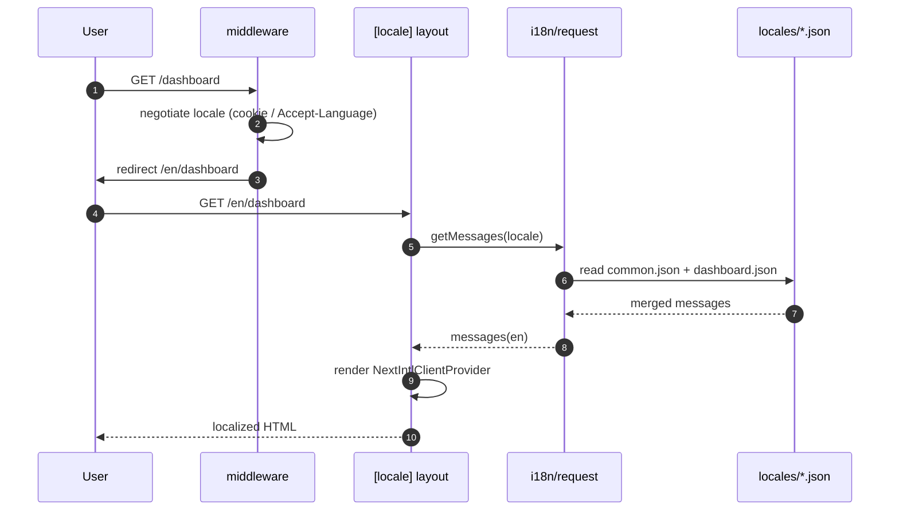

# Internationalization (i18n) for Next.js

> Serve the same Next.js app in multiple languages from one source of truth: translation JSON centralized under `src/locales/[lang]/*.json`, split into **namespaces** where each file owns one domain or screen, plus a shared `common.json` every screen can reuse. The library that maps this onto the App Router cleanly is **`next-intl`**; the file layout below is its recommended namespace pattern.

## Overview

Two problems, one mechanism solves both:

- **Which language?** — a `[locale]` dynamic segment in the URL (`/en/dashboard`, `/vi/dashboard`) plus middleware that negotiates the locale and redirects bare paths into a locale-prefixed one.
- **Which strings?** — for the active locale, load a set of JSON message files and resolve keys by `namespace.key`.

```
src/locales/en/common.json        ← buttons, errors, nav — reused everywhere
src/locales/en/dashboard.json     ← the Dashboard screen only
src/locales/en/orders.json        ← the Orders domain only
src/locales/vi/common.json
src/locales/vi/dashboard.json
src/locales/vi/orders.json
```

A component asks for a namespace and reads keys off it; `common` is available app-wide, so a button label is defined once and reused on every screen.

> **Stack-specific.** Code below is **Next.js App Router + TypeScript + `next-intl`**. `next-intl` is picked over `next-i18next` (built for the Pages Router) and bare `react-intl` (no built-in App-Router / RSC wiring). The namespace JSON layout ports to any of them; only the loader and hooks change.

## How it works



The locale lives in the URL (shareable, cacheable, SSR-friendly); messages are loaded server-side per request and streamed to client components through the provider.

## Folder structure

```
src/
  app/
    [locale]/
      layout.tsx          ← sets lang/dir, wraps children in provider
      page.tsx            ← dashboard screen (uses dashboard + common)
      orders/
        page.tsx          ← orders screen (uses orders + common)
  i18n/
    request.ts            ← loads + returns messages for the active locale
    routing.ts            ← locale list, default locale, prefix mode
    config.ts             ← shared locale constants
  middleware.ts           ← locale negotiation + redirect
  locales/
    en/
      common.json
      dashboard.json
      orders.json
    vi/
      common.json
      dashboard.json
      orders.json
```

## Implementation

### 1. Install + wire the plugin

```bash
npm install next-intl
```

```ts
// next.config.ts — feeds the request config into the App Router
import createNextIntlPlugin from 'next-intl/plugin';

const withNextIntl = createNextIntlPlugin('./src/i18n/request.ts');

export default withNextIntl({
  // ...rest of your next config
});
```

### 2. Locales + routing definition

```ts
// src/i18n/config.ts
export const locales = ['en', 'vi'] as const;
export type Locale = (typeof locales)[number];
export const defaultLocale: Locale = 'en';
export const localePrefix = 'always'; // 'always' | 'as-needed' | 'never'
```

```ts
// src/i18n/routing.ts
import { defineRouting } from 'next-intl/routing';
import { defaultLocale, locales } from './config';

export const routing = defineRouting({
  locales,
  defaultLocale,
  localePrefix,
});
```

### 3. Message loader — one namespace per file

The loader merges the JSON files for the active locale. `common` is always loaded; the rest are listed explicitly so server and client share the same bundle (see Pitfalls for lazy per-route loading at scale).

```ts
// src/i18n/request.ts
import { getRequestConfig } from 'next-intl/server';
import { hasLocale } from 'next-intl';
import { routing } from './routing';
import { defaultLocale } from './config';

// One namespace per file under src/locales/[locale]/*.json.
// Adding a screen/domain = drop a new JSON here + add its name to the list.
const namespaces = ['common', 'dashboard', 'orders'] as const;

export default getRequestConfig(async ({ requestLocale }) => {
  const requested = await requestLocale;
  // Validate before any file path is built — locale comes from the URL.
  const locale = hasLocale(routing.locales, requested) ? requested : defaultLocale;

  const messages = (
    await Promise.all(
      namespaces.map(
        async (ns) => [ns, (await import(`../locales/${locale}/${ns}.json`)).default] as const,
      ),
    )
  ).reduce((acc, [ns, value]) => {
    acc[ns] = value;
    return acc;
  }, {} as Record<string, Record<string, unknown>>);

  return { locale, messages };
});
```

> The dynamic `import(\`../locales/${locale}/${ns}.json\`)` is safe **because** `locale` was just validated against `routing.locales`. Never feed a raw user-supplied segment into a dynamic import path.

### 4. Middleware — negotiate + redirect

```ts
// src/middleware.ts
import createMiddleware from 'next-intl/middleware';
import { routing } from './i18n/routing';

export default createMiddleware(routing);

export const config = {
  // Skip static assets, API routes, and Next internals
  matcher: ['/((?!api|_next|_vercel|.*\\..*).*)'],
};
```

### 5. The `[locale]` segment + provider

```tsx
// src/app/[locale]/layout.tsx
import { NextIntlClientProvider, hasLocale } from 'next-intl';
import { getMessages, setRequestLocale } from 'next-intl/server';
import { notFound } from 'next/navigation';
import { routing } from '../../i18n/routing';

export function generateStaticParams() {
  return routing.locales.map((locale) => ({ locale }));
}

export default async function LocaleLayout({
  children,
  params,
}: {
  children: React.ReactNode;
  params: Promise<{ locale: string }>;
}) {
  const { locale } = await params;
  if (!hasLocale(routing.locales, locale)) notFound();

  setRequestLocale(locale); // enable static rendering per locale

  const messages = await getMessages();
  const dir = locale === 'ar' || locale === 'he' ? 'rtl' : 'ltr';
  return (
    <html lang={locale} dir={dir}>
      <body>
        <NextIntlClientProvider locale={locale} messages={messages}>
          {children}
        </NextIntlClientProvider>
      </body>
    </html>
  );
}
```

### 6. Using translations — server + client

**Server component** — pick the namespace that matches the screen, plus `common`:

```tsx
// src/app/[locale]/page.tsx  (Dashboard screen)
import { useTranslations } from 'next-intl';
import { setRequestLocale } from 'next-intl/server';

export default async function DashboardPage({
  params,
}: {
  params: Promise<{ locale: string }>;
}) {
  const { locale } = await params;
  setRequestLocale(locale);

  const t = useTranslations('dashboard'); // this screen's namespace
  const tc = useTranslations('common');   // shared, reusable namespace

  return (
    <main>
      <h1>{t('title')}</h1>
      <button>{tc('actions.save')}</button> {/* reused on every screen */}
    </main>
  );
}
```

**Client component** — same hook, same namespaces (messages were streamed in by the provider):

```tsx
'use client';
import { useTranslations } from 'next-intl';

export function OrderCard() {
  const t = useTranslations('orders'); // Orders domain namespace
  const tc = useTranslations('common');
  return <button aria-label={tc('actions.close')}>{t('cancelOrder')}</button>;
}
```

### 7. Interpolation + plurals (ICU)

```json
// src/locales/en/orders.json
{
  "itemCount": "{count, plural, =0 {No items} one {# item} other {# items}}",
  "greeting": "Welcome, {name}"
}
```

```tsx
const t = useTranslations('orders');
t('itemCount', { count: 3 });   // "3 items"
t('greeting', { name: 'Ada' }); // "Welcome, Ada"
```

### Reusing `common`

`common.json` holds anything used on more than one screen — button labels, validation errors, the nav bar. Because `common` is always loaded, a screen never redefines "Save" or "Cancel"; it reads `tc('actions.save')`. Rule of thumb: **a string lives in a screen/domain namespace if one screen owns it, and in `common` if two or more screens share it.**

```json
// src/locales/en/common.json — defined once, used everywhere
{
  "actions": { "save": "Save", "cancel": "Cancel", "close": "Close" },
  "errors": { "required": "This field is required." }
}
```

## Edge cases

- **Unknown locale in the URL.** `hasLocale(...)` in both the loader and the layout falls back to `defaultLocale` (loader) or `notFound()` (layout) — never crash on `/xx/...`.
- **Missing key in one locale.** `next-intl` renders the key path (or a configured fallback) and logs in dev. Treat a key present in the default locale but absent elsewhere as a CI lint failure, not a runtime surprise.
- **Namespace not loaded.** Asking for a namespace that wasn't merged in `request.ts` throws at render. The namespace list is the contract between loader and components — keep them in sync.
- **Search-engine locale.** Set `<html lang>` (done in the layout) and emit `hreflang` alternate links per locale for each localized URL; the URL already carries the locale, so this is mechanical.
- **Right-to-left languages.** Direction is locale-driven: `dir` on `<html>` alongside `lang` (shown in the layout above).
- **Locale-aware redirects.** A redirect target (e.g. after login) that must stay locale-prefixed should still pass the safe-redirect check used in [[redirect-after-login]] — validate first, then re-apply the active locale prefix before navigating.

## Key decisions

- **URL carries the locale.** `/en/...`, `/vi/...` — shareable, SSR-cacheable, no cookie dependency for first paint.
- **Namespaces = files = domains/screens.** `common.json` for the shared layer; one file per screen or domain. Files stay small, merge conflicts stay rare, and a translator (or an LLM) can load only the file relevant to a change.
- **`next-intl` over the alternatives.** First-class App Router + RSC support; `next-i18next` predates RSC, and `react-intl` alone leaves the SSR/provider wiring to you.
- **Validate before dynamic import.** The locale comes from the URL; it is checked against the locale list before it ever reaches a file path.
- **ICU for pluralization.** Don't hand-roll `"item(s)"` — ICU `{count, plural, ...}` handles one/few/many/other per locale correctly.

## Pitfalls

- **Key drift between locales.** Adding a key to `en/common.json` and forgetting `vi/common.json` ships a missing translation. Enforce parity with a CI script that diffs key sets across locales.
- **Loading every namespace up front.** Fine at small scale; with hundreds of screens, gate per-route namespaces (always load `common`, load the screen's namespace on its route) to keep the message bundle lean.
- **Namespace name collisions.** Two namespaces merged under the same top-level key silently shadow each other. Keep namespace names unique — they are file names.
- **Client component without the provider.** `useTranslations` in a client component throws if no ancestor rendered `NextIntlClientProvider` with `messages`. The `[locale]` layout is the canonical place to mount it.
- **Forgetting `setRequestLocale`.** Without it, `generateStaticParams` can't statically render each locale and you fall back to dynamic rendering — slower, and it defeats the App Router's static-per-locale optimization.
- **Hardcoded strings in components.** Any user-visible literal that bypasses `t(...)` is an untranslatable string. Treat raw JSX text as a lint signal.
- **Naive interpolation.** `t('greeting') + ' ' + name` bypasses ICU and breaks word order in languages where the name comes first. Always interpolate via the message: `t('greeting', { name })`.

## Notes

- Locale-aware redirect targets compose with the safe-redirect validator in [[redirect-after-login]] — validate the path first, re-apply the locale prefix after.
