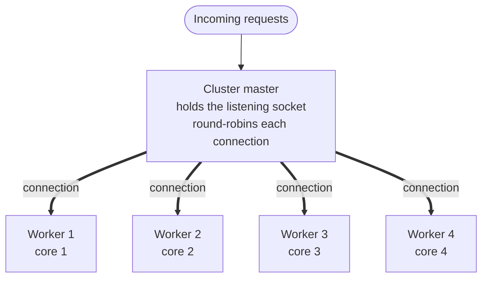
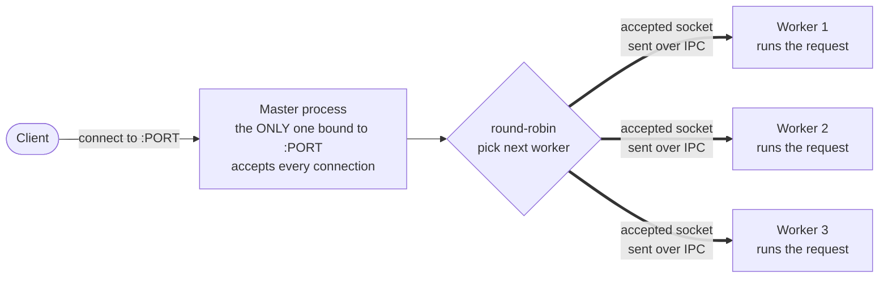
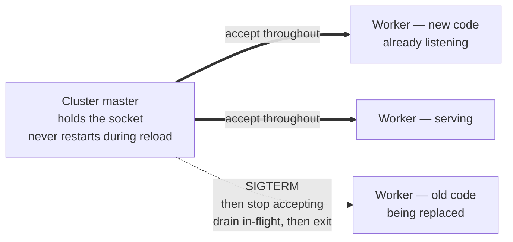

# Node.js PM2 Deployment

> Generic implementation reference for running a Node.js (Express) service across all CPU cores with zero-downtime reloads. One process manager in cluster mode replaces the orchestrator and reverse proxy on a single host.

## Overview

Node.js runs JavaScript on a **single main thread** — the event loop. One Node process therefore uses **one CPU core** for JS execution, no matter how many cores the machine has. To use more than one core you must run **more than one process** and spread traffic across them. PM2 does exactly this in `cluster` mode.

PM2 `cluster` mode uses Node's built-in `cluster` module: one **master** process holds the listening socket and **round-robins** each accepted connection to N **worker** processes, each on its own core. Every worker is a full Node process running the same Express app. This is the only PM2 mode that uses multiple cores — `fork` mode runs a single process plus restart-on-crash and stays on one core.



The master never handles business logic — it only accepts connections and distributes them. Workers do the real work, and because there are N of them, N cores are busy. `instances: 'max'` spawns one worker per core (`os.cpus().length`); pin it to a fixed number if the host is shared.

**Threads versus processes.** PM2 gives you multiple **processes**, not multiple **threads**. Each worker is still single-threaded. The real "threads" in a Node app are the **libuv thread pool** (default **4** threads, set via `UV_THREADPOOL_SIZE`), which handles async I/O such as `fs`, `crypto`, `zlib`, and `dns.lookup`. For an I/O-heavy Express API, raising `UV_THREADPOOL_SIZE` (e.g. to 16) often helps more than adding workers — even inside a single process. CPU-bound JavaScript is the exception: neither clustering nor the thread pool parallelizes it; use `worker_threads` or offload the work to a queue.

## One port, many workers

All N workers run the same code with the same `app.listen(PORT)`, yet there is **no `EADDRINUSE`** and only one port is consumed. The reason: in cluster mode **only the master process ever binds the port** — the workers never do.

Node's `cluster` module intercepts `server.listen()` inside each worker. Instead of the worker binding the port itself, the listen request is forwarded to the master over the worker's IPC channel. The master binds `:PORT` once, holds the listening socket, and calls `accept()` on every incoming connection. The worker never opens the port, so N workers cost exactly one listening port — there is nothing for the second worker's `listen()` to collide with.

Once the master has accepted a connection it does **not** run the request. It **round-robins** — picks the next worker in turn — and **passes the accepted client socket to that worker over IPC** (a file-descriptor handle sent across the worker's pipe). The worker receives the live socket, emits `connection` on its HTTP server, and owns that request to the end. So the answer to the three questions at once: one port (held by the master), the master round-robins each accepted connection to a worker, and workers consume no port because they never call the real `listen()`.



Read the flow: the **client connects to `:PORT`**, the **master is the sole listener** that accepts, then the accepted socket is **forwarded over IPC to whichever worker is next** in the round-robin. Workers hold no listening socket — they only hold the client connections the master hands them.

This is Node's default scheduling policy — **`cluster.SCHED_RR`** (round-robin) on Linux and macOS: the master accepts, the master forwards, one port total. The alternative is the OS-balanced model (`cluster.SCHED_NONE`, the default on Windows): workers share the listening socket via `SO_REUSEPORT` and the **kernel** spreads incoming connections across them. Same observable result — N workers, one port, traffic distributed — just a different load balancer (PM2's master versus the kernel).

**Verify it on the host** — only the master PID is in `LISTEN` state on the port; workers show `ESTABLISHED` client connections, never the listener:

```bash
# Listener on :3000 is the MASTER pid only; workers appear on ESTABLISHED client conns
ss -ltnp 'sport = :3000'      # LISTEN entry = master PID
lsof -i :3000                 # master: LISTEN ; workers: ESTABLISHED
```

- Distribution is per-**connection**: every frame of one TCP connection — including a WebSocket upgrade and all its subsequent frames — stays on the single worker that received it. Round-robin spreads across connections, never within one.
- The master runs no application code; it only accepts and forwards, so its overhead is small relative to the workers.
- This is exactly why `pm2 reload` is zero-downtime: the port lives on the master, which is never restarted during a reload, so the single listening socket stays open and accepting while workers roll over underneath it.

## The reload

`pm2 reload` updates the code of a running cluster **without dropping connections**. The mechanism is a **rolling handover of workers**, conceptually a rolling deployment applied to processes on one host instead of instances across a fleet.

Two things make it zero-downtime. First, **the master is never restarted during a reload** — it keeps the listening socket bound and accepting, so the kernel never refuses a connection for lack of a listener. Second, **the new worker is already listening before the old one is signalled**, so at every moment at least one worker serves traffic.



Read the snapshot: the **new worker is already taking traffic**, another worker **keeps serving**, and the **old worker is told to drain and exit**. The socket accepts throughout, so no client is refused; the old worker finishes its in-flight requests before it goes away, so nothing in flight is cut.

The reload loop is: spawn a new worker, wait until it emits `listening`, signal one old worker, let that old worker drain and exit, then repeat for the next old worker until all have been replaced. Because the handover is one-at-a-time, capacity stays roughly constant — the same property a fleet-level rolling deployment gives you across instances.

**`reload` versus `restart`** — the only difference that matters:

| Command | Master | Workers | Downtime |
|---|---|---|---|
| `pm2 restart` | stays | all killed, then all re-spawned | gap where no worker exists |
| `pm2 reload` | stays | rolling: new listens first, then old drains and exits, one at a time | none |

Zero **connection refusals** comes for free from the socket handover. Zero **dropped requests** does not — it requires the app to drain its in-flight work before exiting. That is the graceful-shutdown code in the example below; without it, a reloaded worker exits immediately and whatever it was mid-response dies with a connection reset.

## PM2 on host versus Docker

There are three ways to run this stack, and only two are sane. **PM2 inside a single Docker container is an anti-pattern** — it runs a process manager inside a process manager for no benefit, since Docker already supplies crash restart and the orchestrator already supplies horizontal scale.

| Option | Setup | Verdict |
|---|---|---|
| PM2 cluster inside one container | `pm2-runtime` in the image | anti-pattern — redundant |
| Docker, one process per container | `node server.js` + replica scaling + proxy | Docker best practice |
| PM2 on the bare host | no Docker, PM2 cluster directly on the OS | simplest for single-host multi-core |

Docker earns its layer only when you have multiple services to compose, need staging-equals-production parity, or plan to scale across multiple machines. For a single Express API on one host where the goal is "use all my cores reliably", PM2 on the host is the more direct path. Decision matrix:

| Factor | PM2 on host | Docker, one process per container |
|---|---|---|
| Multi-core usage | `instances: 'max'`, one command | replicas plus nginx / Traefik wiring |
| Zero-downtime deploy | `pm2 reload`, built-in rolling | needs replicas plus a health-gated proxy |
| Crash restart and boot | `pm2 startup` and `pm2 resurrect` | `restart: unless-stopped` |
| Moving parts | one tool | daemon plus compose plus proxy plus registry |
| RAM overhead | minimal | roughly 50–150 MB per layer |
| Multi-service stack | manual and messy | `docker compose up` |
| Reproducible env parity | nvm and apt, drifts per box | one image, identical everywhere |
| Horizontal scale to many hosts | not its job | Swarm or Kubernetes |
| Host isolation | app is a host process | container boundary |

The same job (restart on crash) that PM2 does with `max_restarts`, Docker does with `restart: unless-stopped`; the same job (scale across cores) that PM2 does with `instances`, Docker does with replica count plus a reverse proxy. Pick one stack and do not stack them — running PM2 cluster inside a container that is also scaled as replicas double-manages processes and risks oversubscription.

If you do run PM2 inside a container anyway, beware the CPU-count trap: Docker does not cap cores by default, so the container sees the host's core count and `instances: 'max'` spawns a worker per host core — 32 workers inside a container you meant to cap at 2. Pin `instances` to the value you set on `cpus`, never `'max'`, inside a container.

## Example

The two files below are the minimum for real zero-downtime: the PM2 config that runs the cluster, and the graceful-shutdown code that lets each worker drain before it exits.

```js
// ecosystem.config.js
module.exports = {
  apps: [{
    name: 'api',
    script: 'server.js',
    exec_mode: 'cluster',          // REQUIRED: fork mode cannot zero-downtime reload
    instances: 'max',              // one worker per host core ('max' = os.cpus().length)
    max_memory_restart: '400M',    // recycle a worker that leaks past this
    kill_timeout: 5000,            // grace given to drain BEFORE SIGKILL (default ~1600ms)
    shutdown_with_message: false,  // true = IPC 'shutdown' message instead of a signal
    env: {
      NODE_ENV: 'production',
      UV_THREADPOOL_SIZE: 16       // libuv thread pool (fs/crypto/zlib/dns), default 4
    }
  }]
}
```

```js
// server.js — graceful shutdown is MANDATORY for real zero-downtime
const server = app.listen(PORT, () => log('listening on ' + PORT));

function graceful(signal) {
  log(`${signal} received, draining in-flight before exit`);
  server.close(async () => {       // stop accepting NEW connections; let in-flight finish
    await closeDb();               // close DB / Redis pools, flush buffers
    process.exit(0);
  });
  // hard cap: if drain stalls (e.g. a hung WebSocket), force-exit so reload completes
  setTimeout(() => process.exit(1), 30_000).unref();
}

process.on('SIGTERM', () => graceful('SIGTERM'));
process.on('SIGINT',  () => graceful('SIGINT'));
```

One release cycle, step by step:

```bash
# 0. Install once per host
npm i -g pm2

# 1. Start the cluster (N workers across all cores)
pm2 start ecosystem.config.js

# 2. Survive reboots: generate and install a systemd unit, then snapshot the list
pm2 startup            # run the sudo command it prints
pm2 save               # snapshot process list for pm2 resurrect

# 3. Deploy new code with ZERO downtime (rolling worker reload, not restart)
pm2 reload api

# 4. Pick up changed environment variables (plain 'reload' reuses cached env)
pm2 reload api --update-env

# 5. Watch live state and logs
pm2 status && pm2 logs api --lines 50
```

- `exec_mode: 'cluster'` is non-negotiable: in `fork` mode, `reload` silently degrades to `restart` and you get downtime.
- `instances: 'max'` uses every core on a dedicated host; use a fixed number on a shared host or inside a CPU-capped container.
- `kill_timeout` must exceed your slowest request — the default (~1600 ms) is too short for most real apps; 5–10 s is safer.
- Handle **both** `SIGTERM` and `SIGINT` so the drain runs regardless of which signal PM2 sends; `shutdown_with_message: true` switches PM2 to an IPC `shutdown` message you can listen for instead.
- The `setTimeout` hard cap is what saves you when a stuck long-lived connection would otherwise block `server.close()` forever and force PM2 to `SIGKILL` the worker.

## Pros and cons

| Pros | Cons |
|---|---|
| Uses all CPU cores with one command | Single-host only — no horizontal scale across machines |
| Built-in zero-downtime reload via `pm2 reload` | In-memory state is lost per worker on every reload |
| Restart on crash and boot, batteries included | Must write the graceful-shutdown code yourself |
| Lean on a small VPS, few moving parts | Cluster mode and signal handling are easy to misconfigure |

## When to use

- Use when you run **one Node.js (Express) API on one host** and want all cores plus zero-downtime reloads with the fewest moving parts.
- Best for **stateless** services where each worker can be drained and replaced independently; treat sessions and caches as shared, not in-process.
- Move to **Docker, one process per container** when you also run other services (Postgres, Redis, another app), need staging-equals-production reproducibility, or plan to scale to multiple machines with Swarm or Kubernetes.
- For **CPU-bound** JavaScript, clustering helps use cores but does not parallelize a single heavy task — reach for `worker_threads` or a work queue regardless of how you deploy.

## Gotchas

- **`kill_timeout` too short**: the default (~1600 ms) `SIGKILL`s a worker mid-request. Set it to 5–10 s, above your slowest request's latency.
- **WebSockets, SSE, long-polling**: `server.close()` waits for HTTP keep-alive to drain but a live long-lived connection holds the worker open forever. Actively close those clients in `graceful()`, or the hard-cap timeout is the only thing that frees the worker.
- **`instances: 1`**: reload can still be zero-downtime (new listens before old exits), but you lose the safety margin. Run at least 2 workers.
- **Fork mode**: `reload` degrades to `restart` (downtime). You must be in `cluster` mode.
- **Environment variables**: plain `reload` reuses the cached environment. Run `pm2 reload api --update-env` when env changed.
- **In-memory state**: sessions, caches, and rate-limit counters reset per worker on every reload. Move them to Redis or another shared store.
- **PM2 inside Docker plus replica scaling**: double process management and likely oversubscription. Pick PM2-on-host or Docker-replicas, not both.

## Implementation notes

- Pin `exec_mode: 'cluster'` and `instances` to the cores you actually want — `'max'` on a dedicated host, a fixed number on a shared host or CPU-capped container.
- Wire `SIGTERM` and `SIGINT` graceful shutdown with a hard-cap timeout; that code is what makes `reload` truly zero-downtime rather than merely connection-refusal-free.
- Use `pm2 startup` and `pm2 save` so the cluster survives host reboots.
- Deploy with `pm2 reload` (not `restart`) and add `--update-env` when the environment changed.
- Treat every worker as stateless and restartable; keep shared state (sessions, database, queues) outside the process.
- If you later move to Docker or Kubernetes, drop PM2 and run one process per container — the graceful-shutdown code above carries over unchanged.

## Quick reference

Three behaviors that decide what code a running PM2 worker actually executes. All three follow from one fact: a Node process holds its loaded code in memory for its whole lifetime, and only a fresh process re-reads disk.

**1. Old code survives without a reload — until a worker restarts**

`git pull` + `npm run build` replace files on disk but do not touch a running worker. It keeps serving the old code until something restarts it.

| Trigger | Picks up new code? | When |
|---|---|---|
| Nothing — worker stays alive | ❌ No — old code | indefinitely |
| Worker crash | ✅ Yes — PM2 auto-restart | on the crash |
| `max_memory_restart` exceeded | ✅ Yes — PM2 recycle | when RSS crosses the limit |
| Host reboot + `pm2 startup` / `pm2 save` | ✅ Yes — `pm2 resurrect` | on reboot |
| Explicit `pm2 restart` | ✅ Yes | when you run it |
| `pm2 reload` | ✅ Yes — zero-downtime rolling | when you run it |

Per-request file reads (templates, static assets, configs re-read on each request) are the exception — the old worker sees those change on disk immediately, even before a reload.

**2. What happens if the RAM holding the code is cleared**

The loaded code and the live process are the same thing in memory — there is no separate "code cache" to flush while keeping the old code running.

| How RAM is cleared | Process survives? | Code after |
|---|---|---|
| Garbage collection | ✅ Yes | Old — modules stay referenced by `require.cache`, never collected |
| Memory pressure / swapping | ✅ Yes | Old — the OS pages memory in and out transparently |
| Delete `require.cache` entries (hot-swap) | ✅ Yes, alive | New — next `require` re-reads disk; partial and fragile |
| OOM kill / `max_memory_restart` | ❌ No — killed | New — PM2 restart |
| Crash / heap corruption | ❌ No | New — PM2 restart |
| Reboot / power loss | ❌ No | New — `pm2 resurrect` |

So "clear RAM but keep serving old code" is not a real state: either the process lives (old code intact) or it dies (PM2 brings back new code).

**3. `require()` caches on call, not on use**

Calling `require('./foo')` loads and caches the module immediately, whether or not you ever reference it. "Unused" does not mean "uncached".

| How the module is required | Required before rebuild? | Cached? | Code used after rebuild |
|---|---|---|---|
| `require('./foo')` at top of file, never referenced | ✅ Yes | ✅ Yes | Old |
| `require('./foo')` inside a route that ran before rebuild | ✅ Yes | ✅ Yes | Old |
| `require('./foo')` inside a route that never ran before rebuild | ❌ No — deferred | ❌ No | New — first call reads disk |

The only way an unused module picks up new code without a restart is a deferred `require`. Mixing eager-old and lazy-new modules in one process is an inconsistent state — which is why we reload the whole process rather than hot-swap individual modules.
