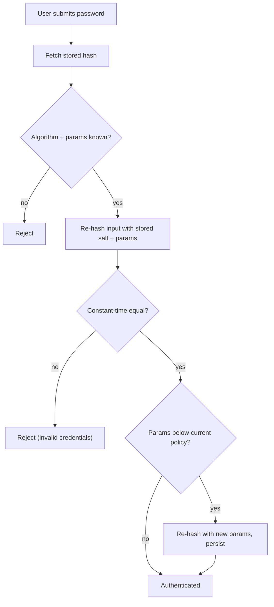

# Password Hashing

> Generic implementation reference for storing user passwords securely. **Hash, never encrypt.**

## Hash, do not encrypt

This is the single most important rule:

- **Hashing** is one-way and irreversible. **Encryption** is reversible. Passwords must be **irreversible**.
- Store only a salted, slow, memory-hard **hash** of the password — never the plaintext, never an encrypted blob you could decrypt.
- Never use a fast cryptographic digest on its own (`MD5`, `SHA-1`, `SHA-256`, `SHA-512`). They are designed to be fast, which is the opposite of what password storage needs — GPUs can brute-force billions per second.

The threat model: if the password database is stolen, the hashes should be expensive enough to crack that the attacker gains little, while legitimate logins still verify correctly.

## Core concepts

| Concept                | Role                                                                                                                                                                                          |
| ---------------------- | --------------------------------------------------------------------------------------------------------------------------------------------------------------------------------------------- |
| **Salt**               | A unique random value per password, mixed into the hash. Defeats rainbow tables and ensures two identical passwords produce different hashes. Store it alongside the hash (it is not secret). |
| **Pepper**             | A server-side secret added via HMAC (or append) and **not** stored in the DB. Means a DB-only leak still cannot crack passwords. Harder to rotate — keep in a secrets manager / HSM.          |
| **Work factor / cost** | How much CPU time the hash consumes. Tune upward as hardware speeds up.                                                                                                                       |
| **Memory hardness**    | Requires significant RAM per hash, blunting GPU / ASIC / FPGA attacks.                                                                                                                        |
| **Parameter encoding** | Modern schemes store `algo + params + salt + hash` in one self-describing string, so old hashes remain verifiable after you raise the cost.                                                   |

## Algorithm comparison

| Algorithm | Memory-hard | Notes |
|---|---|---|
| **Argon2id** (PHC winner) | Yes | Current best default. Blends Argon2i (side-channel resistance) and Argon2d (GPU resistance). Use this if you can. |
| **bcrypt** | No (CPU-hard) | Battle-tested, ubiquitous, easy. Capped at 72 input bytes. Solid fallback where Argon2id is unavailable. |
| **scrypt** | Yes | Memory-hard, predates Argon2. Still good but less commonly used today. |
| **PBKDF2** | No | Iteration-based; the weakest of these. Acceptable mainly for compliance/FIPS environments. Prefer HMAC-SHA256 or SHA512 variants. |

**Do not use:** plaintext, `MD5`, `SHA-1`, `SHA-256/512` alone, `DES`/`crypt`, or any reversible encryption (e.g. AES) for passwords.

## Recommendations

1. **Primary: Argon2id.**
2. **Fallback: bcrypt** (if Argon2id is unavailable in your stack).
3. **scrypt** is fine where already in use; do not start new designs on PBKDF2 unless required by compliance.
4. Always use a **vetted library** — never implement the algorithm yourself.

## Parameter tuning

Calibrate so a single hash takes a target of roughly **250–500 ms** on production hardware (or as slow as your login UX allows). Benchmark on the target machine, then set the cost; revisit annually as hardware improves.

OWASP baselines (verify current guidance and benchmark locally):

| Algorithm | Baseline parameters |
|---|---|
| Argon2id | `m = 19456 KiB` (~19 MiB), `t = 2`, `p = 1` (Argon2id v1.3+). Pre-v1.3: `m = 47104` (46 MiB), `t = 1`, `p = 1`. |
| bcrypt | work factor `11+` (tune; ≥10). |
| scrypt | `N = 2^17`, `r = 8`, `p = 1`. |
| PBKDF2 | `PBKDF2-HMAC-SHA256`: 600,000 iterations (or `SHA512`: 210,000). |

## Verify flow

Verification does **not** decrypt anything. It re-runs the hash with the **stored salt and parameters**, then compares in constant time:

Because parameters are encoded inside the stored string, you can raise the cost later and still verify legacy hashes — then transparently upgrade them on the user's next successful login (the `Params below current policy?` branch above).

## Operational concerns

- **Transparent rehashing / upgrade-on-login:** when a user logs in and their stored hash uses an older algorithm or lower cost, re-hash with current parameters and persist. Zero downtime, no forced resets.
- **Rate-limit / throttle login attempts** per account and per IP; add progressive backoff. This is independent of hash strength but complements it.
- **Bound input length** to prevent denial-of-service via huge passwords. A common pattern is to pre-hash with a fast HMAC keyed by the pepper (`HMAC-SHA256(pepper, password)`) before the slow hash — this also sidesteps bcrypt's 72-byte limit.
- **Unicode:** normalize and handle passwords as UTF-8 bytes consistently; never silently truncate.
- **Don't over-restrict passwords** (NIST 800-63B): allow long passwords (≥64 chars), do not require arbitrary character classes, and block only commonly-breached passwords via a denylist.
- **Secret management:** store the pepper in a secrets manager / KMS / env injected at runtime — never in source control.

## Migration between algorithms

Moving from (e.g.) bcrypt → Argon2id needs no flag day:

1. Keep verifying against the legacy algorithm.
2. On each successful login, if the stored hash is the old format, compute a new Argon2id hash and replace it.
3. Optional: show an "upgraded" flag internally; report remaining legacy hashes for monitoring.
4. After the rollout window, force-reset any accounts that never logged back in.

## Common mistakes (anti-patterns)

- Fast hashes (`SHA-256`, `MD5`) for passwords.
- A shared/global salt instead of a unique per-user salt.
- A pepper hardcoded in source or committed to the repo.
- Capping password length far too low, or requiring cosmetic complexity rules.
- Hand-rolled crypto instead of a vetted library.
- "Double hashing" naïvely (`md5(sha1(...))`) — adds no real security.
- Storing password hints or recoverable password questions that leak the password.
- Encrypting passwords because "we can decrypt for support" — never.

## Library reference (examples)

| Language | Argon2id | bcrypt |
|---|---|---|
| Node.js / TypeScript | `argon2` | `bcrypt` / `bcryptjs` |
| Python | `argon2-cffi` | `bcrypt` |
| Go | `golang.org/x/crypto/argon2` | `golang.org/x/crypto/bcrypt` |
| Rust | `argon2` crate | `bcrypt` crate |
| PHP | `password_hash(..., PASSWORD_ARGON2ID)` | `password_hash(..., PASSWORD_BCRYPT)` |

Prefer the built-in `password_hash` / framework helper where one exists — it handles salt generation and parameter encoding for you.

## Implementation notes

- Default to **Argon2id**; fall back to **bcrypt**.
- Unique salt per password; optional pepper kept outside the DB.
- Calibrate cost to ~250–500 ms per hash; re-measure periodically.
- Encode algorithm + params + salt in the stored string so legacy hashes stay verifiable.
- Upgrade hashes transparently on successful login.
- Throttle login attempts; use vetted libraries; never encrypt or store plaintext.

Once a password is verified, the session is established via the token flow in [[token-based-authentication-with-refresh-rotation|authentication]].
