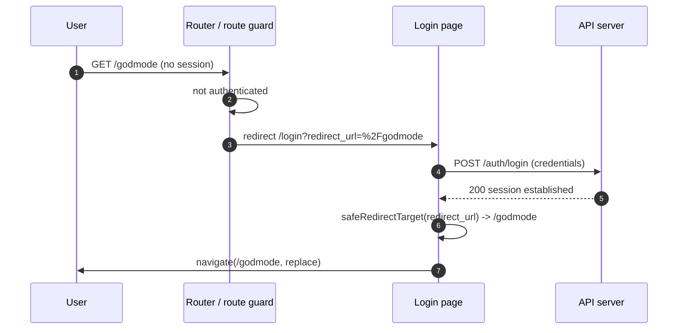
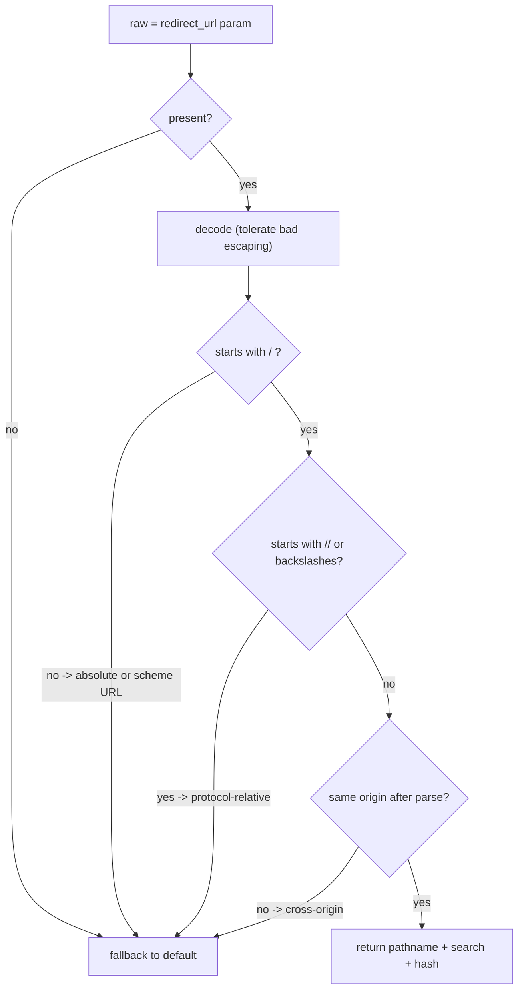

# Redirect After Login

> When an unauthenticated user requests a protected page, carry their intended destination through the login step and send them back there once they authenticate — instead of dumping them on a generic home page. This is the *consumer* half of the flow; [[axios-refresh-token-interceptor|the session-expired handler]] is the *producer* half (it builds the `return_to` / `redirect_url` value when a live session dies mid-use).

## Overview

The user clicks a deep link while logged out:

```
https://example.com/godmode   →   (no session)   →   https://example.com/login?redirect_url=/godmode
```

They log in. The desired behavior is **not** "go to the dashboard" — it is "go where they were heading":

```
https://example.com/login?redirect_url=/godmode   →   (auth OK)   →   https://example.com/godmode
```

The mechanism, in one line: **capture the intended URL → redirect to `/login?redirect_url=<encoded path>` → on success, redirect to that path (validated).**

That parenthetical — *(validated)* — is the entire security surface of this feature. A raw, user-controlled `redirect_url` fed straight into `location.assign(...)` is an [open redirect](https://cwe.mitre.org/data/definitions/601.html) (CWE-601), and open redirects are a direct path to credential phishing. Most of this note exists to make that safe.

> **Stack-specific.** Code below is **TypeScript + React + react-router v6 (browser)**. The pattern ports to Next.js (`redirect()` in server actions / middleware), Vue Router (`router.push`), or a traditional server that issues a `302` — the *validation* is identical everywhere; only the navigation call changes.

## How it works

The happy path, end to end:



Two distinct moments do work:

1. **Capture** — a route guard sees an unauthenticated request for a protected page and appends `redirect_url=<encoded pathname+search>` before sending to `/login`.
2. **Restore** — after a successful login, the login page reads `redirect_url`, runs it through a validator, and navigates there.

Restore is where the danger lives. The validator's decision tree:



Read it as: a target is accepted **only** if it is a root-relative path that, resolved against our own origin, stays on our own origin. Everything else — absolute URLs, scheme URLs, protocol-relative URLs — collapses to the safe default.

## The open-redirect hole (read this first)

Feeding `redirect_url` straight into navigation is the classic open redirect:

```
/login?redirect_url=https://evil.com/login   →   after auth   →   location.href = "https://evil.com/login"
```

The attacker mirrors your login page on `evil.com`, sends the phishing link around, and the victim — who genuinely started on *your* domain — types their password into the clone. You vouched for the destination by redirecting to it.

A naive `if (redirect_url.startsWith('/'))` check is **not enough**. These all start with `/` and still escape your origin in some browser:

| Input | Why it's dangerous |
|---|---|
| `//evil.com` | Protocol-relative — the browser fills in the current scheme and treats it as `https://evil.com`. |
| `/\evil.com` | Leading backslash; some browsers normalize it to `//evil.com`. |
| `///evil.com` | Three slashes still resolve cross-origin. |
| `/a]@evil.com` or `/../..//evil.com` | Path tricks that some parsers resolve to an absolute URL. |
| `https://evil.com` | Absolute — the only thing `startsWith('/')` already rejects, which is why people stop too early. |

And these do **not** start with `/`, which is exactly why "must start with `/`" is the first hard rule:

| Input | Why it's dangerous |
|---|---|
| `javascript:alert(document.cookie)` | Executes script in your origin on navigation. |
| `data:text/html,<script>...` | Renders attacker HTML. |

The rule that kills all of them at once: **only same-origin, root-relative paths are valid targets.** Then verify it by parsing.

## Safe-redirect validation

The validator. This is the single source of truth — both the login page and any server-side redirect should funnel through equivalent logic.

```ts
const DEFAULT_REDIRECT = '/';
// Routes that must never be a redirect target — otherwise ?redirect_url=/login
// lands the user straight back in the auth flow.
const DENY_PATHS = new Set(['/login', '/signup']);

/**
 * Resolve a user-controlled redirect target to a safe, same-origin path.
 * Returns DEFAULT_REDIRECT for anything absolute, cross-origin, malformed, or
 * pointing at an auth route. `origin` defaults to the browser origin; pass the
 * request origin explicitly to reuse this server-side.
 */
export function safeRedirectTarget(
  raw: string | null | undefined,
  fallback = DEFAULT_REDIRECT,
  origin: string = typeof window !== 'undefined' ? window.location.origin : '',
): string {
  if (!raw) return fallback;

  let decoded: string;
  try {
    decoded = decodeURIComponent(raw);
  } catch {
    return fallback; // malformed percent-encoding — don't try to be clever
  }

  // Only root-relative paths are allowed. This single rule rejects absolute
  // URLs (https://evil.com) and scheme URLs (javascript:, data:), because
  // none of them start with '/'.
  if (!decoded.startsWith('/')) return fallback;

  // Reject protocol-relative (//evil.com) and backslash (/\evil.com) forms:
  // some browsers resolve them to absolute, cross-origin URLs.
  if (/^[\/\\]{2}/.test(decoded)) return fallback;

  // Final guard: parse against the given origin and keep only same-origin paths.
  // new URL('//evil.com', origin) resolves to evil.com, so its origin differs
  // and is rejected here — belt and suspenders alongside the regex above.
  try {
    const url = new URL(decoded, origin);
    if (url.origin !== origin) return fallback;
    if (DENY_PATHS.has(url.pathname)) return fallback; // no auth-route loops
    return url.pathname + url.search + url.hash;
  } catch {
    return fallback;
  }
}
```

Two checks matter most and they are deliberately redundant:

- **`startsWith('/')` + not `//` or `/\`** catches the obvious escapes by shape.
- **`new URL(..., origin).origin === origin`** is the authoritative answer: parse it the way the browser will, then refuse anything that leaves the origin.

Keep both. The shape check is cheap clarity; the parse check is the one you cannot drop.

### Validate at the redirect site, not just at capture

Capture-time validation is convenience, not security — an attacker hand-crafts the URL, so they bypass whatever the guard wrote. **The point that performs the navigation must validate.** If a server ever performs the redirect (e.g. a traditional `POST /login` returning `302 Location: <redirect_url>`), the same check runs server-side, comparing against the server's own origin. Client validation never replaces this.

## Where to store the intended URL

| Store | Survives reload | Survives cross-domain OAuth round-trip | Leakage | Notes |
|---|---|---|---|---|
| **Query param** (`?redirect_url=`) | ✅ | ✅ (it rides in the URL) | Visible in URL, referrers, logs | Simplest for SPAs; the default choice here. |
| **sessionStorage** | ✅ (per tab) | ⚠️ Lost if the auth flow opens a new context | None in URL | Cleaner URLs; lost when the tab closes. |
| **Cookie** | ✅ | ✅ (if not `SameSite=Strict` across the OAuth redirect) | Sent to server | Good for server-driven flows; watch `SameSite`. |
| **Server session / `state`** | ✅ | ✅ | None | Most secure; required for OAuth/OIDC — bind the return path to the `state` nonce, not the URL. |

For a same-origin SPA login, the **query param** is the right default: it survives reloads and the back button, needs no storage plumbing, and is safe *once it passes the validator*. Reach for server-side `state` only when the login itself hops domains (OAuth), because then you cannot trust a URL param that crossed those hops.

## Implementation (React + react-router)

### 1. Capture — the route guard

When an unauthenticated user hits a protected route, record where they were going and send them to login carrying it.

```tsx
// RequireAuth.tsx — wraps protected routes
import { Navigate, useLocation } from 'react-router-dom';
import { useAuth } from './auth-context';

export function RequireAuth({ children }: { children: React.ReactNode }) {
  const { user, bootstrapped } = useAuth();
  const location = useLocation();

  // Wait for /auth/me before deciding, so a valid cookie doesn't flash login.
  if (!bootstrapped) return null;

  if (!user) {
    const from = encodeURIComponent(location.pathname + location.search);
    return <Navigate to={`/login?redirect_url=${from}`} replace />;
  }

  return <>{children}</>;
}
```

Encode `pathname + search` so a deep link like `/orders?page=2` round-trips intact. `replace` keeps the protected URL out of history (see Pitfalls).

### 2. Restore — the login handler

After credentials are accepted, read the param, validate it, and navigate.

```tsx
// LoginPage.tsx
import { useState } from 'react';
import { useNavigate, useSearchParams } from 'react-router-dom';
import { safeRedirectTarget } from './safe-redirect';
import { api } from './api';

export function LoginPage() {
  const navigate = useNavigate();
  const [params] = useSearchParams();
  const [error, setError] = useState<string | null>(null);

  async function onSubmit(e: React.FormEvent) {
    e.preventDefault();
    setError(null);
    const form = new FormData(e.target as HTMLFormElement);
    try {
      await api.post('/auth/login', {
        email: form.get('email'),
        password: form.get('password'),
      });
      // session established — cookie set by the server (or token stored).
      const target = safeRedirectTarget(params.get('redirect_url'));
      navigate(target, { replace: true }); // replace: don't leave /login in history
    } catch {
      setError('Invalid email or password.'); // never navigate on a failed login
    }
  }

  // ...form JSX (render `error` near the submit button)...
}
```

`navigate(target, { replace: true })` so that pressing Back from `/godmode` does not return the user to `/login`. If they log out later, the natural Back target is the page *before* the protected one, not the login screen.

> **Login CSRF.** SameSite on the *issued* session cookie does not protect `/auth/login` itself — the login POST carries no session cookie yet, so it can be cross-site-POSTed. Validate `Origin`/`Referer` server-side on `/auth/login` (or require a double-submit CSRF token), independent of the cookie's SameSite flag, or an attacker can log the victim into the attacker's account.

### Naming: `redirect_url`

This vault standardizes on **`redirect_url`** — the interceptor writes it and the login handler reads it, so a session that expires mid-use and a fresh deep-link login share one restore flow. (`return_to`, `next`, and `redirect` are common aliases elsewhere; pick one name per app and use it in both halves.)

## Edge cases

- **Already logged in.** A logged-in user visiting `/login` should skip straight to `redirect_url` (or the default home) rather than show a login form.
- **Missing or empty param.** Fall back to the default — never navigate to an empty string.
- **Intended destination was a `POST`.** A redirect can only resume a `GET`. A deep link to a form-submit endpoint is not returnable; surface the form page instead.
- **Target is an auth route** (`/login`, `/signup`). Restoring to `/login` lands the user back on the auth screen while logged in. The validator's `DENY_PATHS` deny-list falls these back to the default.
- **Authentication vs authorization.** This pattern restores a route after *authentication* ("are you logged in?"). Whether the user may *see* `/godmode` is a separate *authorization* question — see [[role-based-access-control]]. Restore them, then let RBAC decide.
- **Cross-subdomain targets.** `new URL(..., origin)` rejects subdomains (`app.example.com` vs `example.com`) because origins differ. Intentionally allowing a sibling subdomain means an explicit host allow-list, not a relaxed origin check.

## Key decisions

- **Validate at the redirect site, not just at capture.** Capture is convenience; the navigation point is security. Server-issued redirects validate server-side too.
- **Same-origin root-relative paths only.** `startsWith('/')` + not `//`/`\` + origin parse. Three checks, deliberately redundant.
- **Query param for SPAs, `state` for OAuth.** The URL param survives reloads and the back button; cross-domain auth hops cannot trust a URL param, so bind the return path to the OAuth `state` nonce server-side.
- **Always a safe fallback.** Every rejection returns a default destination; the validator never throws and never returns an unsafe string.
- **`replace` navigation.** Login is a transition, not a page to keep in history.

## Pitfalls

- **Open redirect (the big one).** `window.location.href = redirect_url` raw, or a server `Location:` header from an unvalidated param. CWE-601 → phishing. Use `safeRedirectTarget` (client) and its server equivalent.
- **The validator owns only its hop.** It proves the *top-level* target is same-origin and returns `search` verbatim. If a destination route redirects on its own query param (e.g. `/jump?next=…`) without re-validating, the chain opens at hop two. Every redirect site must apply the same validator to its own params.
- **Protocol-relative `//evil.com`.** Passes a naive `startsWith('/')` check and still escapes the origin. The regex and the origin-parse both catch it; don't remove either.
- **Double-encoding.** Encoding twice means decoding once leaves a still-encoded path, so the user lands on a literal `%2Fgodmode` instead of `/godmode`. Encode once at capture; decode once at restore.
- **Returning to a `POST` route.** Impossible — navigation is `GET`. Don't try to "resume" a form submission; route the user to the form.
- **Login loop.** `redirect_url=/login` would land the user back on the login screen while authenticated. The validator's `DENY_PATHS` blocks this; keep auth routes in it if you add more.
- **Trusting `document.referrer`.** Unreliable across redirect chains and it leaks to external sites on the next navigation. Don't use it as the return path.
- **Forgetting `replace`.** Without it, Back from the destination returns to `/login`, which is confusing and can re-trigger the flow.
- **Lost param across an OAuth round-trip.** A `sessionStorage` return path is wiped when login opens a new tab/origin; re-append it to the callback URL or store it server-side bound to `state`.

## Notes

- Pairs with [[axios-refresh-token-interceptor]]: that note *produces* the redirect target (`location.assign('/login?return_to=...')`) when a session expires mid-use; this note *consumes* it after login. Wire both through the same validator.
- The session model these depend on is [[token-based-authentication-with-refresh-rotation]].
- Once the user is back on their route, [[role-based-access-control]] decides whether they may actually view it — redirect handles authentication, RBAC handles authorization.
- Ports directly to Next.js (`redirect(target)` in middleware / server actions, same validation), Vue Router (`router.push(target)`), and traditional servers (validate the `Location` header server-side before issuing `302`).
