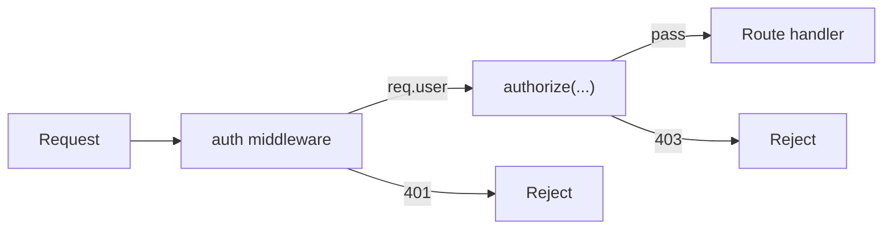
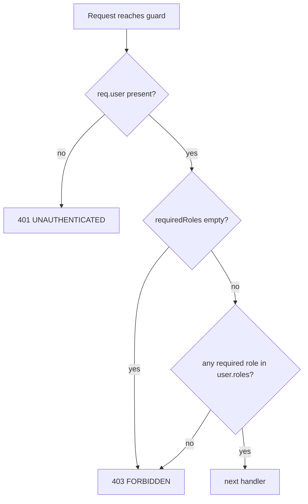

# Authorization

> Generic implementation reference for role-based authorization. Two variants — **single-role** (simplest) and **multi-role** (flexible) — share one spine. Patterns and recommendations — adapt to your domain.

## Overview

Authorization answers "what may this authenticated user do?". This reference covers **role-based access control (RBAC)** in two variants: **single-role** (one role per user, equality check) and **multi-role** (one or more roles per user, any-of check). Both are **denied by default** — a guard with no role configured must never pass.

Authentication (see [[token-based-authentication-with-refresh-rotation|authentication]]) runs first and attaches the principal; then authorization decides whether the request may proceed.



## Choosing a model

Pick the variant that matches your surface; both share the rest of this doc.

| Need | Pick |
|---|---|
| ≤2–3 roles, never overlap, one role per user, simple/admin-only tool or MVP | **Part 1 — Single-role** |
| Roles that stack (`user` + `seller`), overlap, or ≥3 with additive privileges | **Part 2 — Multi-role** |
| Uncertain / early stage | Start single-role; multi-role is a superset, migration is mechanical (see Part 2 storage) |

> Single-role is the degenerate case of multi-role. Don't build multi-role "for later" unless you can name the second role today — YAGNI.

## Audience routing

Access tokens carry an audience claim (e.g. `customer` / `admin`). The auth middleware derives the expected audience from the request path, and `authorize()` composes with it on privileged surfaces.

| Path prefix (example) | Expected audience |
|---|---|
| `/customer`, `/account` | `customer` |
| `/admin` | `admin` |
| `/auth` | either |

Admin surfaces require both an `admin`-audience token **and** an `admin` role. (A minimal internal tool with a single audience can ignore this section.)

## Part 1 — Single-role RBAC

> Simplest variant. One role per user, equality-based guard. Right call for internal tools, simple SaaS, MVPs, or any surface where roles never overlap.

### Role model

Two roles, fixed:

| Role | Purpose |
|---|---|
| `user` | Baseline authenticated identity (default on sign-up) |
| `admin` | Full administrative access |

A user holds exactly one role. Add values to the enum only if you genuinely need them — if roles start overlapping or stacking, you want [[#Part 2 — Multi-role RBAC]].

### Storage

Scalar column on the user table:

| Property | Recommendation |
|---|---|
| Column | `role` scalar, NOT NULL |
| Default | `'user'` |
| CHECK | `role IN ('user', 'admin')` |
| Index | plain btree (only if you filter by role) |

No array, no GIN, no array-length constraint.

### The authorize() guard

A single-role guard is one equality check:

```ts
type Role = 'user' | 'admin';

const authorize = (required: Role) => (req, res, next) => {
  if (!req.user) return res.status(401).json({ error: 'UNAUTHENTICATED' });
  return req.user.role === required
    ? next()
    : res.status(403).json({ error: 'FORBIDDEN' });
};
```

Behavior:

- No principal → 401 `UNAUTHENTICATED`.
- `req.user.role !== required` → 403 `FORBIDDEN`.
- Deny by default still holds — never wire a route expecting an unguarded call to pass.

Admin management (admin audience, `authorize('admin')`) is equally simple: list users, flip a user's `role` between `'user'` and `'admin'`. No array mutation, no add/remove semantics.

### When this stops being enough

Switch to Part 2 the moment you need any of: a user holding two roles at once, additive privileges across roles, or more than ~3 roles with overlapping access. Don't simulate multi-role with a single column by "promoting" through ranks — that's multi-role with extra steps.

## Part 2 — Multi-role RBAC

> Flexible variant. Each user holds one or more roles; guards use an **any-of** check. Right call for marketplaces, overlapping privileges, or role composition.

### Role model

Define roles as a fixed enum, for example:

| Role | Typical purpose |
|---|---|
| `user` | Baseline authenticated identity (default on sign-up) |
| `seller` / `contributor` | Elevated domain action (selling, posting) |
| `admin` | Full administrative access |
| `moderator` | Limited content/policy action |

A user may hold several roles at once, e.g. `['user', 'seller']`. Choose names that match your domain; the mechanism below works for any enum.

### Multi-role storage

When roles are an array column on the user table:

| Property | Recommendation |
|---|---|
| Column | roles array, NOT NULL |
| Default | a baseline role (e.g. `['user']`) |
| CHECK | `array_length(roles, 1) >= 1` — an empty array breaks every authz check |
| Index | a **GIN** index for efficient `WHERE 'admin' = ANY(roles)` membership queries |

If you migrate from a single-role column to a multi-role array, backfill from the old column, swap the index type (a btree cannot serve array membership), and keep the old column until the cutover is verified.

### The authorize() guard

A typical `authorize(...requiredRoles)` middleware:



Behavior:

- No principal → 401 `UNAUTHENTICATED`.
- Empty required list → 403 `FORBIDDEN` (deny by default — a misconfigured guard must never grant access).
- `requiredRoles.some(r => user.roles.includes(r))` → pass; otherwise 403 `FORBIDDEN`.
- Log mismatches with the user id, path, required roles, and actual roles — no PII beyond identifiers.

### Administrative capabilities

A typical admin surface (admin audience, `authorize('admin')`) exposes user management:

| Action | Effect |
|---|---|
| List / get users | Paginated, filterable by role/status/search |
| Update user | Change roles and/or status |
| Add / remove role | Mutate the roles array |

### Role to capability

Authorization is enforced route-by-route through `authorize(...)`; there is usually no need for a central permission table early on. The mapping grows as routes are added.

| Role                     | Typical access                |
| ------------------------ | ----------------------------- |
| `user`                   | Baseline authenticated routes |
| `seller` / `contributor` | Elevated domain routes        |
| `admin`                  | Admin surface                 |
| `moderator`              | Limited policy routes         |

> Illustrative examples, not a fixed schema — pick role names and access scopes to match your domain.

### Reference implementation (central registry)

> **Stack-specific.** The code below targets **Express + TypeScript**. The *pattern* — a route-name-keyed registry, discriminated rules, deny-by-default evaluator — is framework-agnostic; adapt the request shape (`req.user`, matched-route lookup), the middleware signature, and the types to your stack (Hono, Fastify, NestJS, Django / FastAPI, Spring, etc.).

Once the route count grows, centralize authorization into a **registry keyed by route name** (not `req.path`), kept separate from routing so routes retain their own middleware. Rules use a small discriminated union: a single condition for the common case, an explicit `require` combine for the rare cross-condition AND/OR. Two axes stay separate — `require` (how conditions combine) and `check` (how roles combine within one condition).

Types:

```ts
type Role = 'user' | 'seller' | 'admin' | 'moderator';

type Permission =
  | 'users.read' | 'users.ban' | 'users.assignRole'
  | 'orders.refund' | 'content.feature';

type Condition =
  | { perm: Permission }
  | { roles: Role[]; check?: 'any' | 'all' };   // check defaults to 'any'

type Rule =
  | 'public'
  | Condition
  | { require: 'all' | 'any'; of: Condition[] };
```

Role → permission matrix (single source of truth for "who has which permission"):

```ts
const roleMatrix: Record<Role, Permission[]> = {
  user:       [],
  seller:     [],
  moderator:  ['users.read', 'content.feature'],
  admin:      ['users.read', 'users.ban', 'users.assignRole',
               'orders.refund', 'content.feature'],
};

const can = (roles: Role[], perm: Permission) =>
  roles.some(r => roleMatrix[r].includes(perm));
```

The registry — route name → rule, authz only (no routing, no handlers):

```ts
const rbacTable = {
  // public: explicit allowlist; everything else is deny-by-default
  'health':         'public',
  'auth.login':     'public',
  'auth.refresh':   'public',
  'auth.register':  'public',

  // permission-only (preferred when you have a permission model)
  'admin.users.list':    { perm: 'users.read' },
  'admin.users.get':     { perm: 'users.read' },
  'admin.users.roles':   { perm: 'users.assignRole' },
  'admin.users.ban':     { perm: 'users.ban' },
  'orders.refund':       { perm: 'orders.refund' },

  // role-only (no permission model here, or role is the natural gate)
  'reports.view':      { roles: ['admin', 'moderator'], check: 'any' },
  'seller.dashboard':  { roles: ['seller', 'admin'],    check: 'any' },
  'admin.settings':    { roles: ['admin'] },
} satisfies Record<string, Rule>;   // compile-checks every row
```

Evaluator (deny-by-default) and middleware factory (keyed lookup — never matches `req.path`):

```ts
function passes(roles: Role[], rule: Rule): boolean {
  if (rule === 'public') return true;
  if ('require' in rule) {
    const r = rule.of.map(c => passes(roles, c));
    return rule.require === 'all' ? r.every(Boolean) : r.some(Boolean);
  }
  if ('perm'  in rule) return can(roles, rule.perm);
  if ('roles' in rule) {
    const c = rule.check ?? 'any';
    return c === 'all'
      ? rule.roles.every(r => roles.includes(r))
      : rule.roles.some(r => roles.includes(r));
  }
  return false;
}

const authorize = ({ key }: { key: string }) => (req, res, next) => {
  const rule = rbacTable[key];
  if (!rule)              return res.status(403).json({ error: 'FORBIDDEN' });        // unknown rule → deny
  if (rule === 'public')  return next();
  if (!req.user)          return res.status(401).json({ error: 'UNAUTHENTICATED' });
  return passes(req.user.roles, rule)
    ? next()
    : res.status(403).json({ error: 'FORBIDDEN' });
};
```

Route wiring — the key is explicit, middleware freedom is preserved:

```ts
router.post('/admin/users/:id/roles',
  validateBody(assignRoleSchema),
  authorize({ key: 'admin.users.roles' }),
  addRole);
```

Notes on this shape:

- **Owner / resource checks don't live here.** "User can edit *their own* profile" is resolved in the handler after loading the resource — the registry is for role/permission gates only.
- **Deny by default.** A route key with no entry returns 403; a boot-time check should fail if any registered route lacks an entry, or any entry references no route.
- **`satisfies Record<string, Rule>`** turns a typo'd permission or malformed row into a compile error.
- **Two files answer two questions:** `roleMatrix` → "who can do X?"; `rbacTable` → "what does this route need?" No overlap, no drift.

## Implementation notes

- Deny by default everywhere; a guard with no required roles must never pass.
- Compose audience checks with role checks on privileged surfaces.
- If you need finer-grained control later (permissions, resource ownership), layer it on top of roles rather than replacing them.
- **Roles arrive in the access token and are stale until it expires.** `req.user.roles` (Part 2) / `req.user.role` (Part 1) reflects the moment the token was minted, so a demotion takes up to the access TTL to take effect. For high-trust admin mutations, re-read from the DB/cache rather than trusting the claim (see [[token-based-authentication-with-refresh-rotation]]), or revoke the user's refresh family on role change.
- Multi-role specifics (CHECK array length, GIN index, single→multi migration) live in [[#Part 2 — Multi-role RBAC]].
