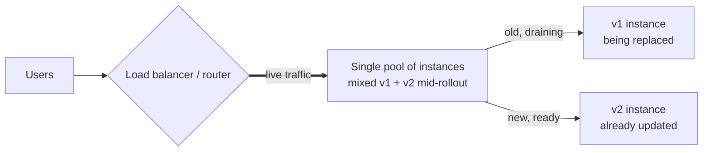
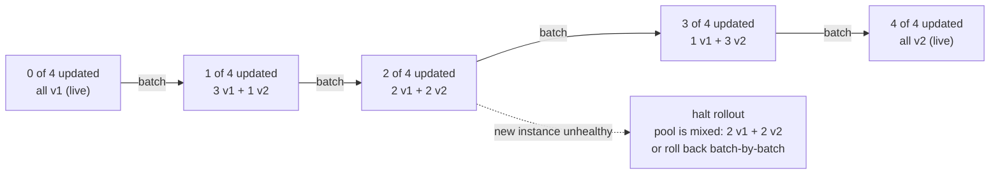
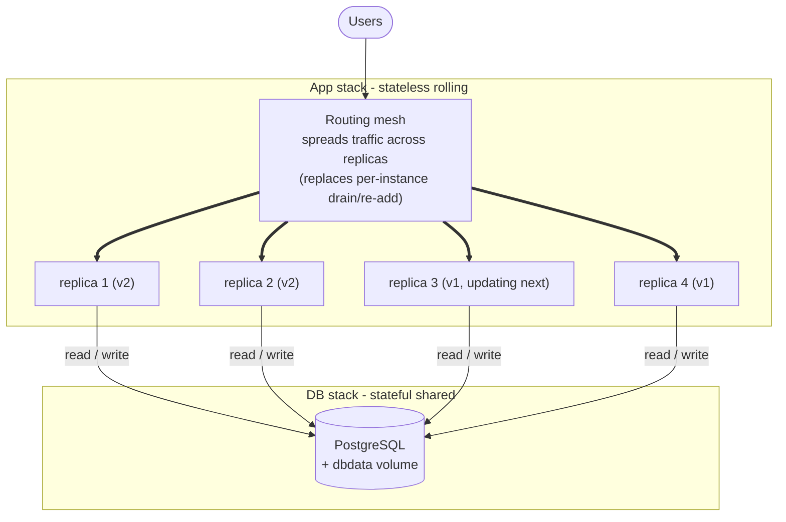

# Rolling Deployment

> Generic implementation reference for gradual, in-place fleet updates. Replace old-version instances with new-version instances a few at a time, keeping service capacity constant throughout.

## Overview

Rolling deployment updates a service **in place**: it replaces instances of the **current version** with instances of the **new version** in **small batches**, instead of spinning up a whole second environment (blue-green) or splitting traffic between two coexisting versions (canary). At any moment the live pool is a **mix** — some instances still on the old release, some already on the new — and capacity stays roughly constant because new instances come up as old ones go down.

The release is a **batch-by-batch replacement within one environment**, not a traffic switch and not a concurrent-version split. Two knobs control the pace: **max unavailable** (how many old instances can be down at once) and **max surge** (how many extra new instances can exist beyond the target count). Rollback is the same machinery in reverse — replace new with old, batch by batch.



Before the rollout, every instance in the pool runs v1. During the rollout (shown above), the pool is mixed — some v2 instances already serve, some v1 instances are draining to be replaced next. After the rollout, every instance runs v2 and no v1 remains.

## The rollout

1. Start with the **full pool running the current version** (v1), all serving traffic.
2. Take a **batch** of instances out of rotation (drain their connections), within the `max unavailable` budget so overall capacity stays above the minimum you need.
3. **Replace** each drained instance with the new version (v2) — stop the old one, start a new one — and bring it back into rotation.
4. **Repeat** in batches until every instance runs v2; the pool is never empty and never fully duplicated.
5. **Roll back** at any point by reversing direction: the next batch you replace is a v2 instance, swapped back to v1, until the whole pool is on the old release again.

## The progression

The version mix in the single pool shifts one batch at a time. Each step is a steady state: a few instances change version, capacity stays constant, then the next batch proceeds. A failed health check on a new instance halts the rollout mid-pool — the already-updated instances keep running while you decide.



So a health-check failure at the half-way point leaves the pool mixed — two v2 instances already serve while two v1 instances still run. Capacity never drops to zero the way a recreate-style redeploy would force, and the rollout pauses rather than exposing the fault to everyone the way a blue-green switch would.

**With real release versions** — the batch count climbs; the pool is never empty, never a full duplicate:

| Batch | Updated instances | Still on old version | Pool during step | On healthy | On unhealthy |
|-------|-------------------|----------------------|------------------|------------|--------------|
| 0 | 0 | 4 | all v1 (live) | start batch 1 | (nothing to roll back) |
| 1 | 1 | 3 | 1 v2 + 3 v1 | advance to batch 2 | halt / roll back batch |
| 2 | 2 | 2 | 2 v2 + 2 v1 | advance to batch 3 | halt / roll back batch |
| 3 | 3 | 1 | 3 v2 + 1 v1 | advance to batch 4 | halt / roll back batch |
| 4 | 4 | 0 | all v2 (live) | release complete | roll back to v1 batch-by-batch |

Read batch 2: **two instances already run v2** while **two still run v1** — both versions live in the same pool at once, which is exactly what blue-green avoids by keeping the versions in separate environments, and what canary avoids by weighting rather than replacing.

## Nginx example

Nginx is not an orchestrator, but it can model the rolling pattern at the reverse-proxy layer: list every instance in one `upstream`, take a batch out by marking its member `down` and reloading (so traffic drains to the rest), deploy to that instance, then remove the `down` flag and reload to bring it back. Repeat per batch.

```nginx
# /etc/nginx/conf.d/app.conf

upstream app {
    # one pool, four instances — all v1 before the rollout
    server 10.0.0.11:8080;   # app-1
    server 10.0.0.12:8080;   # app-2
    server 10.0.0.13:8080;   # app-3
    server 10.0.0.14:8080;   # app-4
}

server {
    listen 80;
    server_name app.example.com;

    location / {
        proxy_pass http://app;

        proxy_set_header Host              $host;
        proxy_set_header X-Real-IP         $remote_addr;
        proxy_set_header X-Forwarded-For   $proxy_add_x_forwarded_for;
        proxy_set_header X-Forwarded-Proto $scheme;
    }
}
```

Roll one batch (here, one instance) at a time — drain, deploy, restore, repeat:

```bash
# 1. Take app-2 OUT of rotation so the router stops sending it new traffic:
sudo sed -i 's|server 10.0.0.12:8080;   # app-2|server 10.0.0.12:8080 down; # app-2 (drained)|' /etc/nginx/conf.d/app.conf
nginx -t && nginx -s reload

# 2. In-flight requests on app-2 finish; deploy v2 onto it (rebuild / restart the app there):
ssh 10.0.0.12 'deploy-myapp v2'

# 3. Verify the updated instance serves v2 BEFORE returning it to the pool:
curl http://10.0.0.12:8080/health

# 4. Bring app-2 back into rotation; the pool is now 1 v2 + 3 v1:
sudo sed -i 's|server 10.0.0.12:8080 down; # app-2 (drained)|server 10.0.0.12:8080;   # app-2|' /etc/nginx/conf.d/app.conf
nginx -t && nginx -s reload

# 5. Repeat for app-3, then app-4, then app-1 — one drain -> deploy -> restore cycle each.
```

Rollback is the same loop in reverse — drain a v2 instance, redeploy v1 onto it, restore:

```bash
# drain app-2, redeploy v1, verify, restore — repeat per instance until the pool is all v1 again.
```

- `server <addr> down;` + `nginx -s reload` is the **drain**: Nginx stops sending new requests to that backend while old workers let in-flight ones finish — the batch leaves rotation without dropping connections.
- Nginx models rolling at the **routing** layer only — the actual "replace the instance with the new version" step happens on the host (`deploy-myapp`), not inside Nginx. An orchestrator (Swarm, Kubernetes) automates both the drain and the replace.
- For **graceful draining**, pair `down` with a short stop-wait so a stuck instance is retried away from quickly; better still, let the app signal readiness so the router only re-adds a healthy instance.
- For **hands-off rolling**, drive the `down` flag from an include file or templating so each batch is CI-driven and health-gated rather than a manual `sed` per instance.

## Docker Compose example

Rolling update is a first-class feature of an orchestrator, so the honest Compose example uses **Docker Swarm** mode: declare the app as a replicated service with `update_config` (batch size, delay, order, failure action), and `docker stack deploy` applies the new image one batch at a time. Keep the **stateful database in a separate stack** on the same network — a rolling update of the app must never recreate the DB.



Snapshot of a rollout in flight: **two replicas already run v2**, **two still run v1** — the Swarm update task is mid-way through replacing them in batches of one. The routing mesh keeps serving throughout because it only sends traffic to healthy replicas; the **app stack** is what rolls, while the **database is stateful and shared**, living in a separate stack on the same network so an update never recreates it. This makes the *Decouple database changes from code deploys* rule concrete (see *Gotchas* below): every replica, old or new, reads/writes **one** database.

```yaml
# docker-compose.swarm.yml — app stack (replicated service, rolling update)
services:
  app:
    image: myapp:v1            # current release (pin explicit tags, not :latest); bump to v2 to roll
    deploy:
      replicas: 4
      update_config:
        parallelism: 1         # 1 replica replaced per batch (your "max unavailable")
        delay: 10s             # wait between batches so you can watch metrics
        order: start-first     # start the new replica before stopping the old (surge)
        failure_action: rollback
      rollback_config:
        parallelism: 1
        order: start-first
    environment:
      - DATABASE_URL=postgres://app:${DB_PASSWORD}@db:5432/app
    restart: unless-stopped
    networks: [appnet]
```

```yaml
# docker-compose.db.yml — DB stack (stateful, NOT part of the roll)
services:
  db:
    image: postgres:16
    environment:
      - POSTGRES_USER=app
      - POSTGRES_PASSWORD=${DB_PASSWORD}
    volumes:
      - dbdata:/var/lib/postgresql/data
    restart: unless-stopped
    networks: [appnet]

volumes:
  dbdata:

networks:
  appnet:
    external: true
```

One release cycle, step by step:

```bash
# 0. One-time prerequisites: Swarm mode + the shared network + the DB stack (runs indefinitely)
docker swarm init
docker network create --driver overlay --attachable appnet
docker stack deploy -c docker-compose.db.yml db

# 1. Start the app stack: 4 replicas of v1, the routing mesh load-balances them
docker stack deploy -c docker-compose.swarm.yml app

# 2. Trigger the rolling update by changing the image to v2 (the stack file is the source of truth):
sed -i 's|image: myapp:v1|image: myapp:v2|' docker-compose.swarm.yml
docker stack deploy -c docker-compose.swarm.yml app

# 3. Swarm replaces replicas in batches of 1 (parallelism), 10s apart — watch it progress:
docker service ls
docker service ps app_app --no-trunc

# 4. The pool passes through mixed states (1 v2 + 3 v1 -> 2 v2 + 2 v1 -> ...) until all 4 are v2.
#    If a new replica fails its health check, failure_action: rollback reverses the roll automatically.
```

Rollback is the same command in reverse — point the image back at v1 and redeploy, or use Swarm's explicit rollback:

```bash
# Explicit rollback to the previous release (Swarm tracks the last deployed image):
docker service update --rollback app_app

# Or repoint the image and redeploy, same as a forward roll:
sed -i 's|image: myapp:v2|image: myapp:v1|' docker-compose.swarm.yml
docker stack deploy -c docker-compose.swarm.yml app
```

- `update_config.order: start-first` is the **surge** knob: Swarm starts the new replica before stopping the old one, so capacity never dips below the target — the rolling analogue of blue-green's "verify before switch."
- **Swarm is required**: plain `docker compose up` ignores `update_config` — rolling semantics need the Swarm (or Kubernetes) scheduler. In Compose without Swarm, `docker compose up -d --no-deps <svc>` replaces the whole service at once, not batch-by-batch.
- **Kubernetes equivalent**: a `Deployment` with `strategy: type: RollingUpdate`, `maxUnavailable`, and `maxSurge` is the same model — readiness gates via `readinessProbe` control when a new pod enters rotation.
- **DB stays out of the roll**: run migrations once against the shared DB *before* the rollout begins (a one-shot migrate step), and keep them expand/contract so old and new replicas both tolerate the current schema throughout the mixed-pool window.
- **Traefik alternative**: run Traefik as the routing mesh and have it read a health-checked label per replica — bringing a healthy new replica up *is* its entry into rotation, with no manual `sed` or reload at all.

## Pros and cons

| Pros | Cons |
|---|---|
| No second full environment — capacity you already pay for is what you roll | Mixed versions run concurrently during the window; both must coexist |
| Gradual change with capacity held roughly constant | Slower than a blue-green flip — each batch needs to stabilize |
| Automatic, health-gated rollback built into the orchestrator | A bad release is live to part of traffic before it is caught |
| Simple to operate — one pool, one service, one command to advance | Long-lived sessions can be dropped when an instance is drained |

## When to use

- Use when you want **gradual, automated fleet updates** **without paying for a second full environment**, and your orchestrator (Swarm, Kubernetes) supports rolling updates natively.
- Best for **stateless** services behind a load balancer or routing mesh, where draining and re-adding instances is routine.
- Avoid when the old and new versions **cannot coexist on the same data** (breaking DB schema, incompatible API contracts) — there, prefer blue-green so the version switch is atomic and reversible.
- When you need **real production validation on a measured slice** rather than a fleet-wide walk, prefer canary; rolling replaces instances, it does not isolate a test slice.

## Gotchas

- **Database migrations**: old and new replicas read/write the *same* schema **at the same time** during the mixed-pool window. Use expand–contract migrations; the new code must tolerate the old schema, and the old code must tolerate the new, until the roll completes.
- **Sessions / stateful connections**: draining an instance drops in-flight work and any in-memory session pinned to it. Use shared session storage and drain gracefully (let connections finish) before stopping.
- **API consistency**: mixed versions mean mixed API versions talking to each other and to clients. Keep API changes backward-compatible for the duration of the rollout.
- **Background jobs / queues**: replicas of both versions may produce or consume work at once — ensure jobs are idempotent and version-tolerant.
- **Batch sizing**: too large a `parallelism` (max unavailable) drops capacity below what traffic needs; too small and the roll is slow. Tune against your headroom, and prefer `order: start-first` so surge, not unavailability, absorbs the change.
- **Readiness gates**: the orchestrator must only route to a new replica after it passes a health/readiness check, or you serve from a half-started instance. Wire a real readiness probe.
- **Cost**: unlike blue-green, you do not run a full duplicate — but you briefly run surge capacity (extra replicas during `start-first`), and the mixed-pool window still costs two versions of the app concurrently.

## Implementation notes

- Keep every replica identical except the version — same config, infrastructure, and secrets.
- Drive updates through the orchestrator's declared state (the stack file / Deployment manifest); never replace instances by hand if you want repeatable, rollback-able rolls.
- Move the version forward by changing the image tag in that declared state and re-deploying; the orchestrator applies it batch-by-batch.
- Decouple database changes from code deploys — concurrent-version schema compatibility is the hardest part to reverse.
- Gate each batch on health checks and monitoring, both on the new replica as it starts and on the pool as a whole; let `failure_action: rollback` reverse a bad roll automatically.
