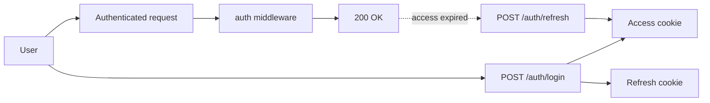
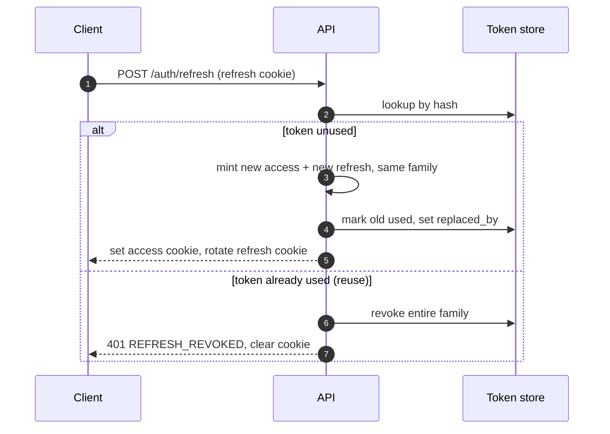
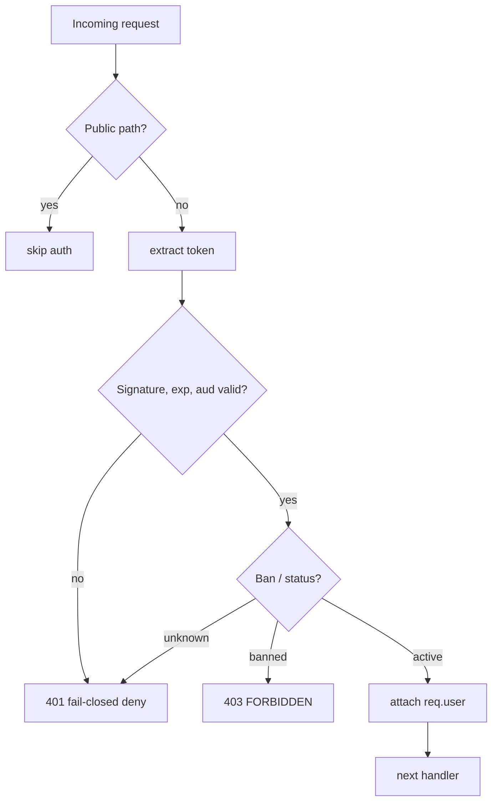

# Authentication

> Generic implementation reference for token-based authentication. These are patterns and recommendations, not a prescription — adapt names, libraries, and layout to your stack.

## Overview

A robust web auth system typically uses a **dual-token** model:

- A short-lived **JWT access token** (signed, commonly HS256) carried in an HttpOnly cookie.
- A long-lived **opaque refresh token** (random bytes, stored only as a hash) used to mint new access tokens.

Tokens should never be readable by JavaScript. The browser sends them automatically as cookies; API clients may also send the access token through an `Authorization: Bearer` header. Distinguish **audiences** (for example a customer surface versus an admin surface) so a token issued for one cannot be replayed against the other.



## Token model

### Access token

| Property | Recommendation |
|---|---|
| Algorithm | HS256 (symmetric, single verifier) or RS256/ES256 (asymmetric, multiple verifiers) |
| Lifetime | Short — 5 to 15 minutes |
| Clock skew | ~60 s tolerance on verification |
| Issuer | A stable application identifier |
| Transport | HttpOnly cookie **or** `Authorization: Bearer <token>` |

### Refresh token

| Property  | Recommendation                                                            |     |
| --------- | ------------------------------------------------------------------------- | --- |
| Format    | Opaque — at least 32 random bytes, base64url-encoded (not a JWT)          |     |
| At rest   | Store only a hash (SHA-256 or stronger); never store the raw token        |     |
| Lifetime  | Long — days to weeks                                                      |     |
| Grouping  | A **family id** so a rotation lineage can be tracked and revoked together |     |
| Transport | HttpOnly cookie                                                           |     |

### Access-token claims (recommended)

| Claim                         | Meaning                                         |
| ----------------------------- | ----------------------------------------------- |
| `sub`                         | User id                                         |
| `email` (or other identifier) | Principal identifier                            |
| `roles` / `role`                       | Role claim — `roles[]` array (multi-role) or scalar `role` (single-role); see [[role-based-access-control]]                           |
| `scope` / context             | Optional — tenant, KYC/participant state, etc.  |
| `iat` / `exp`                 | Issued-at / expiry, epoch seconds               |
| `iss`                         | Issuer literal                                  |
| `aud`                         | Audience — which surface the token is valid for |

> **Roles in the access token are stale until it expires.** A demoted user keeps a signed `admin` token for the access TTL (5–15 min). The status/ban cache covers bans but not role *reduction*. On demotion, either revoke the user's refresh family so the next access token reflects the new roles, or re-check roles from the DB/cache on privileged (admin-audience) surfaces instead of trusting the claim — see [[role-based-access-control]].

## Cookies

Centralize cookie names and flags so every surface (API, SSR, mobile gateway) agrees.

| Cookie | Purpose | Lifetime |
|---|---|---|
| Access-token cookie | Sent on every authenticated request | access-token TTL |
| Refresh-token cookie | Sent only to the refresh endpoint | refresh-token TTL (longer with "remember me") |

Recommended flags: `HttpOnly`, `Secure` (production / HTTPS), `SameSite=Lax` (use `Strict` or `None` based on your CSRF strategy), `Path=/`, and `Domain` set to the apex domain **only** if you need cross-subdomain cookie sharing. Omit `Domain` during local development so cookies bind to `localhost`.

A "remember me" option can extend the refresh cookie to a fixed long max-age (e.g. 30 days).

## Token lifecycle and refresh rotation

Recommended rotation contract (safe under concurrency):

1. Mint the **new** access + refresh pair first, then mark the old refresh token as used in the same transaction.
2. If minting succeeds but the mark-used step fails, the old token remains usable and the new one is also valid — the client simply refreshes again. No session loss.
3. If mark-used fails because the row was already used (a concurrent caller reused it), treat it as **token theft** and revoke the entire family.

> **"Concurrent caller" means a thief, not a second tab.** This contract assumes the client refreshes one at a time — a single tab (in-realm single-flight) or multiple tabs serialized with a Web Lock (see [[axios-refresh-token-interceptor]]). Two tabs that share one refresh cookie and both hit `/auth/refresh` at once look identical to theft on the server, so without client-side serialization legitimate multi-tab / phone+laptop use gets force-logged-out. Serialize on the client; then "reuse found" really means reuse.

**Detect reuse atomically.** "The row was already used" must be decided by the database under concurrency — a plain `BEGIN; SELECT used_at; …; UPDATE;` lets two refreshes both see `used_at IS NULL`, both mint, and both UPDATE, so no error is raised and reuse goes undetected. Use `SELECT … FOR UPDATE` on the row, or a conditional update and check the affected row count:

```sql
UPDATE refresh_tokens
   SET used_at = now(), replaced_by = $newId
 WHERE hash = $1 AND used_at IS NULL
RETURNING id;
-- 0 rows → another caller consumed it first → reuse → revoke the family
```



## Refresh-token retention and purge

Rows are **kept**, not deleted, at rotation time — the consumed row is the evidence reuse detection needs (a replayed token matches a row with `used_at` set, so you revoke the family). Table growth is bounded by a **purge job**, not by deleting on rotation.

- **Keep until expiry.** A refresh-token row stays until `expires_at` (refresh TTL) so the reuse-detection window stays open for the token's whole lifetime.
- **Optional grace window.** Keep expired rows a little longer (e.g. 24–72 h) to catch late replays and preserve a forensic trail, then delete.
- **Purge job.** A scheduled background task reclaims space: `DELETE FROM refresh_tokens WHERE expires_at < now() - <grace>`. Index `expires_at`; run hourly or daily.
- **Only the purge job deletes rows.** Rotation marks (`used_at`, `replaced_by`); reuse detection revokes the family; the purge job removes dead rows. Never delete in the rotation or reuse path.
- **Bounded steady state.** Live rows ≈ active refresh tokens + recently rotated but unexpired rows. With the purge job running, the table does **not** grow without limit over time.
- **Only if you measure a problem:** you may purge *consumed* rows more aggressively — drop rows with `used_at` set once they are older than a short reuse window (e.g. 10–30 min) instead of waiting for full TTL. Default to TTL + grace; it is simpler and safer.

## Request authentication

A typical `auth` middleware validates every non-public request:



Steps:

1. **Extract** the token from the `Authorization: Bearer` header, falling back to the access-token cookie.
2. **Resolve the expected audience** from the request path (e.g. customer vs admin prefixes).
3. **Verify** signature, issuer, expiry (with skew tolerance), and audience.
4. **Validate** the claims against a schema (for example a Zod schema) before trusting them.
5. **Status / ban check** — check a cache first, then the database, and **fail closed** (deny) if neither can answer. Never admit an unknown user.
6. Attach the resolved principal (`req.user`) and the raw claims to the request.

Store the signing secret with at least 32 bytes of entropy. If it is base64- or hex-encoded, decode it at boot.

## Endpoints (typical surface)

| Method | Path | Purpose |
|---|---|---|
| POST | `/auth/login` | Credentials → access + refresh pair |
| POST | `/auth/refresh` | Rotate the refresh token, return a new access token |
| POST | `/auth/logout` | Revoke the token family behind the refresh cookie |
| POST | `/auth/logout-all` | Revoke every family for the current user |
| GET | `/auth/me` | Return the current user |
| POST | `/auth/register` + `/verify` | Sign-up with a short-lived verification token |

Rate-limit `/auth/refresh` and `/auth/logout` aggressively (e.g. ~10/min) — they are the main abuse surface.

## Email OTP and registration

Sign-up is verified by a one-time code sent over **email** (no SMS):

| Concern | Recommendation |
|---|---|
| Channel | Email only — behind a provider interface (console/log for dev, a real provider for prod) |
| OTP lifetime | Short — ~60 s |
| Max attempts | Lock the key after ~5 failed attempts |
| Registration token | Short-lived signed token (e.g. ~10 min) consumed by the verify step |

## Session revocation and bans

Because access tokens are short-lived and stateless, revocation is usually enforced by a **status/ban check** in the middleware: a fast cache (TTL ~60 s) backed by the database, failing closed if both are unavailable. To revoke a session immediately, rotate or revoke its refresh-token family.

## Error codes (suggested)

| Code | Meaning |
|---|---|
| `UNAUTHENTICATED` | No/invalid token, or fail-closed deny |
| `TOKEN_EXPIRED` | Access token past expiry (+skew) |
| `FORBIDDEN` | Authenticated but not allowed — see [[role-based-access-control|authorization]] |
| `REFRESH_REVOKED` | Refresh-token family revoked (reuse/theft) |
| `PARTICIPANT_REQUIRED` (optional) | A context gate (tenant/KYC) not yet satisfied |

## Configuration (categories)

| Category | Example variables |
|---|---|
| Token signing | `JWT_SECRET`, `JWT_ISSUER`, `ACCESS_TOKEN_TTL`, `REFRESH_TOKEN_TTL` |
| Status cache | ban/status cache TTL |
| Registration | registration-token TTL |
| Email delivery | provider + API key + from-address |
| OTP | OTP TTL, max attempts |
| Cookies | cookie domain (apex in prod, unset in dev) |
| CORS | allowed origins per surface |

## Implementation notes

- Keep token minting, rotation, cookie helpers, and the auth middleware as distinct modules.
- Centralize cookie names and flags so every surface agrees.
- Fail closed on every status lookup — a cache or database error must never admit a user.
- Constrain the role column at the DB level (non-empty array CHECK for multi-role, or `CHECK role IN (...)` for single-role) — an empty/invalid role breaks every authorization check. Details in [[role-based-access-control]].
- Treat refresh-token reuse as theft and revoke the family.

## Why refresh tokens stay opaque (not JWT)

A recurring idea: mint refresh tokens as **signed JWTs**, delete the old row on rotation, and treat **valid-signature-but-not-in-DB** as theft. It sounds tidy — reject fakes by signature, keep the table small — but it is weaker than the opaque design above. Do not do it.

- **"Valid signature, not in DB" is a noisy signal, not a theft signal.** It also fires for tokens the purge job already removed after expiry, a normal `/logout`, `/logout-all`, two tabs racing a refresh, phone + laptop, or a flaky retry. Revoking on it forces mass re-login on ordinary behavior.
- **The precise theft signal is "row found AND already consumed."** That needs the row kept (`used_at` / `replaced_by`). Delete-on-rotate erases the evidence and makes replay look identical to garbage.
- **You lose granularity.** This design revokes the **family** (one session lineage; other devices survive). The JWT variant typically revokes **all** of the user's tokens — blunt, worse UX.
- **You lose the forensic trail** — the `replaced_by` chain is gone when rows are deleted on rotation.
- **Opaque tokens leak nothing; refresh JWTs leak claims.** A refresh JWT carries cleartext `sub`, `roles`, … in every stolen token and enlarges the cookie. Opaque tokens reveal nothing and force the DB check you want anyway.
- **Signing-key compromise is worse with JWT refresh tokens.** A leaked key lets an attacker mint valid refresh JWTs on demand; a rule of "valid sig + not in DB = suspicious" then self-DoSes — forged tokens trigger mass-revoke while the attacker keeps minting fresh, valid ones. Opaque tokens limit a stolen token to itself.
- **A signature check buys ~nothing** — it saves one indexed `SELECT`. Irrelevant at realistic scale.
- **Table size is solved by the purge job above, not by the token format** — which removes the only real motivation for the JWT variant.

Keep refresh tokens **opaque**, detect theft by **consumed-row match**, revoke the **family**, and reclaim space with the **purge job**.

